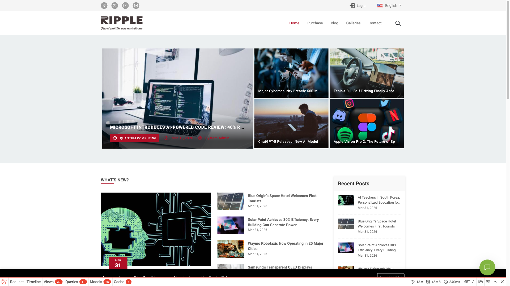

# Widget Customization

The chat widget is a floating button that expands into a chat window on your frontend pages.



## How It Works

When the plugin is active and enabled, the widget is automatically injected into your theme's footer. No theme code changes required.

The widget consists of:
1. **Toggle button** — Floating circular button with chat/close icons
2. **Chat window** — Header, start form or message area, and input footer

## Styling with CSS Variables

The widget uses CSS custom properties that you can override in your theme:

```css
#live-chat-widget {
    --lc-primary: #5A5EB9;        /* Main color */
    --lc-primary-hover: #4a4ea0;  /* Hover color */
    --lc-status-color: #22c55e;   /* Online indicator color */
    --lc-offset-x: 20px;          /* Horizontal offset */
    --lc-offset-y: 20px;          /* Vertical offset */
}
```

These are set automatically from Settings, but you can override them via custom CSS in your theme.

## Position Classes

The widget container gets a position class based on settings:

| Setting | CSS Class |
|---------|-----------|
| Bottom Right | `lc-position-bottom_right` |
| Bottom Left | `lc-position-bottom_left` |
| Center Right | `lc-position-center_right` |
| Center Left | `lc-position-center_left` |

## Mobile Visibility

When **Hide on mobile** is selected in settings, the widget gets the class `lc-hidden-on-mobile` which hides it on screens ≤768px.

## Chat Flow

### 1. Start Form

When no active conversation exists, visitors see a form with:
- Name field (always required)
- Email field (if enabled)
- Phone field (if enabled)
- "Start Chat" button

### 2. Active Chat

After starting a conversation:
- Welcome message appears (if configured)
- Message area shows conversation history
- Input field with send button at the bottom
- Messages poll for updates at the configured interval

### 3. Session Persistence

The widget uses `localStorage` to remember active conversations. When a visitor returns to the site, their previous conversation is automatically restored with full message history.

## Emoji Support

When **Enable Emoji Conversion** is turned on in Settings, text emoticons typed by visitors or admins are automatically rendered as emoji. For example, typing `:)` displays as 🙂 and `:D` as 😄.

This works in all three interfaces: the visitor widget, admin messenger, and agent portal. See [Settings → Visual Effects](/live-chat/settings#visual-effects) for the full list of supported emoticons.

## Keyboard Shortcuts

| Key | Action |
|-----|--------|
| Enter | Send message |
| Escape | Close chat window |
