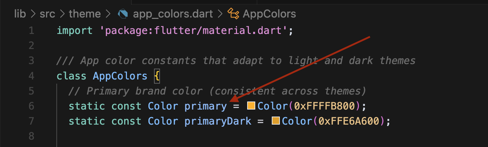

# Changing Theme Colors

## Primary Colors
To modify the primary colors of the application:

1. Navigate to `lib/src/theme/app_colors.dart`
2. Locate the `AppColors` class
3. Modify the following properties:
   ```dart
   static const Color primary = Colors.orange;  // Main brand color
   static const Color primaryDark = Color(0xFFE6A600);  // Darker shade of primary
   ```

## Theme-Specific Colors
The app uses a comprehensive color system that adapts to light and dark themes. To customize these colors:

1. Open `lib/src/theme/app_colors.dart`
2. Find the color constants you want to modify. The colors are organized into categories:
   - Background colors (`lightBackground`, `darkBackground`)
   - Surface colors (`lightSurface`, `darkSurface`)
   - Card background colors (`lightCardBackground`, `darkCardBackground`)
   - Text colors (`lightPrimaryText`, `darkPrimaryText`, etc.)
   - Border colors (`lightBorder`, `darkBorder`)
   - Status colors (`success`, `error`, `warning`, `info`)
   - Price colors (`priceColor`, `originalPriceColor`)

## Using Theme Colors in Code
The `AppColors` class provides helper methods to get the appropriate color based on the current theme:

```dart
// Get background color
Color bgColor = AppColors.getBackgroundColor(context);

// Get text color
Color textColor = AppColors.getPrimaryTextColor(context);

// Get border color
Color borderColor = AppColors.getBorderColor(context);
```

## Screenshots

*Example of theme color configuration in the app*
