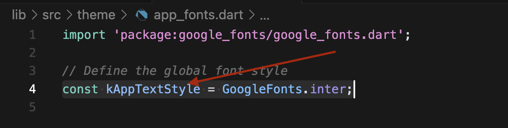

# Changing App Font

The app uses Google Fonts with Inter as the default font. To modify the font:

1. Open `lib/src/theme/app_fonts.dart`
2. Update the font style:
   ```dart
   const kAppTextStyle = GoogleFonts.YOUR_FONT_NAME;
   ```

Available Google Fonts can be found at [Google Fonts](https://fonts.google.com/).

## Screenshots

*Example of font configuration in the app*
