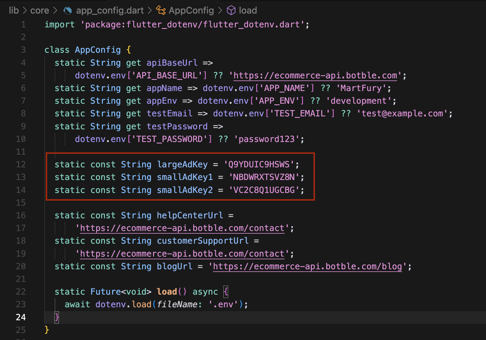

# Setting Up Ad Keys

## Home Screen Ad Configuration
The app uses three different ad placements in the home screen:

1. Large Banner Ad
2. Small Banner Ad 1
3. Small Banner Ad 2


To configure these ads:

1. Navigate to `lib/core/app_config.dart`
2. Update the following ad keys:
   ```dart
   static const String largeAdKey = 'YOUR_LARGE_AD_KEY';
   static const String smallAdKey1 = 'YOUR_SMALL_AD_KEY_1';
   static const String smallAdKey2 = 'YOUR_SMALL_AD_KEY_2';
   ```

These ad keys correspond to the ad placements in your admin panel. You can set the actual ad content for each key in your admin panel at `https://your-domain/admin/ads`.

## Screenshots

*Example of ad key configuration in app_config.dart*


*Example of ad configuration in admin panel*
