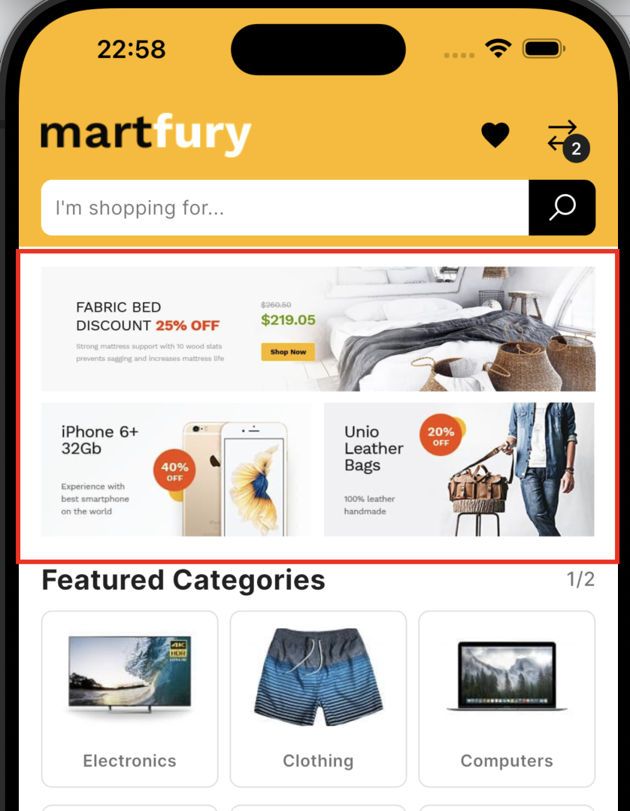
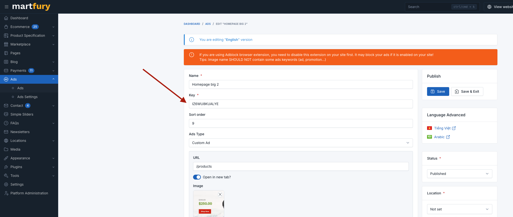

# Setting Up Ad Keys

## Overview

The app displays advertisement banners on the home screen. Ad content is managed through your admin panel, and the app fetches ads using configurable ad keys.

## Configuration

Ad keys are configured in your `.env` file as a comma-separated list:

```env
# Advertisement keys (comma separated)
AD_KEYS=Q9YDUIC9HSWS,NBDWRXTSVZ8N,VC2C8Q1UGCBG
```

Each key corresponds to an ad placement created in your admin panel.

## How It Works

1. The app reads the `AD_KEYS` environment variable
2. Keys are split by comma into a list
3. The home screen displays ads in a responsive grid layout:
   - If you have an **odd number** of keys: first ad displays as a large banner, remaining ads display as smaller banners in pairs
   - If you have an **even number** of keys: all ads display as smaller banners in pairs

## Setting Up Ads in Admin Panel

1. Log in to your admin panel at `https://your-domain/admin`
2. Navigate to **Ads** section
3. Create new ad placements with unique keys
4. Copy the keys and add them to your `.env` file

## Examples

### Three Ads (1 Large + 2 Small)

```env
AD_KEYS=HERO_BANNER,PROMO_LEFT,PROMO_RIGHT
```

Layout:
```
┌─────────────────────────┐
│      HERO_BANNER        │  ← Large banner
├───────────┬─────────────┤
│PROMO_LEFT │ PROMO_RIGHT │  ← Two small banners
└───────────┴─────────────┘
```

### Four Ads (All Small)

```env
AD_KEYS=AD1,AD2,AD3,AD4
```

Layout:
```
┌───────────┬─────────────┐
│    AD1    │    AD2      │
├───────────┼─────────────┤
│    AD3    │    AD4      │
└───────────┴─────────────┘
```

### Single Ad (Large Banner)

```env
AD_KEYS=MAIN_BANNER
```

## No Ads

To disable ads completely, leave the `AD_KEYS` variable empty or remove it:

```env
AD_KEYS=
```

## Applying Changes

After modifying `.env`:

1. **Stop the app completely**
2. Run `flutter run` again

**Note:** Hot reload does not apply `.env` changes.

## Screenshots


*Example of ad display on home screen*


*Example of ad configuration in admin panel*
