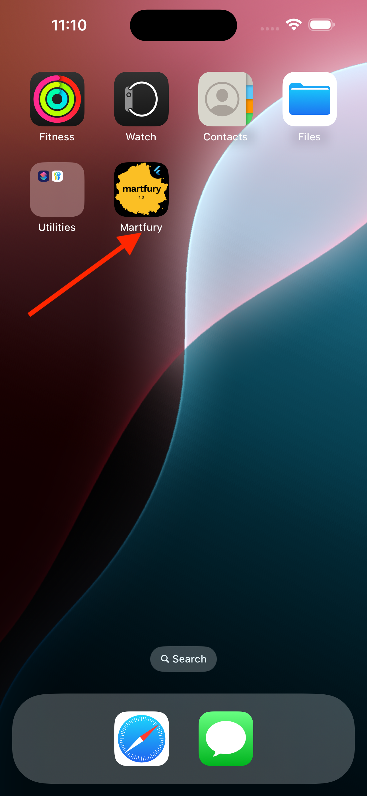

# Changing App Name



## Quick Configuration

The app display name can be set in your `.env` file:

```env
APP_NAME=YourAppName
```

This name is used throughout the app for display purposes (headers, titles, etc.).

## Platform-Specific Names

For the app name that appears on the device home screen and app stores, you need to update platform-specific files:

### Android

1. Open `android/app/src/main/AndroidManifest.xml`
2. Update the `android:label` attribute:
   ```xml
   <application
       android:label="Your New App Name"
       ...
   ```

### iOS

1. Open `ios/Runner/Info.plist`
2. Update the `CFBundleName` and `CFBundleDisplayName`:
   ```xml
   <key>CFBundleName</key>
   <string>Your New App Name</string>
   <key>CFBundleDisplayName</key>
   <string>Your New App Name</string>
   ```

## Important Notes

- **`.env` APP_NAME**: Used for in-app display (e.g., profile screen, headers)
- **AndroidManifest.xml**: Used for Android home screen and Play Store
- **Info.plist**: Used for iOS home screen and App Store

For consistency, ensure all three locations use the same app name.

## Applying Changes

- `.env` changes: Stop the app and run `flutter run` again
- Platform file changes: Rebuild the app completely
