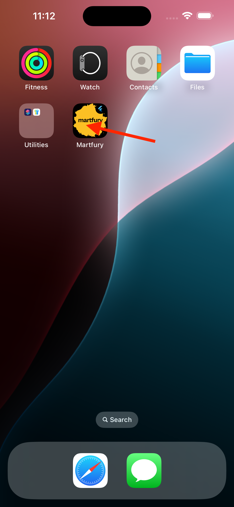

# Changing App Logo



## Android
1. Replace the following files in `android/app/src/main/res/`:
   - `mipmap-hdpi/ic_launcher.png`
   - `mipmap-mdpi/ic_launcher.png`
   - `mipmap-xhdpi/ic_launcher.png`
   - `mipmap-xxhdpi/ic_launcher.png`
   - `mipmap-xxxhdpi/ic_launcher.png`

2. Update `android/app/src/main/AndroidManifest.xml`:
   ```xml
   <application
       android:icon="@mipmap/ic_launcher"
       ...
   ```

## iOS
1. Replace the following files in `ios/Runner/Assets.xcassets/AppIcon.appiconset/`:
   - All icon files in various sizes
2. Update `ios/Runner/Info.plist`:
   ```xml
   <key>CFBundleIconName</key>
   <string>AppIcon</string>
   ```
