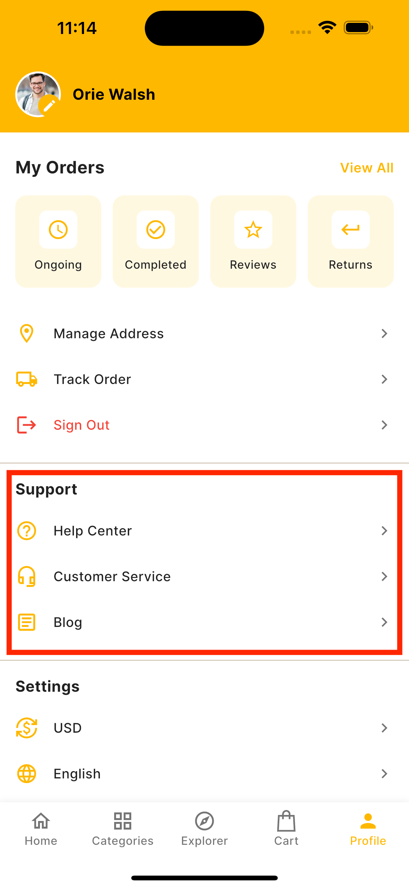

# Profile Screen External Links



## Configuration

The external links are configured in `lib/core/app_config.dart`:
```dart
static const String helpCenterUrl = 'https://ecommerce-api.botble.com/contact';
static const String customerSupportUrl = 'https://ecommerce-api.botble.com/contact';
static const String blogUrl = 'https://ecommerce-api.botble.com/blog';
```

## Implementation

The profile screen (`lib/src/view/screen/profile_screen.dart`) includes a "Support" section with three external links:

1. **Help Center**
   - Icon: `Icons.help_outline`
   - Opens `AppConfig.helpCenterUrl` in a WebView
   - Translation key: `profile.help_center`

2. **Customer Service**
   - Icon: `Icons.headset_mic_outlined`
   - Opens `AppConfig.customerSupportUrl` in a WebView
   - Translation key: `profile.customer_service`

3. **Blog**
   - Icon: `Icons.article_outlined`
   - Opens `AppConfig.blogUrl` in a WebView
   - Translation key: `profile.blog`

## Usage

Each link is implemented using the `_buildMenuItem` widget:
```dart
_buildMenuItem(
  'profile.help_center'.tr(),
  Icons.help_outline,
  onTap: (context) => Navigator.push(
    context,
    MaterialPageRoute(
      builder: (context) => WebViewScreen(
        url: AppConfig.helpCenterUrl,
        title: 'profile.help_center'.tr(),
      ),
    ),
  ),
),
```

## Best Practices

1. **URL Configuration**
   - Keep URLs in `AppConfig` for easy maintenance
   - Use HTTPS for all external links
   - Update URLs in one central location

2. **User Experience**
   - Use appropriate icons for each link
   - Provide clear labels using translations
   - Open links in WebView for better user experience

3. **Security**
   - Validate URLs before opening
   - Use HTTPS links
   - Handle WebView errors gracefully

4. **Internationalization**
   - All labels are translatable
   - Support RTL layouts
   - Use translation keys for consistency

## Example Usage

```dart
class ProfileScreen extends StatelessWidget {
  @override
  Widget build(BuildContext context) {
    return ListView.builder(
      itemCount: profileLinks.length,
      itemBuilder: (context, index) {
        return buildLinkItem(profileLinks[index]);
      },
    );
  }
}
```
