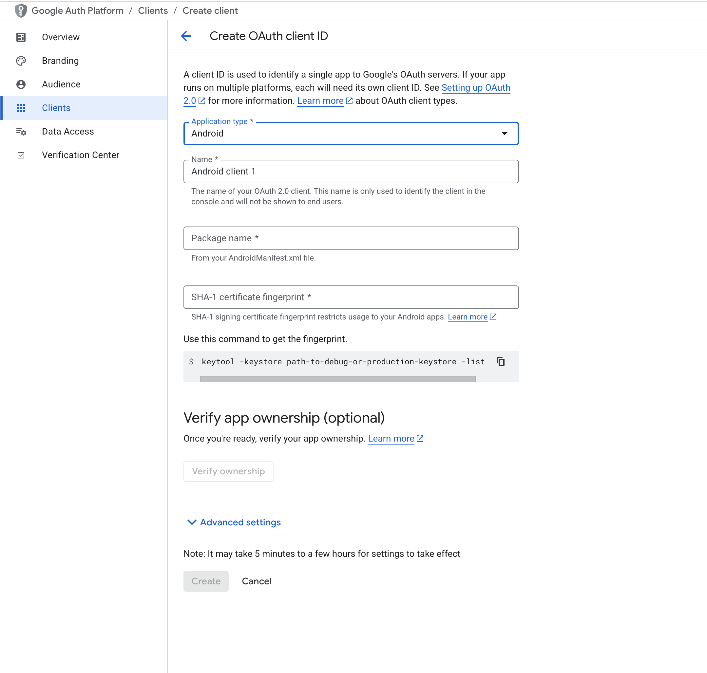

# Google Sign In Setup Guide for Mobile App

This guide will help you set up Google Sign In in your Martfury mobile app.

## Prerequisites

1. A Google Cloud Platform Account
2. Basic knowledge of mobile app development

## Step 1: Configure Google Cloud Platform

1. Go to [Google Cloud Console](https://console.cloud.google.com)
2. Create a new project or select an existing one
3. Enable the Google Sign-In API
4. Go to "Credentials"


5. Create OAuth 2.0 Client IDs for both Android and iOS



Note: 

6. Note down your Client ID and Server Client ID

## Step 2: Configure Your Mobile App

### Environment Variables

Create or update your `.env` file with the following variables:

```bash
GOOGLE_CLIENT_ID=your_google_client_id
GOOGLE_SERVER_CLIENT_ID=your_google_server_client_id
```

### iOS Configuration

The Google Sign In configuration is already set up in your `Info.plist`. Make sure it contains:

```xml
<key>CFBundleURLTypes</key>
<array>
    <dict>
        <key>CFBundleURLSchemes</key>
        <array>
            <string>com.googleusercontent.apps.YOUR_CLIENT_ID</string>
        </array>
    </dict>
</array>
```

### Android Configuration

For Android, you need to add the following to your `AndroidManifest.xml`:

```xml
<activity
    android:name="com.google.android.gms.auth.api.signin.internal.SignInHubActivity"
    android:excludeFromRecents="true"
    android:exported="false"
    android:theme="@android:style/Theme.Translucent.NoTitleBar" />
```

And in your app's `build.gradle`:

```groovy
defaultConfig {
    // ...
    manifestPlaceholders += [
        'appAuthRedirectScheme': 'com.googleusercontent.apps.YOUR_CLIENT_ID'
    ]
}
```

## Step 3: Testing the Integration

## Troubleshooting

### Common Issues

1. **Sign In fails with "Invalid configuration"**

   - Verify that your Google Cloud project is properly configured
   - Check that your app's bundle ID/package name matches the one in Google Cloud Console
   - Ensure the OAuth consent screen is configured

2. **App crashes on Google Sign In**
   - Verify that your Google Client IDs are correct
   - Check that all required configurations are in place
   - Ensure you have an active internet connection

### Getting Help

If you encounter any issues:

1. Check the [Google Sign-In Documentation](https://developers.google.com/identity/sign-in/android/start-integrating)
2. Review the [google_sign_in package documentation](https://pub.dev/packages/google_sign_in)
3. Check your app's logs for detailed error messages

## Security Considerations

1. Never commit your Google Client IDs to version control
2. Always use environment variables for sensitive data
3. Implement proper error handling and user feedback

## Additional Resources

- [Google Cloud Console](https://console.cloud.google.com)
- [Google Sign-In Documentation](https://developers.google.com/identity/sign-in/android/start-integrating)
- [google_sign_in Package](https://pub.dev/packages/google_sign_in)
