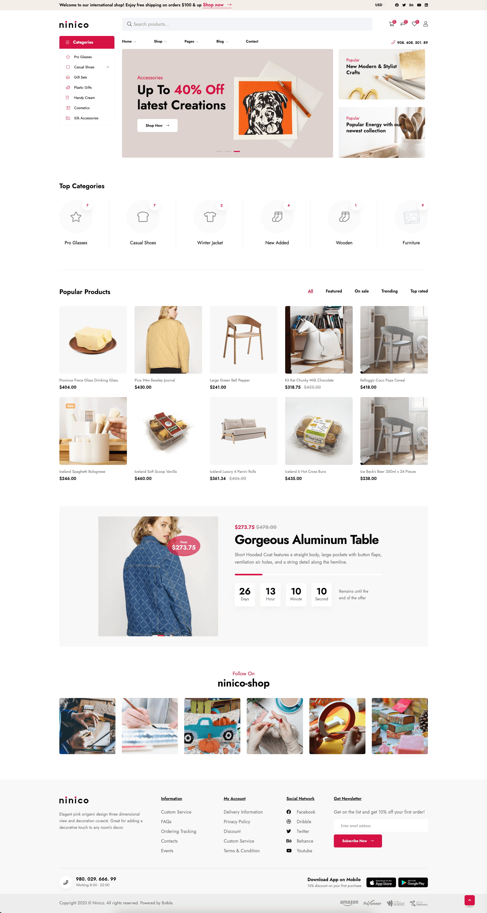

# Ninico - Laravel Multipurpose Minimal Shop

## Introduction

Ninico is a versatile ecommerce shop script powered by Laravel 10.x. Built on the foundation of **Botble CMS**, this
product offers remarkable flexibility for various use cases.

Whether you intend to sell Fashion Products, Shoes, Bags, Cosmetics, Electronics, Furniture, and more, Ninico provides a
solid platform for your ecommerce venture.

**Created:** `2023-08-14`

**By:** [Botble Technologies](https://botble.com)

**Email:** [contact@botble.com](mailto:contact@botble.com)

Thank you for choosing Ninico. For any inquiries beyond this documentation, please don't hesitate to reach us through
our user page contact form [here](https://codecanyon.net.net/user/botble). We're here to provide prompt support.

## Demo

- **Homepage:** [https://ninico.botble.com](https://ninico.botble.com)
- **Admin Panel:** [https://ninico.botble.com/admin](https://ninico.botble.com/admin)
- **Admin Account:** `admin`/`12345678` (username & password are autofilled)
- **Customer Login Page:** [https://ninico.botble.com/login](https://ninico.botble.com/login)
- **Customer Account:** `john.smith@botble.com`/`12345678`

## Key Features

- **Multi-language Support:** Enjoy the advantage of unlimited languages for global outreach.
- **Comprehensive Ecommerce Functionality:** Benefit from a full suite of ecommerce features, including product catalog,
  attributes, variations, collections, discounts, and shipping options.
- **Versatile Product Selling:** Sell both simple and variable products with ease.
- **Unlimited Categories & Sub-Categories:** Organize your products effortlessly with no limitations.
- **Advanced Product Filtering:** Empower your customers to filter products by size, color, brand, category, and more.
- **Wishlist (Optional):** Elevate user experience by enabling an optional wishlist feature.
- **Visual Swatches:** Enhance product selection with color, label, and image swatches.
- **Frequently Bought Together:** Encourage upsells with the "Frequently Bought Together" feature.
- **Typography Options:** Utilize advanced typography settings for a unique storefront look.
- **Single Checkout Page:** Simplify the checkout process for improved conversions.
- **Diverse Payment Methods:** Accept payments through PayPal, Stripe, Paystack, Razorpay, Mollie, and more.
- **Multi-currency Support:** Facilitate transactions in multiple currencies.
- **RTL (Right-to-Left) Support:** Cater to languages and regions with right-to-left scripts.
- **Modular Components:** Utilize pre-built modules for pages, blogs, menus, contact forms, newsletters, sliders, and
  more, reducing repetitive code.
- **Robust Media System:** Efficiently manage media content, with support for Amazon S3 and DigitalOcean Spaces.
- **SEO & Sitemap Integration:** Boost discoverability with SEO tools and access sitemap.xml for enhanced search engine
  visibility.
- **Google Analytics Integration:** Monitor website analytics data seamlessly within the admin panel.
- **Translation Tool:** Easily translate both the front theme and admin panel to accommodate various languages.
- **Pre-built Beautiful Theme:** Start with an appealing theme that's ready to use.
- **Powerful Permission System:** Effectively manage users, teams, and roles through a flexible permission system.
- **Customizable Admin Templates:** Choose from multiple color schemes to match your preferences.
- **Fully Responsive Design:** Ensure compatibility across diverse screen resolutions.
- **Coding Standards:** All code adheres to PSR-12 coding standards and best practices.

## Botble Team

For more about our team, visit us at [https://botble.com](https://botble.com).

## Documentation Enhancement

We are committed to continuously improving our documentation to ensure the best experience for our users. If you have
suggestions or specific areas you'd like us to cover in more detail, please don't hesitate to let us know. Your feedback
is invaluable as we strive to provide you with the best possible support.
