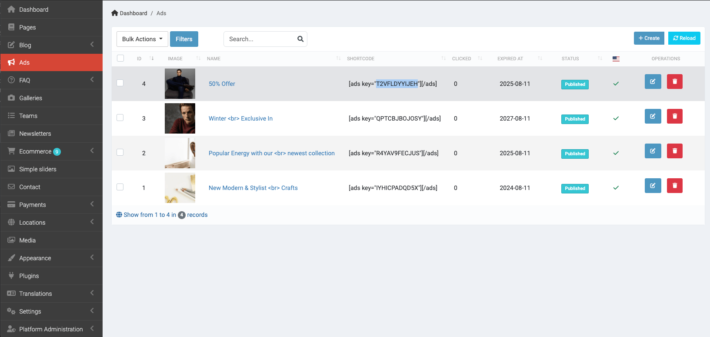

# Ads

::: tip
The ad images should NOT contain `ads`, `advert`... in the name. It may be blocked by Adblock extension.
:::

It's just supported banner ad images for now. It doesn't support **Google Adsense**.

For **Google Adsense**, you need to put JS code for Adsense in **Admin** -> **Appearance** -> **Custom JS**.
