# Homepage

## Setup Homepage

To setup the homepage, you need to create a new page and set it as the homepage in **Page** tab at **Admin** ->
**Appearance** -> **Theme options**.

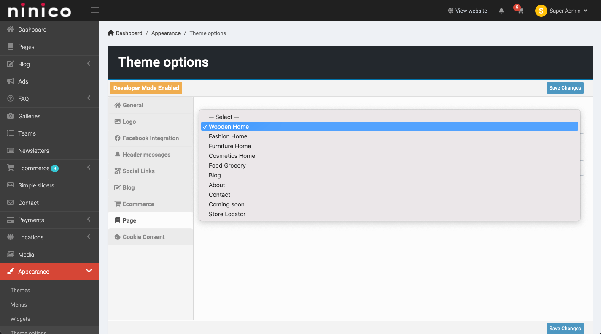

## Customize the Homepage

Pages are managed in **Admin** -> **Pages**. You can edit the homepage by editing the page with the name **Front Page**.

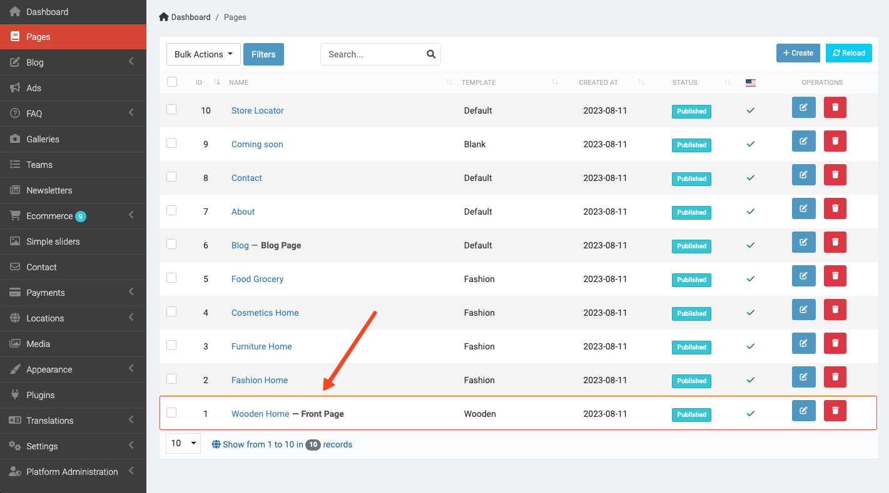

### Hero Section

The hero section is the first section of the homepage. It contains sliders and advertisements that you can customize.

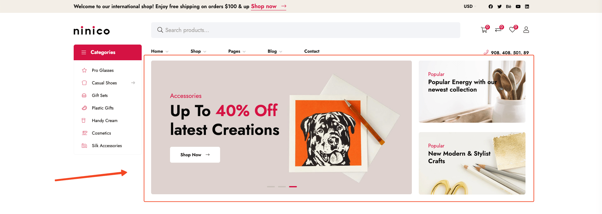

You can see that the left side of the hero section is a slider. You can customize the slider by editing the **Simple
Slider** shortcode.

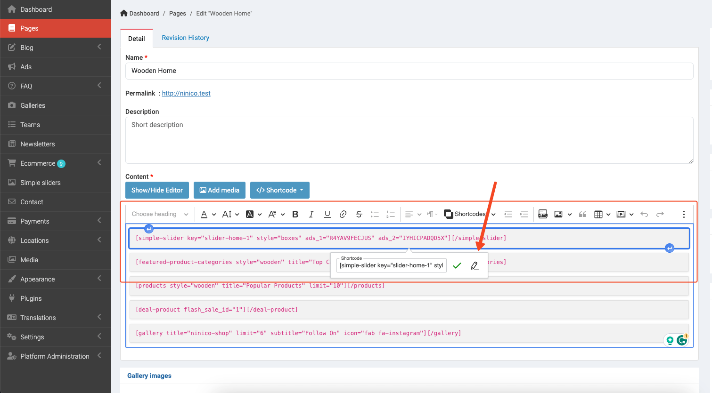

Also in the **Simple Slider** shortcode, you can customize the which advertisements to show on the right side of the
hero section.

To create a new advertisement, you can read the [Usage Ads](./usage-ads.md) document.

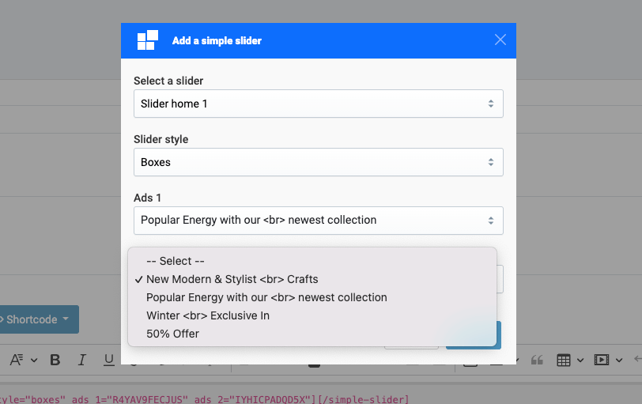

### Featured Categories

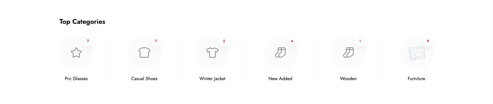

You can add featured categories to the homepage by editing the **Featured Product Categories** shortcode.

### Products List

The products section is a list of products, here you can customize the list style and the products to show.
There are 2 types of list style: **Wooden** and **Fashion**.

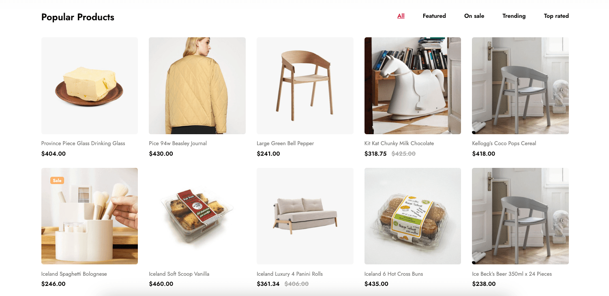

This shortcode also has a tab that allows customers to filter products by types like **Featured**, **Trending**, ...

### Deal products

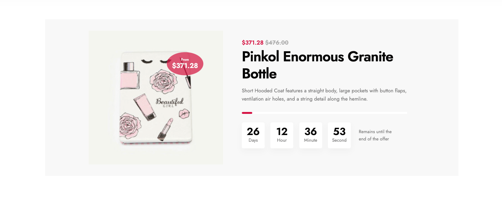

To use this shortcode, you need to create a new flash sale and add products to it. Then you can edit the **Deal Product**
shortcode to show the flash sale.

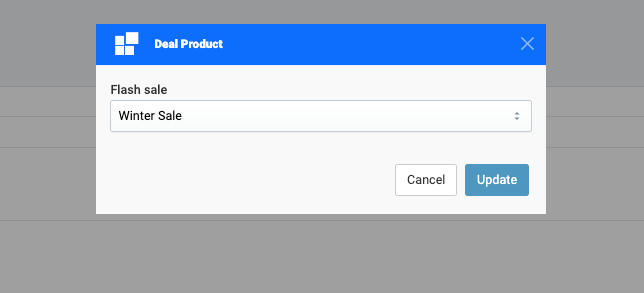

### Galleries

If you'd like to show some images on the homepage, you can use the **Galleries** shortcode.

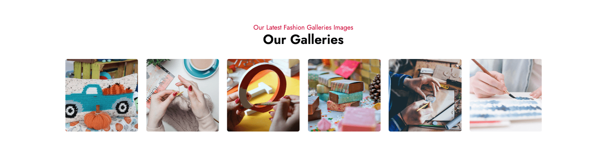

## Other shortcodes

There are some other shortcodes that you can use to customize the homepage. You can find them in **Shortcode** dropdown
when editing the page.

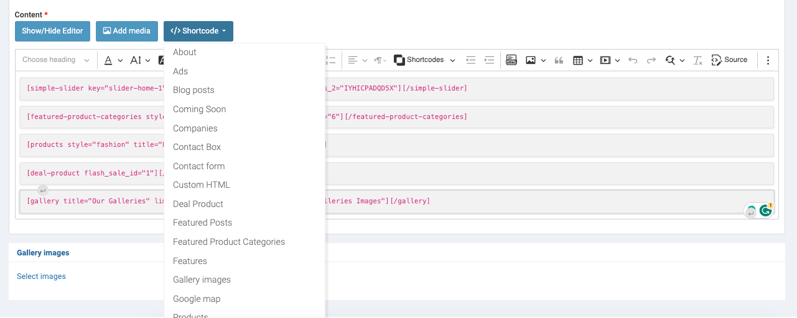

This is a another example of the homepage of a fashion style.

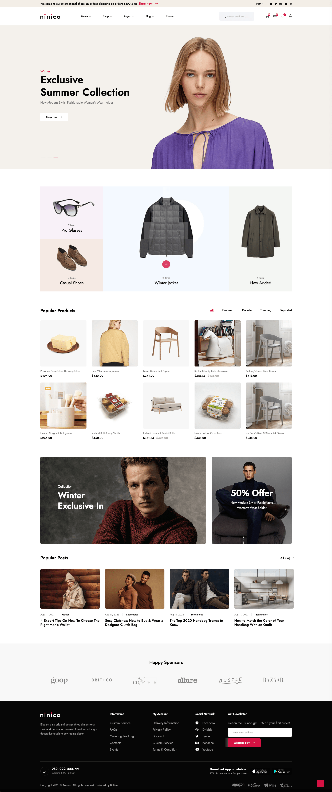
