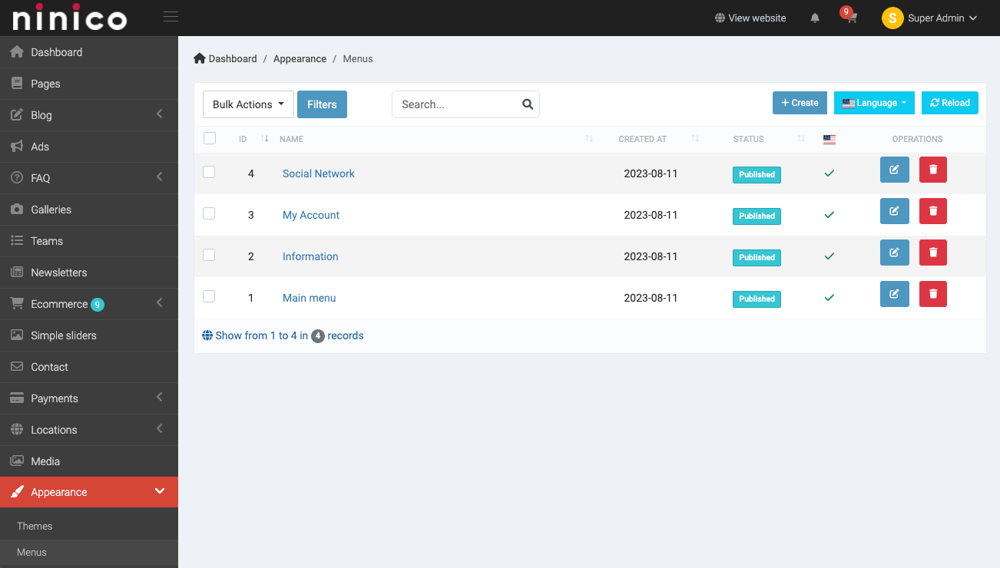
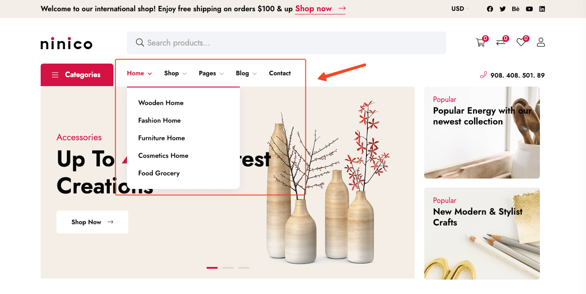
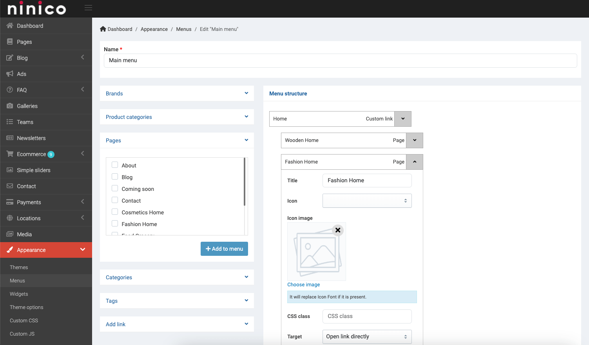
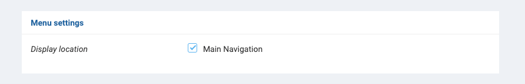
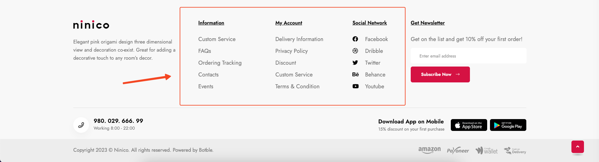

# Menu

Menu can be customized in **Admin** -> **Appearance** -> **Menus**.

In **Ninico**, there are have 2 types of menu: **Main Menu** and **Footer Menu**.

## Main Menu

The main menu is the menu that is shown on the header of the website.

In the **Main Menu**, you can add menu items by choosing the **Pages**, **Categories** or **Custom Links**. You can also
drag and drop menu items to change their order.

To made a menu as main menu, scroll down to **Menu Settings** and check the **Main Navigation** checkbox.

## Footer Menu

The footer menu is the menu that is shown on the footer of the website.

You can see in the image that the footer menu have 3 columns corresponding to 3 menus **Information**, **My Account**
and **Social Network** in **Appearance** -> **Menus**.

This generated by **Footer Sidebar** widget. You can go to [Widgets](./usage-widgets.md) to learn more about how to use
widgets.
