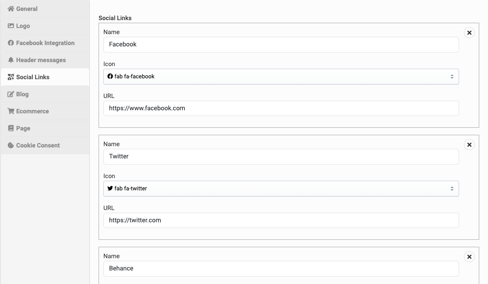

# Theme Options

Theme options is a place that you can customize your theme such like: change the logo, colors, fonts, layout, and other
aspects of the theme without needing to know how to code.

To access the theme options, go to **Admin** -> **Appearance** -> **Theme options**.

## General

In the **General** tab, you can change site title, description, primary color, primary font or even enable/disable
preloader.

## Social links

In the **Social links** tab, you can add your social links to display on the site.

You can add whatever social links you want in here.

## Ecommerce

In the **Ecommerce** tab, you can customize product listing page, number of products per page, ...

To change to text in footer of cart sidebar, just change the text in **Cart footer description** field.

