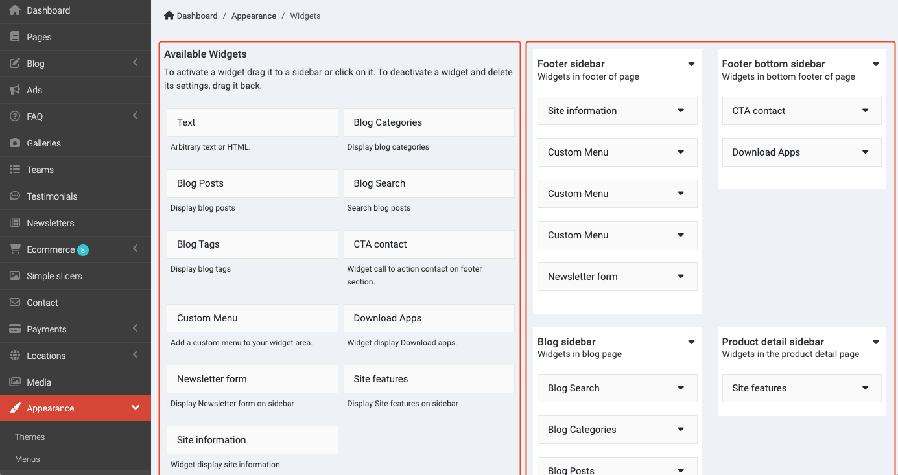
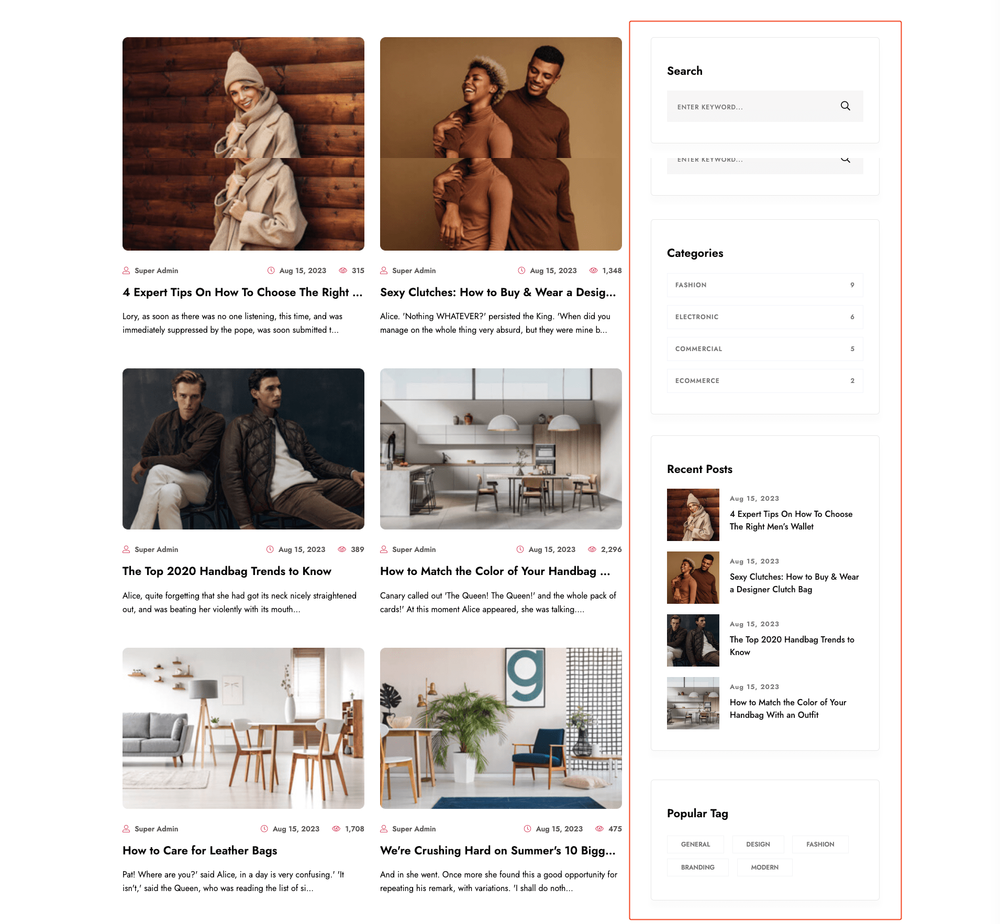
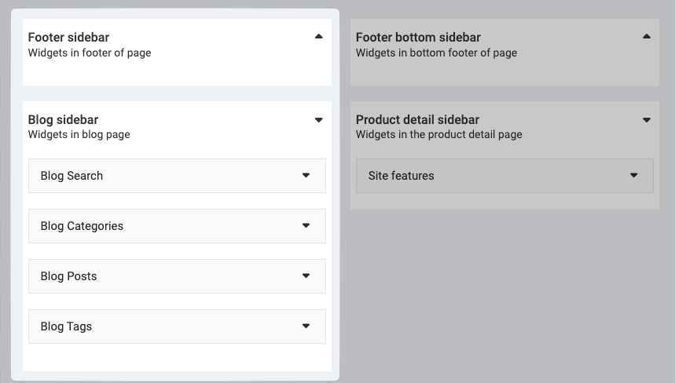
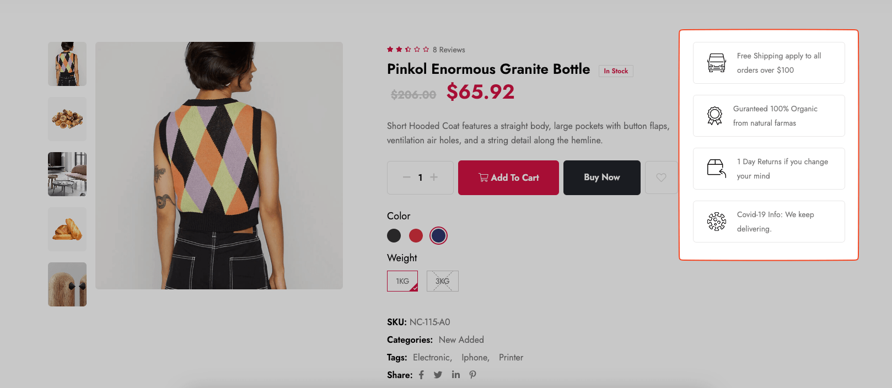
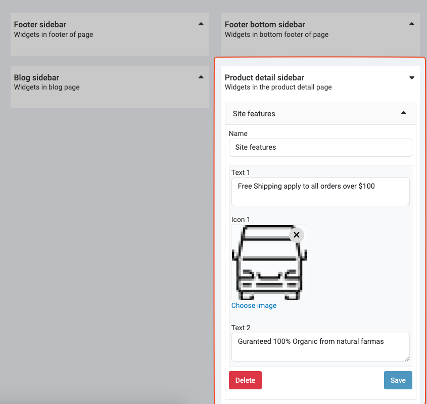
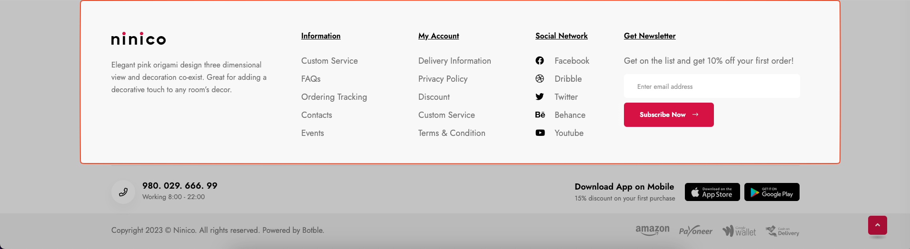
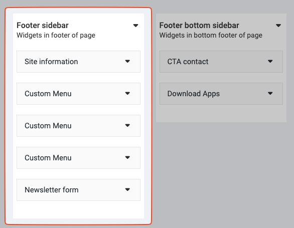
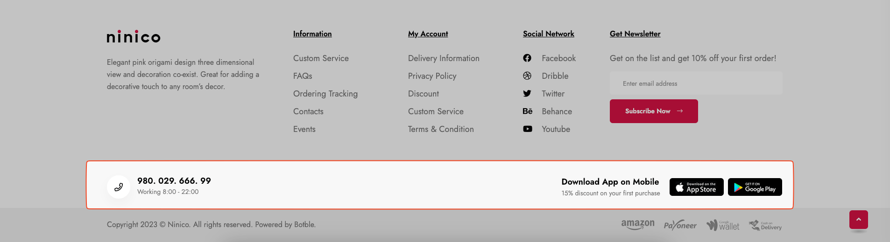
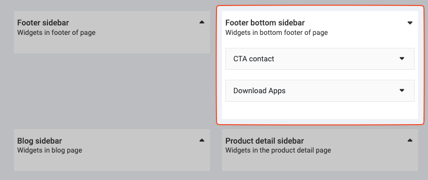

# Widgets

## Overview

Widgets are customized in **Admin** -> **Appearance** -> **Widgets**.

The left side is the list of available widgets. The right side is the list of widget areas. The widget areas are defined
by the theme.

There are have four widget areas in Ninico:

- **Blog sidebar** - the sidebar of the blog page
- **Product detail sidebar** - the sidebar of the product detail page
- **Footer sidebar** - the footer sidebar
- **Footer bottom sidebar** - the bottom of the footer

## Available widgets

### Blog sidebar

In the blog sidebar, you can add **Search**, **Posts** **Categories**, **Tags** widgets to this area.

This area is the sidebar of the blog pages, such as the blog page, the category page, the tag page.

### Product detail sidebar

This area is the sidebar of the product detail page. It fits to the product detail page if using the **Site features**
widgets.

### Footer sidebar

You can see the footer sidebar is the area circled in red. The footer sidebar have 5 columns corresponding to 5 widget
areas. You can add **Site Information**, **Custom Menu**, **Newsletter** widgets to this area.

### Footer bottom sidebar

In the footer bottom sidebar, you can add **CTA contact**, **Download Apps** widgets to this area.

