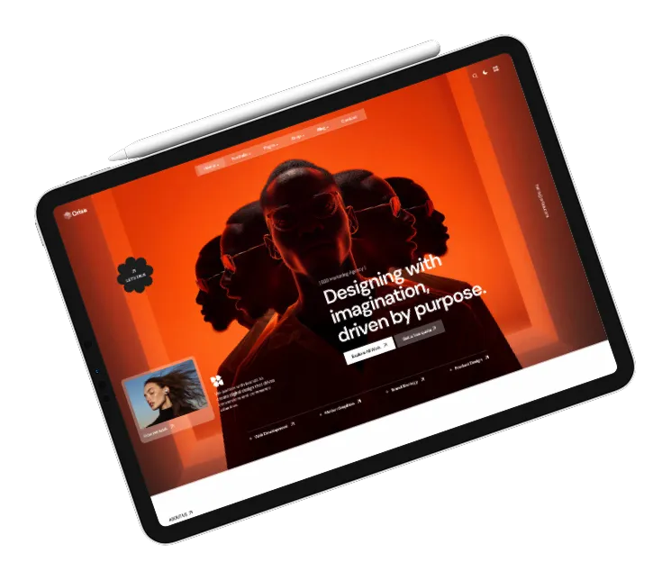

# Orisa - Creative Agency & Portfolio

## Introduction

**Orisa** is a premium Creative Agency & Portfolio theme built on Botble CMS, crafted for agencies, freelancers, and creative professionals who want to showcase their work with style. Whether you run a creative agency, digital agency, marketing firm, AI & tech company, or a personal portfolio, Orisa delivers a polished and flexible digital presence to elevate your brand.

It is built on top of Botble CMS, a Laravel-based CMS, and offers remarkable flexibility for a wide range of use cases.

Released Date: **Apr 07, 2025**

Author: **[Botble Technologies](https://botble.com)**

Email: **contact@botble.com**

Thank you for purchasing our product. If you have any questions that are beyond the scope of this help file, please feel free to email via our user page contact form [here](https://codecanyon.net/user/botble) for quick support. Thank you so much!

## Features Overview

* **Buy Once & Get Free Updates Forever**
* **Free Theme Installation** – if you face any problem during installation, we will help you and it's **FREE**
* **5 Homepage Demos** – Creative Agency, Digital Agency, Marketing Agency, AI & Tech Agency, Personal Creative
* **21+ Shortcodes with 57+ Style Variants** – hero, services, portfolio, testimonials, team, pricing, FAQ, CTA, and more
* **3 Header Styles + 5 Footer Styles** – mix and match for each homepage
* **Dark Mode / Light Mode** toggle with system preference auto-detection
* **RTL (Right To Left)** language support, fully tested with Arabic
* **Ecommerce Ready** – product archive, product detail, cart, wishlist, compare, checkout pages included
* **Magic Cursor** – custom cursor powered by Matter.js physics engine
* **Scroll Animations** – smooth entrance animations on scroll throughout all sections
* **Bootstrap 5.x** – the most popular responsive CSS framework
* **Based on Botble CMS** – modern Laravel framework used by thousands of customers
* **Font Awesome Pro 6** icons bundled – no external CDN required (Envato compliant)
* **100% Fully Responsive** – pixel-perfect on desktop, tablet, and mobile
* **Powerful Admin Panel** – all settings configurable without touching code
* **Multi-Language** – 24 pre-translated locales and unlimited custom languages
* **Child Theme Support** – customize safely without breaking core updates
* **Google Analytics** – analytics data displayed directly in admin panel
* **SEO Optimized** – clean markup, meta management, sitemap generation
* **Fast Support** – we reply to every ticket within 1 business day

## Demo

| Demo | Link |
|------|------|
| Home 1 – Creative Agency | <https://orisa.botble.com> |
| Home 2 – Digital Agency | <https://orisa-home-2.botble.com> |
| Home 3 – Marketing Agency | <https://orisa-home-3.botble.com> |
| Home 4 – AI & Tech Agency | <https://orisa-home-4.botble.com> |
| Home 5 – Personal Creative | <https://orisa-home-5.botble.com> |
| Admin Panel | <https://orisa.botble.com/admin> |

Admin account: `admin` / `12345678` (username & password are autofilled)

## Quick Links

- [Homepage setup](./usage-homepage.md)
- [Menus](./usage-menus.md)
- [Theme Options](./usage-theme-options.md)
- [UI Blocks (Shortcodes)](./usage-ui-block.md)
- [Widgets](./usage-widgets.md)
- [Custom CSS / JS](./usage-custom-css-js.md)
- [Google Analytics](./usage-analytics.md)
- [Upgrade Guide](./upgrade.md)
- [Release Notes](./releases.md)

## Botble Team

For more about our team, visit us at <https://botble.com>.
