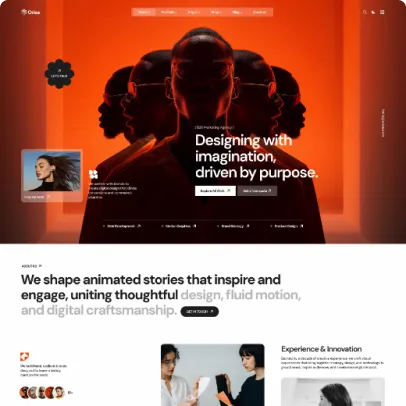

# Homepage

Homepage is the first page that users see when they visit your website. It is the most important page of your website.

## Create Homepage

If you are using the sample data of **Orisa**, the homepage is already created for you.

It's located in Admin -> Pages -> Home. You can skip this step.

To create a homepage, in admin panel, go to `Pages` and click on `Create` button.

In the `Create new page` page, fill in the following fields:

- **Title**: Enter the title of the page. For example, `Home`.
- **Permalink**: You can customize this permalink. But after set this page is homepage then permalink is `/`.
- **Content**: You have the option to customize the content or utilize our pre-defined [UI Block](./usage-ui-block.md).
- **Template**: Select `Homepage`.
- Other fields are optional, you can fill them if you want.

## Setup Homepage

After creating the homepage, you need to set it as the homepage of your website.

In admin panel, go to `Appearance` -> `Theme Options` -> `Page`, and select the homepage you just created in
the `Your homepage displays` field.

::: tip
If you are using the sample data of **Orisa**, the homepage is already created and set up for you.
:::

## Homepage Demo Presets

Orisa ships with **5 homepage demo presets**. Each preset can be imported independently via the demo importer.

| # | Preset Name | Description |
|---|-------------|-------------|
| 1 | **Creative Agency** | Bold hero with video background, service tags, and portfolio grid |
| 2 | **Digital Agency** | Clean layout with animated stats and team showcase |
| 3 | **Marketing Agency** | CTA-focused design with pricing plans and blog posts |
| 4 | **AI & Tech** | Futuristic style with gradient accents and skills carousel |
| 5 | **Personal Creative** | Minimal portfolio layout with social links and about section |

### Importing a Demo

1. Go to `Admin` -> `Appearance` -> `Theme Options` -> `Import Demo`.
2. Select the desired preset from the list.
3. Click **Import** and wait for the process to complete.
4. Navigate to your site — the homepage is now configured with the selected demo content.

::: warning
Importing a demo will overwrite existing pages and widgets. Back up your data before importing.
:::

## Customize Homepage

The homepage or any other page can be customized using UI Block. A list of available
shortcodes can be found in [UI Block](./usage-ui-block.md#available-shortcodes).
