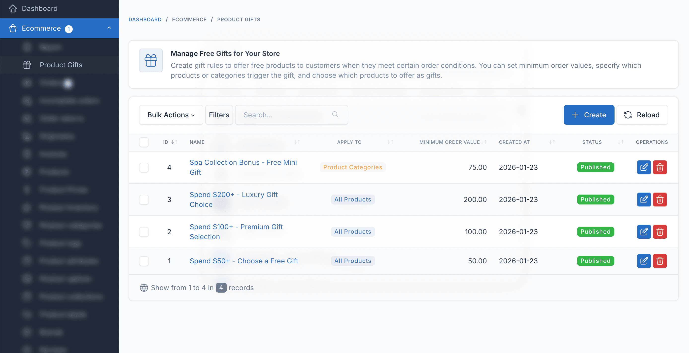
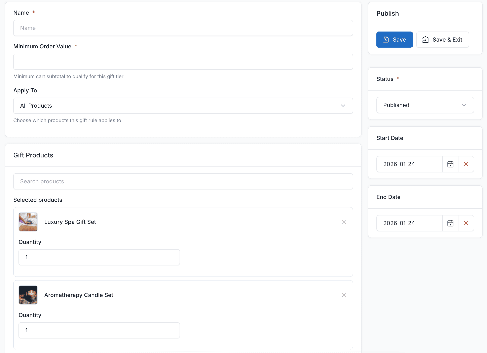
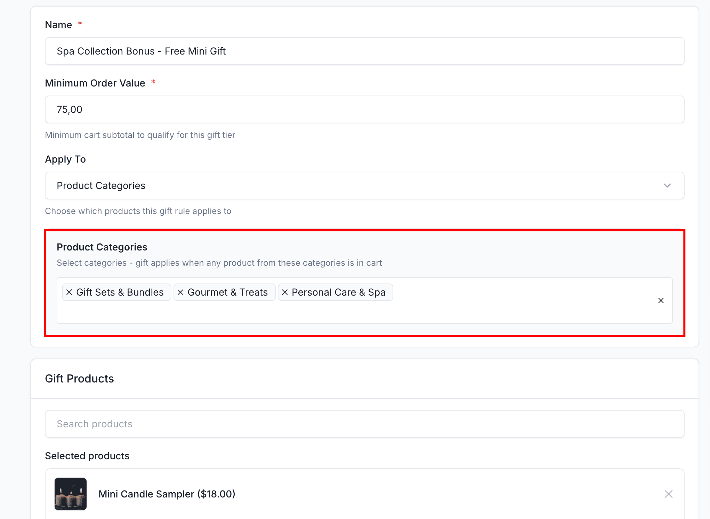
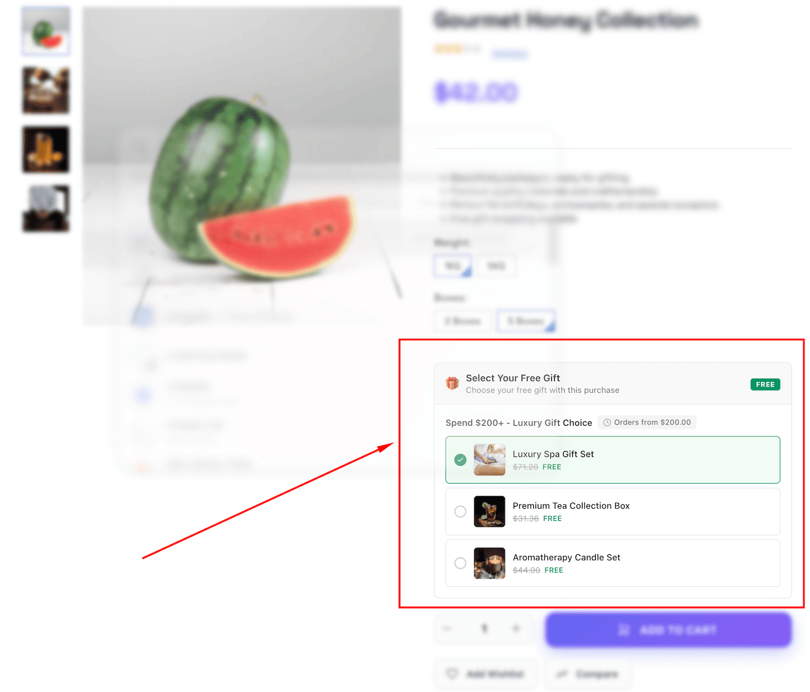
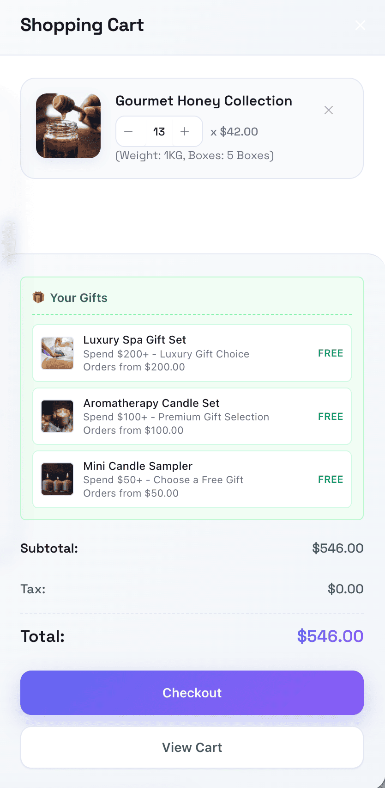
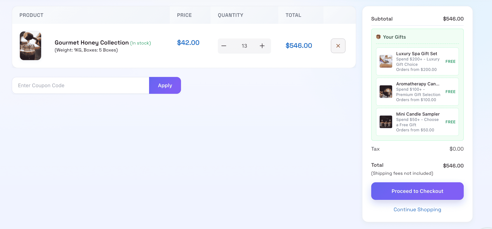
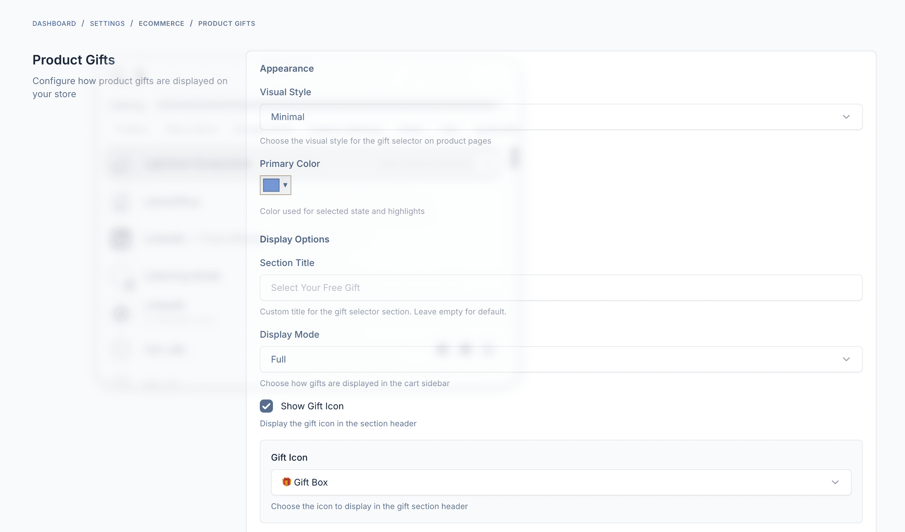

# Usage Guide

This guide covers everything you need to know about using the Product Gifts plugin to create effective gift promotions for your e-commerce store.

## Creating Gift Rules

### Accessing Gift Rules

Navigate to **Ecommerce > Product Gifts** in the admin sidebar to access the gift rules management page.

### Creating a New Rule

1. Click the **Create** button in the top right
2. Fill in the rule details:

#### Rule Settings

| Field | Description |
|-------|-------------|
| **Name** | A descriptive name for the rule (e.g., "Free gift for orders over $100") |
| **Minimum Order Value** | The minimum cart subtotal required to qualify for this gift |
| **Apply To** | Choose targeting: All Products, Specific Products, or Product Categories |
| **Status** | Enable or disable the rule |
| **Start Date** | Optional start date for the promotion |
| **End Date** | Optional end date for the promotion |

### Targeting Options

#### All Products

The gift rule applies to any order that meets the minimum order value, regardless of which products are in the cart.

#### Specific Products

The gift rule only applies when specific products are in the cart.

1. Select "Specific Products" from the Apply To dropdown
2. Search and select the products that trigger this gift rule
3. Customers must have at least one of these products in their cart

#### Product Categories

The gift rule applies when products from specific categories are in the cart.

1. Select "Product Categories" from the Apply To dropdown
2. Choose one or more categories
3. Customers must have products from these categories in their cart

### Adding Gift Products

In the **Gift Products** section on the right side:

1. Search for products to offer as gifts
2. Click on a product to add it
3. Set the quantity for each gift item
4. Add multiple products to give customers choices

## Frontend Display

### Product Page Display

When customers view a product that qualifies for a gift, they'll see the available gifts:

### Cart Display

When customers add qualifying products to their cart, the gift selector appears:

Customers can:
- See available gift tiers based on their cart value
- Select their preferred gift from multiple options
- See the original price crossed out with "FREE" badge

### Checkout Display

The selected gift persists through to checkout:

- Gift appears as a line item with $0 price
- Customers can change their selection before completing the order
- Gift is clearly marked in the order summary

## Settings

Navigate to **Settings > Product Gifts** to customize the display:

### Appearance Settings

| Setting | Description |
|---------|-------------|
| **Visual Style** | Choose from Modern, Minimal, Classic, or Elegant styles |
| **Display Mode** | Full or Compact display in cart |
| **Section Title** | Custom title for the gift section |
| **Primary Color** | Color for selected state and highlights |
| **Show Gift Icon** | Toggle the gift icon in the header |
| **Icon** | Choose an emoji icon for the gift section |

### Display Options

| Setting | Description |
|---------|-------------|
| **Show Product Images** | Display product thumbnails in gift options |
| **Show Original Price** | Show the original price crossed out next to "FREE" |

## Order Management

### Viewing Gifts in Orders

When viewing an order in the admin panel, gift items are clearly marked:

- Gift products appear as line items
- Price shows as $0
- "Gift" badge indicates the item was a free gift
- The triggering rule is referenced

### Order Export

Gift items are included in order exports with:
- Product details
- Quantity
- $0 price
- Gift indicator

## Best Practices

### Setting Effective Thresholds

1. **Analyze your average order value** - Set thresholds slightly above to encourage upselling
2. **Create tiered gifts** - Multiple rules with increasing thresholds and better gifts
3. **Consider profit margins** - Ensure gift costs don't exceed additional revenue

### Choosing Gift Products

1. **Popular items** - Gifts customers actually want
2. **Low-cost, high-perceived-value** - Maximize impact while controlling costs
3. **Complementary products** - Items that go well with common purchases
4. **New products** - Introduce customers to new items

### Timing Promotions

1. **Seasonal campaigns** - Holiday and special event promotions
2. **Inventory management** - Use as gifts to move slow-selling items
3. **Limited time offers** - Create urgency with date-limited rules

## Troubleshooting

### Gifts not appearing

1. Check that the rule is **Published** (not Draft)
2. Verify the **date range** includes today
3. Confirm the cart meets the **minimum order value**
4. Check **targeting conditions** match cart contents

### Gift selection not saving

1. Ensure JavaScript is enabled in the browser
2. Check for JavaScript errors in browser console
3. Clear browser cache and try again

### Gift not added to order

1. Verify the gift product is **in stock**
2. Check that the gift was **selected** before checkout
3. Ensure the order **still qualifies** at checkout time
