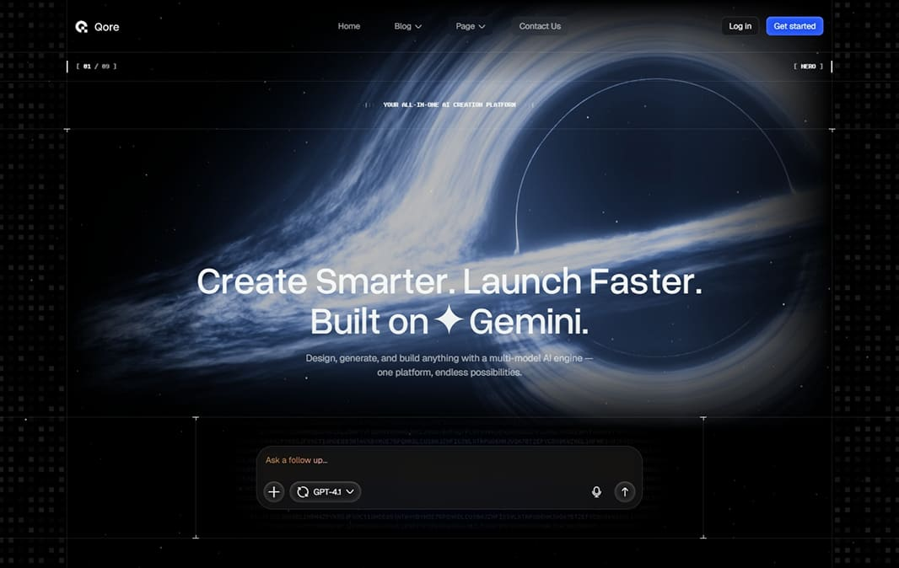

# Qore - AI Driven SaaS Landing Page Laravel Script

## Introduction

Level up your product with Qore's generative AI-themed landing page. Qore is a modern, futuristic AI SaaS landing page theme with stunning animations and a tech-forward aesthetic. Perfect for AI startups, SaaS products, technology companies, and digital agencies who want a cutting-edge online presence.

Deploy in minutes, scale effortlessly, and decide with confidence. Qore features smooth scroll animations, lazy-loaded sections, dark-themed design with gradient accents, and a comprehensive set of shortcodes for building professional landing pages.

It is built on top of Botble CMS, which is a Laravel-based CMS. It offers remarkable flexibility for various use cases.

Released Date: **Jan 2025**

Author: **[Botble Technologies](https://botble.com)**

Email: **contact@botble.com**

Thank you for purchasing our product. If you have any questions that are beyond the scope of this help file, please feel
free to email via our user page contact form [here](https://codecanyon.net/user/botble) for quick support. Thank you
so much!

## Features Overview

* Buy One Time & Get Free Updates Forever
* **Free Theme Installation** - If you will face any problem during installation - we will help you and It's FREE
* **Visual Page Builder**: Drag-and-drop shortcode builder for easy page creation.
* **One Click Demo Import**: Import sample data with a single click.
* Bootstrap 5.x Framework: Bootstrap is the most popular HTML, CSS, and JS framework for developing responsive,
  mobile-first projects on the web.
* Based on our Botble CMS (using modern Laravel framework) which is used by thousands of customers.
* **15+ Shortcodes**: Hero, Features, Benefits, How-To, Pricing, Testimonials, FAQ, CTA, and more.
* **Dark Theme Design**: Modern dark aesthetic with gradient accents and glowing effects.
* **Lazy Loading Sections**: Optimized performance with scroll-triggered content loading.
* **Powerful Theme Options**: Customize colors, fonts, and layouts from admin panel.
* **Built with SASS**: Modern CSS preprocessor for maintainable styles.
* **Modern Swiper Slider**: Smooth, touch-friendly carousels and sliders.
* WOW.js Animations: Stunning scroll-triggered animations throughout.
* Odometer Counters: Animated number counters for statistics.
* Touch Friendly: Easy browsing on touch devices.
* 100% Fully Responsive: Whatever device you are using, your site will run as it should be.
* **Clean, Cross-Browser Compatible Code**: Works on all modern browsers.
* **Free Fonts Included**: No additional font licenses needed.
* Powerful admin panel, all things can be changed from the admin panel, no hardcode.
* Nice and clean design from our designer expert.
* Easy to install with UI - [How to install a script based on Botble CMS](https://www.youtube.com/watch?v=Ox2WgQqOQoQ).
* Multi-language: unlimited language support.
* Google Analytics: display analytics data in the admin panel.
* Translation tool: easy to translate the front theme and admin panel to your language.
* Right To Left (RTL) language support.
* **Ajax Contact Form**: Smooth form submission without page reload.
* **404 Error Page**: Custom designed error page.
* **Comprehensive Documentation**: Detailed guides for setup and customization.
* **24/7 Customer Support**: Fast support, we always reply within 1 business day.

## Demo

* Homepage: https://qore.botble.com
* Admin panel: https://qore.botble.com/admin
* Admin account: `admin` - `12345678` (username & password are autofilled)

## Pre-designed Pages

Qore comes with pre-designed inner pages ready to use:

- **Homepage** - Multi-section SaaS landing page
- **About Us** - Company information page
- **Contact** - Contact form with map
- **Blog** - Blog listing and single post pages
- **Use Cases** - Showcase your product capabilities

## Sections Overview

Qore includes 15+ customizable shortcodes:

### Landing Page Sections
1. **Hero** - Animated hero with AI prompt input and rotating text
2. **Features** - Tabbed features showcase with images
3. **Benefits** - Benefit cards grid with visual objects
4. **How-To** - Step-by-step guide with tabbed images
5. **Showcase** - Use cases demo section
6. **Pricing** - Pricing tiers with monthly/yearly toggle
7. **Testimonials** - Client reviews carousel
8. **FAQ** - Accordion FAQ sections
9. **CTA** - Call-to-action with newsletter form
10. **Brands** - Partner logos infinite carousel
11. **Stats** - Counter statistics section

### About & Contact Sections
12. **Hero About** - About page hero with rating
13. **Teams** - Team member grid
14. **Contact Info** - Contact info cards with icons
15. **Contact Map** - Google Maps embed
16. **Contact Form** - Contact form with info sidebar

## Botble Team

For more about our team, visit us at https://botble.com.
