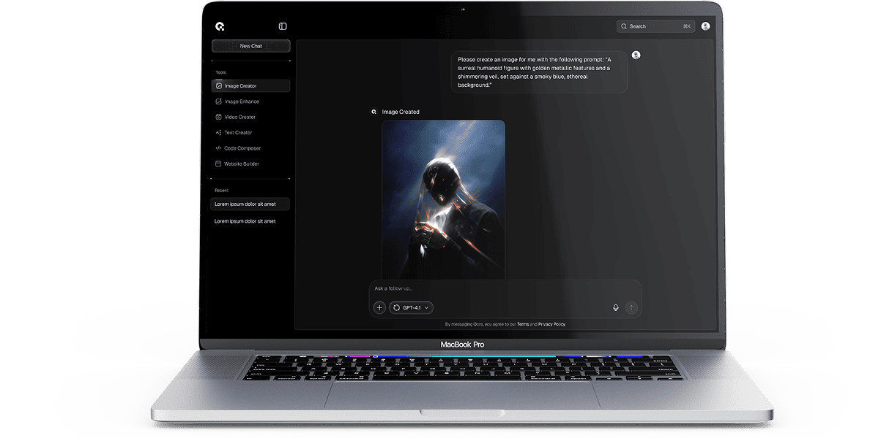

# Homepage

Homepage is the first page that users see when they visit your website. Qore is designed as a modern AI SaaS landing page with multiple animated sections.

## Create Homepage

If you are using the sample data of **Qore**, the homepage is already created for you.

It's located in Admin -> Pages -> Home. You can skip this step.

To create a homepage, in admin panel, go to `Pages` and click on `Create` button.

In the `Create new page` page, fill in the following fields:

- **Title**: Enter the title of the page. For example, `Home`.
- **Permalink**: You can customize this permalink. But after set this page is homepage then permalink is `/`.
- **Content**: Add the [UI Blocks (Shortcodes)](./usage-ui-block.md) for each section.
- **Template**: Select `Homepage`.
- Other fields are optional, you can fill them if you want.

## Setup Homepage

After creating the homepage, you need to set it as the homepage of your website.

In admin panel, go to `Appearance` -> `Theme Options` -> `Page`, and select the homepage you just created in
the `Your homepage displays` field.

::: tip
If you are using the sample data of **Qore**, the homepage is already created and set up for you.
:::

## Customize Homepage

The homepage uses multiple UI Blocks (Shortcodes) for each section:

1. **Hero** - The main hero section with animated text and AI prompt input
2. **Features** - Tabbed features showcase
3. **Benefits** - Benefit cards with visual elements
4. **How-To** - Step-by-step guide
5. **Showcase** - Use cases display
6. **Pricing** - Pricing tiers
7. **Testimonials** - Client testimonials
8. **FAQ** - Frequently asked questions
9. **CTA** - Call-to-action section

A complete list of available shortcodes can be found in [UI Block](./usage-ui-block.md#available-shortcodes).

## Section Numbers

Each section in Qore displays a section number (e.g., `[ 01 / 09 ]`) in the header. Configure these in the shortcode settings:

- **Section Number**: The number to display (e.g., `01`, `02`)
- **Section Label**: Text label for the section (e.g., `HERO`, `FEATURES`)

The section header provides visual hierarchy and helps users understand their position on the page.

## Lazy Loading

Qore uses lazy loading for sections to improve page performance. Sections are loaded as users scroll down the page. This is handled automatically through the `withLazyLoading()` method on each shortcode form.

When a section is in view, it receives the `.shortcode-lazy-loading-loaded` class, triggering its animations and content display.
