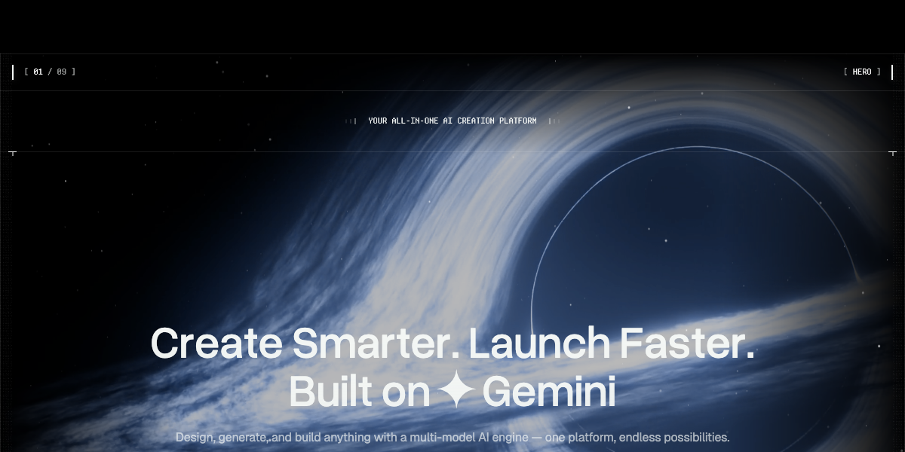
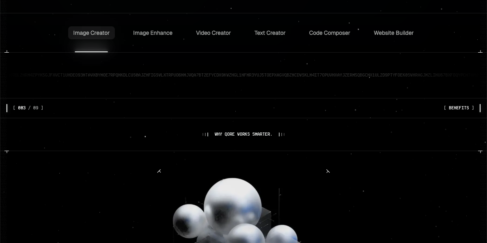
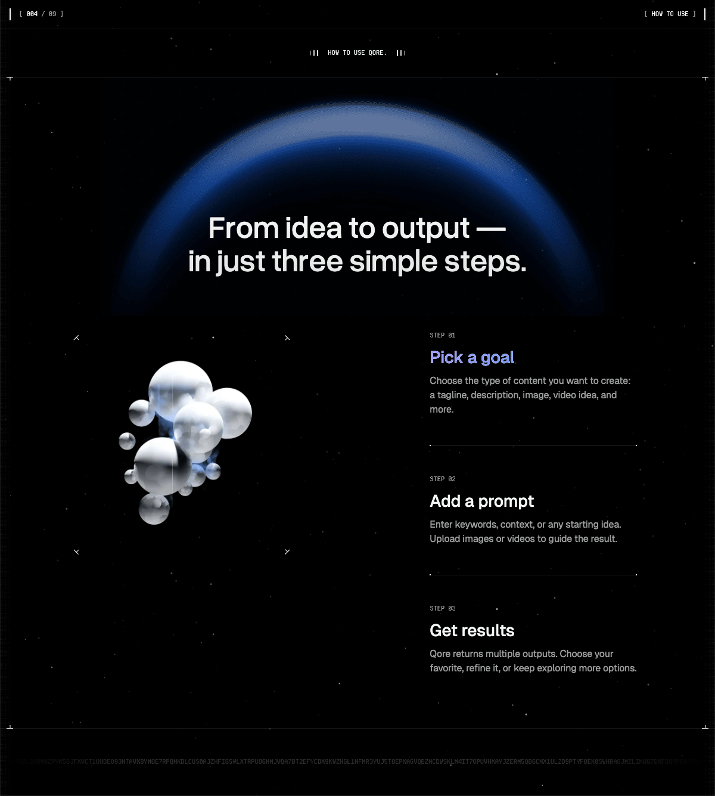
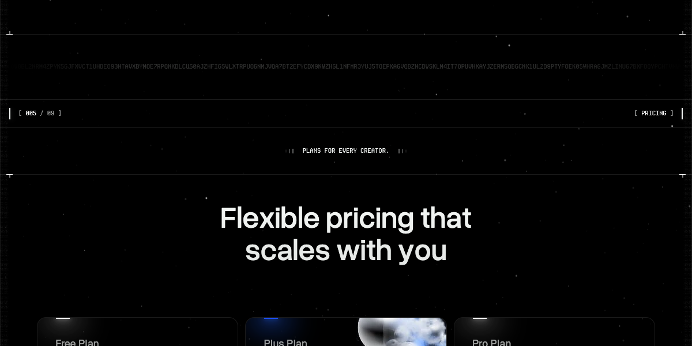
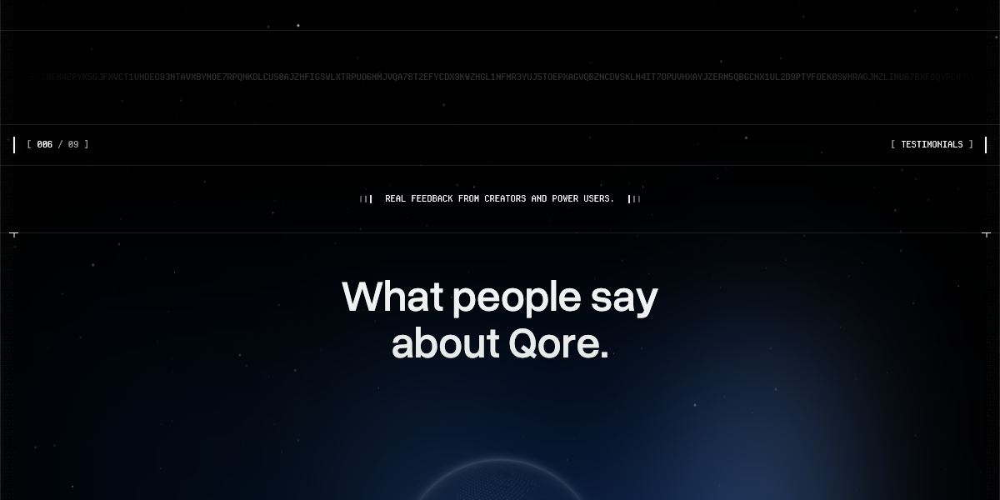
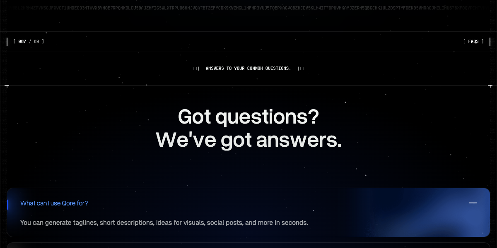
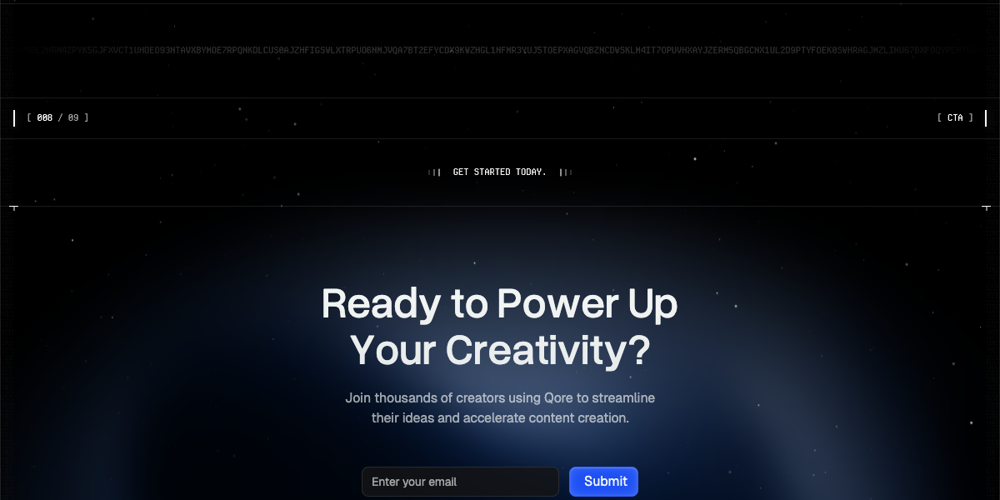

# UI Block (Shortcode)

UI Blocks, also known as Shortcodes, are small pieces of code that allow you to add predefined elements to your website.
They are used to enhance the functionality of your website without the need to write custom code.

## Usage

To use a shortcode, simply add the shortcode to the content of a page or post.

For example, to add a Hero section to the homepage, use the following button:

Search for the shortcode you want and click on the **use** button.

Then you can configure the block settings.

You can modify it as needed by clicking on that block in the editor and clicking on the pencil icon to edit.

## Available Shortcodes

Qore provides 15+ shortcodes for building your landing pages:

### 1. Hero

The main hero section featuring animated title with rotating text, AI prompt input, and brand logos.

**Configuration Options:**

| Field | Description |
|-------|-------------|
| Section Number | Display number (e.g., `01`) |
| Section Label | Section label (e.g., `HERO`) |
| Tagline | Small tagline text above title |
| Title Line 1 | First line of the main title |
| Title Line 2 | Second line of the main title |
| Subtitle | Description text below title |
| Rotating Texts | Repeatable items with prefix, icon, and text for rotating animation |
| Brand Counter Value | Number for brand counter |
| Brand Counter Label | Label for brand counter |
| Brand Images | Repeatable brand logo images |

### 2. Features

Tabbed features showcase with images and descriptions.

**Configuration Options:**

| Field | Description |
|-------|-------------|
| Section Number | Display number (e.g., `02`) |
| Section Label | Section label (e.g., `FEATURES`) |
| Tagline | Tagline text |
| Title | Section title |
| Subtitle | Section description |
| Items | Repeatable feature items with title, description, and image |

### 3. Benefits

Benefits cards grid with visual object decoration.

**Configuration Options:**

| Field | Description |
|-------|-------------|
| Section Number | Display number (e.g., `03`) |
| Section Label | Section label (e.g., `BENEFITS`) |
| Tagline | Tagline text |
| Title | Section title |
| Subtitle | Section description |
| Visual Object Image | Decorative image for the section |
| Items | Repeatable benefit items with icon image, icon class, title, and description |

### 4. How-To

Step-by-step guide with tabbed images showing how to use your product.

**Configuration Options:**

| Field | Description |
|-------|-------------|
| Section Number | Display number (e.g., `04`) |
| Section Label | Section label (e.g., `HOW TO USE`) |
| Tagline | Tagline text |
| Title | Section title |
| Items | Repeatable step items with number, title, description, and image |

### 5. Showcase

Use cases demo section displaying product capabilities.

**Configuration Options:**

| Field | Description |
|-------|-------------|
| Section Number | Display number (e.g., `04`) |
| Section Label | Section label (e.g., `USE CASES`) |
| Tagline | Tagline text |
| Title | Section title |
| Subtitle | Section description |
| Items | Repeatable items with image, title, description, and link URL |

### 6. Pricing

Pricing tiers section with feature lists and CTAs.

**Configuration Options:**

| Field | Description |
|-------|-------------|
| Section Number | Display number (e.g., `05`) |
| Section Label | Section label (e.g., `PRICING`) |
| Tagline | Tagline text |
| Title | Section title |
| Plans | Repeatable pricing plans with: |
| - name | Plan name (e.g., `Free`, `Pro`) |
| - price | Price value (e.g., `$0`, `$19`) |
| - price_suffix | Price suffix (e.g., `forever`, `per user / mo`) |
| - description | Plan description |
| - features | Features list (one per line) |
| - cta_text | CTA button text |
| - cta_link | CTA button link |
| - is_featured | Toggle for featured/highlighted plan |

### 7. Testimonials

Client testimonials carousel with social-style cards.

**Configuration Options:**

| Field | Description |
|-------|-------------|
| Section Number | Display number (e.g., `06`) |
| Section Label | Section label (e.g., `TESTIMONIALS`) |
| Tagline | Tagline text |
| Title | Section title |
| Items | Repeatable testimonials with name, handle, text content, and avatar image |

### 8. FAQ

Accordion-style FAQ section with collapsible answers.

**Configuration Options:**

| Field | Description |
|-------|-------------|
| Section Number | Display number (e.g., `07`) |
| Section Label | Section label (e.g., `FAQ`) |
| Tagline | Tagline text |
| Title | Section title |
| Subtitle | Innovation statement or subtitle |
| Style | Display style: `accordion` (collapsible) or `list` (two columns) |
| Items | Repeatable FAQ items with question and answer |

### 9. CTA (Call-to-Action)

Call-to-action section with optional newsletter form.

**Configuration Options:**

| Field | Description |
|-------|-------------|
| Section Number | Display number (e.g., `08`) |
| Section Label | Section label (e.g., `CTA`) |
| Tagline | Tagline text |
| Title | Section title |
| Subtitle | Section description |
| Show Newsletter | Toggle to show newsletter form (`yes`/`no`) |
| Newsletter Placeholder | Placeholder text for email input |
| Newsletter Button Text | Submit button text |
| Image | Bottom decorative image |

### 10. Brands

Partner logos displayed in an infinite carousel.

**Configuration Options:**

| Field | Description |
|-------|-------------|
| Title | Section title |
| Counter Value | Number for counter display |
| Counter Suffix | Suffix for counter (e.g., `+`, `K`) |
| Images | Repeatable brand images with alt text |

### 11. Stats

Counter statistics section with animated numbers.

**Configuration Options:**

| Field | Description |
|-------|-------------|
| Items | Repeatable stat items with value, suffix, and label |

### 12. Hero About

About page hero section with title, image, and rating display.

**Configuration Options:**

| Field | Description |
|-------|-------------|
| Title | Page title |
| Subtitle | Page description |
| Image | Hero image |
| Caption | Caption text (e.g., `ABOUT QORE`) |
| Rating Value | Rating number (e.g., `4.9`) |
| Rating Total | Rating maximum (e.g., `5.0`) |
| Review Count | Number of reviews (e.g., `10,000+`) |
| Review Text | Review label text |
| Brand Images | Repeatable brand logo images |

### 13. Teams

Team member grid with photos and positions.

**Configuration Options:**

| Field | Description |
|-------|-------------|
| Title | Section title |
| Items | Repeatable team members with name, position, image, and link URL |

### 14. Contact Info

Contact information cards with icons.

**Configuration Options:**

| Field | Description |
|-------|-------------|
| Title | Section title |
| Items | Repeatable contact cards with icon image, title, description, button text, and button link |

### 15. Contact Map

Google Maps embed section.

**Configuration Options:**

| Field | Description |
|-------|-------------|
| Map URL | Google Maps embed URL (iframe src) |

### 16. Contact Form

Contact form with company information sidebar.

**Configuration Options:**

| Field | Description |
|-------|-------------|
| Title | Form title |
| Office Label | Office section label |
| Office Address | Office address text |
| Email Label | Email section label |
| Email | Contact email address |
| Phone Label | Phone section label |
| Phone | Contact phone number |

## Animation Classes

Qore uses WOW.js for scroll-triggered animations. Common animation classes used:

| Class | Effect |
|-------|--------|
| `wow fadeInUp` | Fade in from bottom |
| `wow bounceInScale` | Bounce in with scale |
| `wow fadeIn` | Simple fade in |

## Hacker Text Effect

Several sections feature a "hacker text" transformation effect on labels. This creates a typing/scrambling animation using the `hacker-text_transform` class.

## Lazy Loading

All shortcodes support lazy loading through the `withLazyLoading()` method. Sections load their content when scrolled into view, improving initial page load performance.
