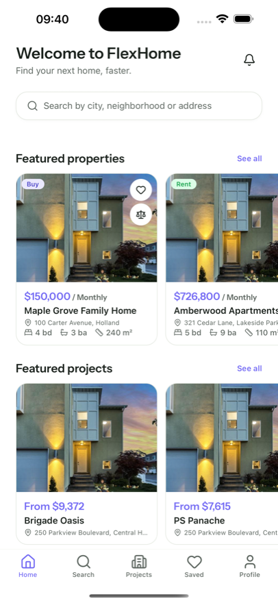
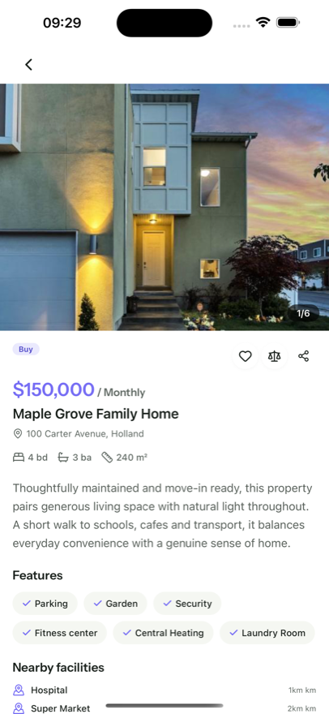

# FlexHome: React Native Property Inquiry & Agent App

A React Native (Expo SDK 54) mobile app for property inquiry and property agent businesses. It is the mobile client for a **Botble real-estate backend** with the `/api/v1` plugin enabled. The codebase is a zero-brand-literal whitelabel solution — rebrand entirely via `.env` (app name, bundle ID, API URL, colors). One codebase builds both iOS and Android. Consumers browse properties, submit inquiries to agents, view favorites, and manage their account, all driven live from your Botble admin. Agents access a WebView-based dashboard for listings, leads, and packages.

<!-- Screenshot gallery (placeholder - add real screenshots from simulator to images/ directory)

  
  
  

-->

## Demo video

A full walkthrough of the app: home, search with filters, property detail gallery, inquiry form, saved properties,
agent reviews, and dark mode.

  <iframe src="https://www.youtube-nocookie.com/embed/1S6liILg5ls?rel=0"
          title="FlexHome React Native app demo"
          style="position:absolute; top:0; left:0; width:100%; height:100%; border:0;"
          allow="accelerometer; autoplay; clipboard-write; encrypted-media; gyroscope; picture-in-picture"
          allowfullscreen></iframe>

[Watch on YouTube](https://youtu.be/1S6liILg5ls)

## Get started

1. [Overview](overview.md)
2. [Installation](installation.md)
3. [Configuration](configuration.md)
4. [Complete Setup & Publishing Guide](complete-setup-and-publishing-guide.md)

## Customize the app

| Topic | Guide |
|---|---|
| Theme colors | [01_theme_colors.md](01_theme_colors.md) |
| App font | [02_app_font.md](02_app_font.md) |
| App name | [04_app_name.md](04_app_name.md) |
| Logo and icons | [05_app_logo.md](05_app_logo.md) |
| API URL & key | [06_api_base_url.md](06_api_base_url.md) |
| Translations | [07_translations.md](07_translations.md) |

## Screens

- [Profile links](11_profile_links.md)
- [Splash screen](17_splash_screen.md)
- [Loading screen](18_loading_screen.md)
- [Version management](10_version_management.md)

## Build & deploy

- [Running the app](08_running_app.md)
- [Deploying to stores](09_deploying_app.md)
- [Push notifications](push_notifications.md)

## Social login

- [Google](14_google_login_setup.md)
- [Apple](13_apple_login_setup.md)
- [Facebook](15_facebook_login_setup.md)
- [Enable / disable providers](16_social_login_configuration.md)

## Feature list

- **Consumer**: Browse properties, search & filter (price, type, location), property detail with gallery, mortgage calculator
- **Inquiry system**: Contact agent form, inquiry follow-up tracking, agent reviews & ratings
- **Favorites**: Server-backed wishlist with optimistic toggle
- **Saved properties**: Compare multiple properties side-by-side
- **Agents directory**: Browse agents, agent detail (listings, reviews)
- **Blog**: Articles and news from Botble blog plugin
- **Agent portal**: WebView-based dashboard for agent listings, inquiries, packages, and commissions
- **Notifications**: Push notifications (FCM), in-app inbox with unread badges
- **Localization**: 4 languages (English, Vietnamese, Arabic, French) with RTL support
- **Dark mode**: Light / dark / system theme
- **Auth**: Email/password, social login (Google, Apple, Facebook), biometric unlock

## Tech stack

- React Native + Expo SDK 54
- TypeScript (strict)
- Expo Router v6 (file-based routing)
- React Query + Context API
- NativeWind (Tailwind for React Native)
- react-i18next + RTL support
- expo-secure-store

## Reference

- [API Integration](api-integration.md)
- [Development Guide](development.md)
- [Upgrade Guide](upgrade.md)
- [Troubleshooting](troubleshooting.md)
- [FAQ](faq.md)
- [Support](support.md)
- [Release notes](releases.md)

## Resources

- **Documentation**: https://docs.botble.com/real-estate-mobile-apps
- **Backend required**: Botble real-estate system with `/api/v1` plugin enabled
- **Whitelabel**: Zero brand literals; rebrand entirely via `.env` (see [Configuration](configuration.md))
- **API Guide**: [API Integration](api-integration.md)
- **Support**: https://botble.ticksy.com
- **Contact**: contact@botble.com
