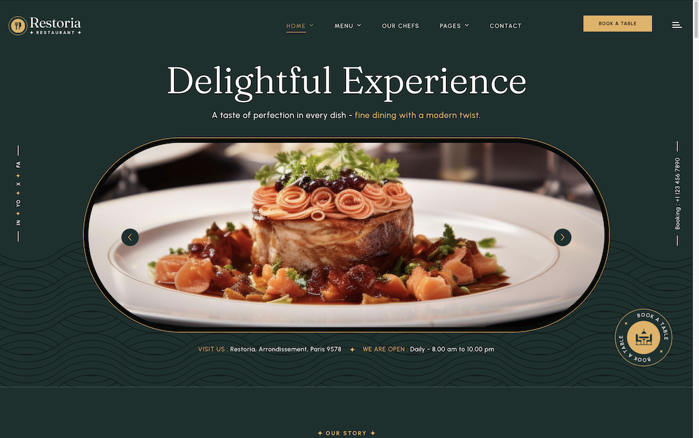

# Restoria - Restaurant Management Theme

## Introduction

Restoria is a premium, multi-page theme crafted exclusively for the food and hospitality industry. Built on Botble CMS, it provides a comprehensive solution for restaurants, cafés, bakeries, bars, catering services, and culinary professionals looking to establish a strong digital presence.

Whether you're running a fine dining establishment, a cozy café, or a bustling food delivery service, Restoria offers the perfect blend of style and functionality. With its modern, clean, and elegant aesthetic, it ensures a seamless user experience that impresses visitors and drives engagement.

Built on the powerful Bootstrap Grid System and leveraging the flexibility of Botble CMS, Restoria delivers fully responsive layouts that look flawless across all devices - from desktops to tablets and mobile phones.

Released Date: **August 22, 2025**

Author: **[Botble Technologies](https://botble.com)**

Email: **contact@botble.com**

Thank you for purchasing our product. If you have any questions that are beyond the scope of this help file, please feel
free to email via our user page contact form [here](https://codecanyon.net/user/botble) for quick support. Thank you
so much!

## Features Overview

* Buy One Time & Get Free Updates Forever
* **Free Theme Installation** – If you face any problem during installation – we will help you and it's FREE
* Bootstrap 5.x Framework: The most popular HTML, CSS, and JS framework for developing responsive, mobile-first projects
* Based on our Botble CMS (using modern Laravel framework) which is used by thousands of customers
* **5 Different Homepage Variations:**
  - Main Homepage (Minimal Hero)
  - Standard Hero
  - Video Hero
  - Category Hero
  - Rolling Images Hero
* **5 Menu Layout Styles** to showcase your culinary offerings beautifully
* **3 Reservation Form Styles** for flexible online table booking
* **Chef Portfolio Pages** to highlight your culinary team
* **Gallery Sections** for showcasing ambiance and dishes
* Touch Friendly: Easy browsing on touch devices
* 100% Fully Responsive: Perfect display on any device
* Powerful admin panel with no hardcoding required
* Clean and modern design from our design experts
* Easy installation with UI - [How to install a script based on Botble CMS](https://www.youtube.com/watch?v=Ox2WgQqOQoQ)
* Multi-language: unlimited language support
* Google Analytics integration
* Translation tool for easy localization
* Right To Left (RTL) language support
* SEO Optimized structure
* Fast support: we always reply to your ticket within 1 business day

## Perfect For

* Restaurants & Fine Dining
* Cafés & Coffee Shops
* Bakeries & Patisseries
* Bars & Pubs
* Food Delivery Services
* Catering Services
* Personal Chef Portfolios
* Fast Food Chains
* Food Trucks
* Any food & hospitality business

<iframe width="560" height="315" src="https://www.youtube.com/embed/iam99NkUIu0?si=TgMuYk1FXBulO3P9" title="YouTube video player" frameborder="0" allow="accelerometer; autoplay; clipboard-write; encrypted-media; gyroscope; picture-in-picture; web-share" referrerpolicy="strict-origin-when-cross-origin" allowfullscreen></iframe>

## Demo

* Homepage: https://restoria.botble.com
* Admin panel: https://restoria.botble.com/admin
* Admin account: `admin` – `12345678` (username & password are autofilled)

### Homepage Variations

1. **Main Homepage**: https://restoria.botble.com
2. **Standard Hero**: https://restoria.botble.com/home-standard-hero
3. **Video Hero**: https://restoria.botble.com/home-video-hero
4. **Category Hero**: https://restoria.botble.com/home-category-hero
5. **Rolling Images Hero**: https://restoria.botble.com/home-rolling-images-hero

## Botble Team

For more about our team, visit us at https://botble.com.