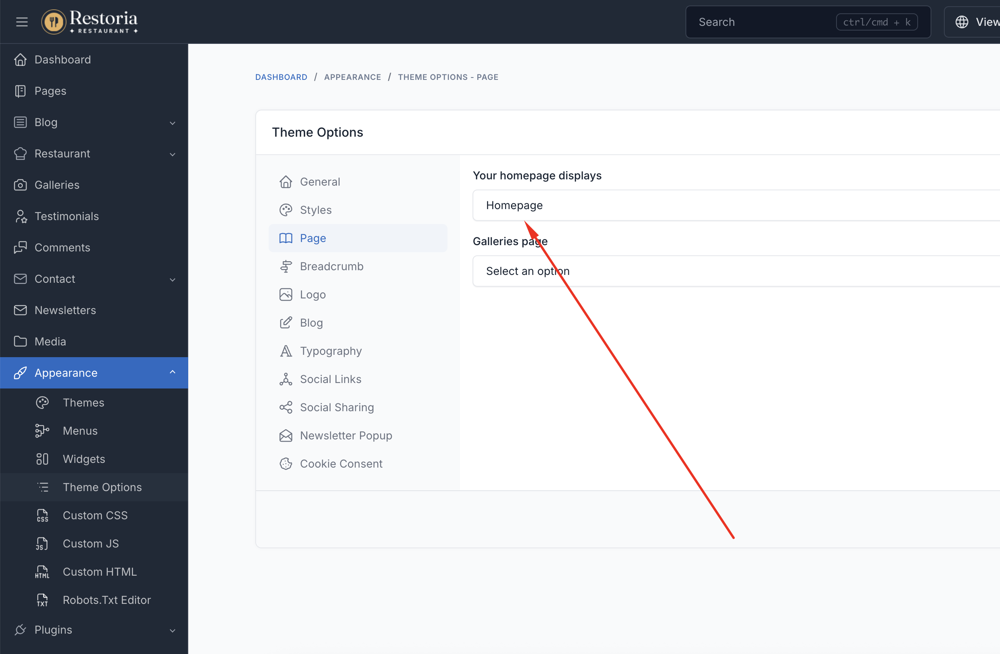

# Homepage

Homepage is the first page that users see when they visit your restaurant website. It sets the tone for your entire online presence and showcases your restaurant's atmosphere, cuisine, and unique offerings.

## Homepage Variations

Restoria comes with 5 stunning homepage variations to match your restaurant's style:

1. **Main Homepage (Minimal Hero)** - Clean and minimalist design focusing on your key message
2. **Standard Hero** - Classic slider hero section with rotating images
3. **Video Hero** - Immersive video background showcasing your restaurant ambiance
4. **Category Hero** - Highlight your menu categories prominently
5. **Rolling Images Hero** - Dynamic rolling image gallery effect

## Create Homepage

If you are using the sample data of **Restoria**, all homepage variations are already created for you.

They are located in Admin -> Pages. You can skip this step if using sample data.

To create a new homepage, in admin panel, go to `Pages` and click on `Create` button.

In the `Create new page` page, fill in the following fields:

- **Title**: Enter the title of the page. For example, `Home` or `Home - Video Hero`.
- **Permalink**: You can customize this permalink. The main homepage permalink should be `/`.
- **Content**: You have the option to customize the content or utilize our pre-defined [UI Block](./usage-ui-block.md).
- **Template**: Select `Homepage` or the appropriate homepage template variant.
- Other fields are optional, you can fill them if you want.

## Setup Homepage

After creating the homepage, you need to set it as the homepage of your website.

In admin panel, go to `Appearance` -> `Theme Options` -> `Page`, and select the homepage you want to use in
the `Your homepage displays` field.

::: tip
If you are using the sample data of **Restoria**, the homepage is already created and set up for you.
:::

## Customize Homepage

Please go to Admin -> Pages -> Homepage, and edit the homepage content.

The homepage can be customized using UI Blocks specifically designed for restaurants:

### Essential Restaurant Sections

- **Hero Banner** - Showcase your restaurant with stunning visuals
- **About Section** - Tell your restaurant's story
- **Menu Preview** - Display featured dishes and categories
- **Reservation Form** - Allow customers to book tables online
- **Chef Team** - Introduce your culinary team
- **Gallery** - Showcase your dishes and ambiance
- **Testimonials** - Display customer reviews
- **Special Offers** - Highlight promotions and events
- **Contact Information** - Display location, hours, and contact details

A complete list of available shortcodes can be found in [UI Block](./usage-ui-block.md#available-shortcodes).
