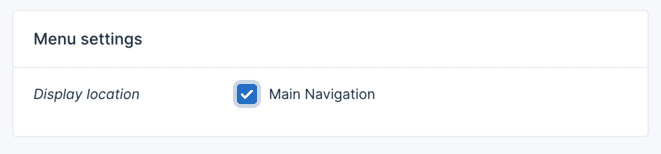

# Menu

Menus are essential for restaurant website navigation. Restoria provides powerful menu management tools specifically designed for restaurants, allowing you to create both navigation menus and food menus.

## Navigation Menus

Manage your website navigation from **Appearance** → **Menus** in the admin panel.


### Creating a Navigation Menu

1. Click the **Create** button
2. Enter a menu name (e.g., "Main Menu", "Footer Menu")
3. Click **Save** to create the menu


### Adding Menu Items

Add items to your menu by selecting from the left panel:

1. **Custom Links**: External URLs or anchor links
2. **Pages**: Your website pages
3. **Menu Categories**: Food menu categories
4. **Blog Categories**: News and events categories
5. **Reservation Link**: Direct booking link


### Organizing Menu Structure

Create multi-level menus with drag-and-drop:

- **Drag items** to reorder
- **Indent items** to create sub-menus
- **Click arrow** to expand item settings
- **Remove** items with the delete button


### Menu Locations

Restoria offers multiple menu locations:

1. **Main Navigation**: Primary header menu
2. **Mobile Menu**: Separate mobile navigation
3. **Footer Menu**: Footer links
4. **Social Menu**: Social media icons
5. **Quick Links**: Sidebar quick access

To assign a menu location:
1. Select your menu
2. Check the desired location in **Display location**
3. Save your menu



## Restaurant Food Menus

Manage your food menus separately from navigation menus.

### Creating Food Menu Categories

Navigate to **Restaurant** → **Menu Categories**:

1. Click **Create** to add a new category
2. Fill in category details:
   - **Name**: Category name (e.g., "Appetizers")
   - **Description**: Brief category description
   - **Icon**: Optional category icon
   - **Order**: Display order (lower numbers first)
   - **Featured**: Mark as featured category

### Adding Menu Items

Go to **Restaurant** → **Menu Items**:

1. Click **Create** to add a dish
2. Enter dish information:
   - **Name**: Dish name
   - **Description**: Detailed description
   - **Price**: Regular price
   - **Special Price**: Promotional price (optional)
   - **Category**: Select category
   - **Image**: Dish photo
   - **Dietary Info**: Vegetarian, vegan, gluten-free, etc.
   - **Allergens**: List allergens
   - **Calories**: Nutritional information
   - **Featured**: Highlight special items

### Menu Display Options

Configure how menus appear on your website:

#### Layout Styles
- **Classic List**: Traditional menu format
- **Grid View**: Visual card layout
- **Tabbed**: Category tabs
- **Accordion**: Collapsible sections
- **PDF Menu**: Downloadable version

#### Display Settings
- **Show Prices**: Display/hide pricing
- **Show Images**: Include dish photos
- **Show Descriptions**: Full or truncated
- **Show Dietary Icons**: Visual indicators
- **Show Nutrition**: Calorie information

## Special Menu Features

### Daily Specials

Create rotating daily specials:

1. Go to **Restaurant** → **Daily Specials**
2. Select day of the week
3. Choose menu items or create new
4. Set special pricing
5. Add "Today's Special" badge

### Seasonal Menus

Manage seasonal menu variations:

1. Create menu categories for seasons
2. Set date ranges for availability
3. Auto-switch based on dates
4. Archive past seasonal items

### Wine & Beverage Lists

Special formatting for drinks:

1. Create beverage categories
2. Add wine pairing suggestions
3. Include vintage years
4. Display by glass/bottle pricing

### Chef's Recommendations

Highlight signature dishes:

1. Mark items as "Chef's Choice"
2. Add chef's notes
3. Display prominently
4. Include preparation details

## Menu Customization

### Styling Options

Customize menu appearance in **Theme Options** → **Menu Style**:

- **Font Family**: Menu text font
- **Font Size**: Text sizes
- **Colors**: Text and background colors
- **Spacing**: Item padding and margins
- **Borders**: Separator styles
- **Icons**: Custom category icons

### Custom CSS

Add custom styling for unique designs:

```css
/* Custom menu item styling */
.food-menu-item {
    border-bottom: 1px dotted #ccc;
    padding: 20px 0;
}

.menu-item-name {
    font-family: 'Playfair Display', serif;
    font-size: 20px;
    color: #333;
}

.menu-item-price {
    color: #d4af37;
    font-weight: bold;
}

.dietary-icon {
    width: 20px;
    height: 20px;
    margin-left: 5px;
}
```

### Menu Translations

For multi-language restaurants:

1. Enable multi-language in settings
2. Translate menu items and descriptions
3. Set language-specific pricing
4. Configure language switcher

## Best Practices

### Menu Organization

1. **Logical Categories**: Group similar items together
2. **Clear Naming**: Use descriptive, appetizing names
3. **Concise Descriptions**: 2-3 lines maximum
4. **Price Clarity**: Display prices consistently
5. **Visual Hierarchy**: Highlight specials and popular items

### Photography Tips

1. **Professional Photos**: High-quality food photography
2. **Consistent Style**: Uniform image treatment
3. **Optimized Size**: Compress for web (max 500KB)
4. **Alt Text**: Describe dishes for accessibility

### Update Frequency

1. **Price Updates**: Keep pricing current
2. **Seasonal Changes**: Update seasonal items
3. **Availability**: Mark out-of-stock items
4. **Specials**: Rotate daily/weekly specials

### Mobile Optimization

1. **Responsive Design**: Test on all devices
2. **Touch-Friendly**: Adequate tap targets
3. **Quick Loading**: Optimize for mobile networks
4. **Easy Navigation**: Simple category access

## Integration Features

### Online Ordering

Connect menu to ordering system:

1. Enable online ordering in settings
2. Set delivery/pickup options
3. Configure payment methods
4. Set minimum order amounts
5. Define delivery zones

### QR Code Menus

Generate QR codes for contactless dining:

1. Go to **Restaurant** → **QR Menus**
2. Generate QR code for menu
3. Customize QR design
4. Print table tents
5. Track QR scans

### POS Integration

Sync with point-of-sale systems:

1. Connect POS provider
2. Map menu items
3. Sync pricing and availability
4. Update in real-time

## Analytics & Insights

### Menu Performance

Track menu metrics:

- **Popular Items**: Most viewed/ordered dishes
- **Category Performance**: Best-performing sections
- **Price Points**: Optimal pricing analysis
- **View Time**: How long users browse

### A/B Testing

Test menu variations:

1. Create menu versions
2. Split test layouts
3. Compare conversion rates
4. Optimize based on data

## Troubleshooting

### Common Issues

**Menu Not Displaying**
- Check menu is assigned to location
- Verify menu has items
- Clear cache after changes

**Styling Issues**
- Check theme compatibility
- Review custom CSS conflicts
- Verify responsive settings

**Performance Problems**
- Optimize menu images
- Enable lazy loading
- Reduce menu items per page

**Translation Issues**
- Verify language files
- Check translation completeness
- Clear language cache

### Menu Backup

Always backup before major changes:

1. Export menu structure
2. Save menu content
3. Document custom settings
4. Test restore process

::: tip
Regularly review and update your menus to ensure accuracy. Consider seasonal updates and monitor which items perform best through analytics.
:::