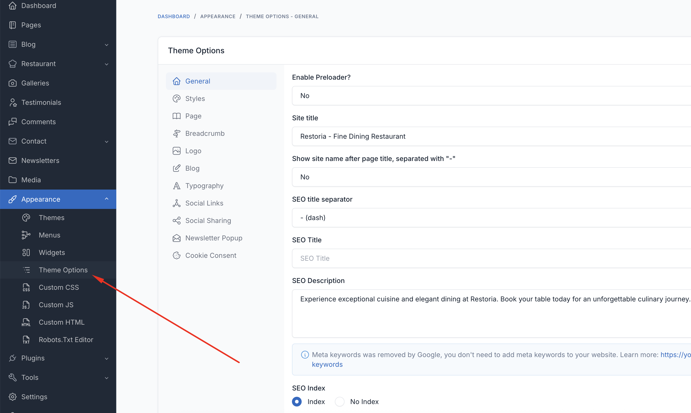
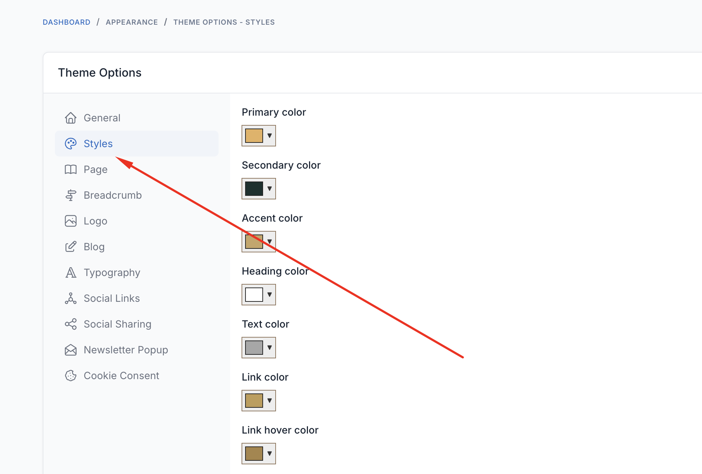
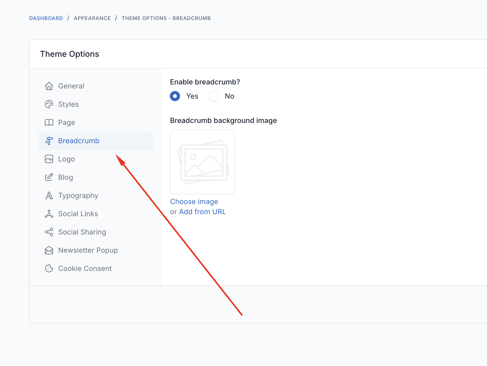

# Theme Options

Theme options allow you to customize every aspect of your Restoria restaurant website without touching any code. Access these settings through **Appearance** → **Theme Options** in your admin panel.

## General Settings

The General tab contains fundamental settings for your restaurant website.

### Site Identity
- **Restaurant Name**: Your restaurant's official name
- **Tagline**: A brief description or slogan
- **Logo**: Upload your restaurant logo (recommended: 200x60px)
- **Favicon**: Small icon for browser tabs (32x32px)

### Contact Information
- **Phone Number**: Primary contact number
- **Email**: Contact email address
- **Address**: Full restaurant address
- **Business Hours**: Operating hours display format

### Social Media
- **Facebook URL**: Link to Facebook page
- **Instagram URL**: Link to Instagram profile
- **Twitter URL**: Link to Twitter account
- **TripAdvisor URL**: Link to TripAdvisor listing
- **Yelp URL**: Link to Yelp business page

## Header

Customize your website's header appearance and functionality.

### Header Style
- **Header Layout**: Choose from 5 different header layouts
  - Classic: Traditional navigation with logo left
  - Centered: Logo centered with split navigation
  - Transparent: Overlay header for hero sections
  - Minimal: Clean, simple navigation
  - Restaurant: Special layout with reservation button

### Sticky Header
- **Enable Sticky Header**: Keep navigation visible while scrolling
- **Sticky Header Style**: Choose sticky behavior (always/on scroll up)
- **Mobile Sticky**: Enable/disable for mobile devices

### Header Elements
- **Show Reservation Button**: Display prominent reservation CTA
- **Show Phone Number**: Display contact number in header
- **Show Business Hours**: Show current open/closed status
- **Show Social Icons**: Display social media links

### Header Colors
- **Background Color**: Header background color
- **Text Color**: Navigation text color
- **Hover Color**: Link hover color
- **Transparent Header Text**: Color for transparent header mode

## Footer

Configure your website footer with restaurant-specific information.

### Footer Layout
- **Footer Style**: Choose from 4 footer layouts
  - Classic: Traditional multi-column layout
  - Minimal: Simple centered footer
  - Restaurant: Special layout with hours and map
  - Newsletter: Includes newsletter signup

### Footer Content
- **About Text**: Brief description for footer
- **Show Newsletter**: Enable newsletter subscription
- **Show Reservation Form**: Mini reservation form in footer
- **Show Map**: Embedded Google Maps
- **Show Instagram Feed**: Display latest Instagram posts

### Footer Widgets
- **Widget Columns**: Number of widget columns (2-4)
- **Show Operating Hours**: Display business hours
- **Show Contact Info**: Display contact details
- **Show Menu Links**: Quick links to menu sections

### Footer Colors
- **Background Color**: Footer background
- **Text Color**: Footer text color
- **Heading Color**: Widget heading colors
- **Border Color**: Separator line colors

## Restaurant Settings

Specialized settings for restaurant functionality.

### Menu Display
- **Menu Layout**: Choose menu page layout
  - Single Column: Traditional list view
  - Two Columns: Split menu display
  - Tabbed: Category tabs
  - Accordion: Expandable categories
- **Show Prices**: Display/hide prices
- **Show Dietary Icons**: Vegetarian, vegan, gluten-free indicators
- **Show Allergen Info**: Display allergen information
- **Currency Symbol**: Set currency for prices
- **Currency Position**: Before/after price

### Reservation System
- **Enable Online Reservations**: Activate booking system
- **Minimum Party Size**: Smallest group size
- **Maximum Party Size**: Largest group size
- **Time Slot Duration**: Booking interval (15/30/60 minutes)
- **Advance Booking Days**: How far ahead customers can book
- **Confirmation Required**: Manual/automatic confirmation
- **Email Notifications**: Send booking confirmations

### Operating Hours
Set your restaurant's operating hours for each day:
- Monday - Sunday: Open/Close times
- **Special Hours**: Holiday schedules
- **Closed Days**: Regular closing days
- **Timezone**: Restaurant timezone

## Styles

Customize the visual appearance of your restaurant website.

### Color Scheme
- **Primary Color**: Main brand color
- **Secondary Color**: Accent color
- **Text Color**: Body text color
- **Heading Color**: Titles and headings
- **Link Color**: Hyperlink color

### Predefined Palettes
Choose from restaurant-themed color schemes:
- **Elegant Gold**: Luxury dining aesthetic
- **Rustic Brown**: Cozy, traditional feel
- **Modern Black**: Contemporary fine dining
- **Fresh Green**: Organic, healthy focus
- **Ocean Blue**: Seafood restaurant theme

### Background Settings
- **Body Background**: Color or pattern
- **Content Background**: Main content area
- **Menu Background**: Menu section styling
- **Pattern Overlay**: Decorative patterns

### Effects & Animations
- **Enable Animations**: Page element animations
- **Parallax Effects**: Background scrolling effects
- **Image Hover Effects**: Gallery and menu image effects
- **Loading Animation**: Page load effects

## Typography

Control fonts and text styling throughout your website.

### Font Families
- **Primary Font**: Main body text font
- **Heading Font**: Titles and headings
- **Menu Font**: Special font for menu items
- **Decorative Font**: Accent text (quotes, special sections)

### Font Sizes
- **Body Text**: Base font size (14-18px recommended)
- **H1 - H6**: Heading sizes
- **Menu Title**: Menu item name size
- **Menu Description**: Item description size
- **Menu Price**: Price display size

### Font Weights & Styles
- **Regular Weight**: Normal text (300-400)
- **Bold Weight**: Strong text (600-700)
- **Line Height**: Text spacing (1.4-1.8)
- **Letter Spacing**: Character spacing

## Pages

Configure special pages and their display settings.

### Homepage Settings
- **Homepage Layout**: Select active homepage variation
- **Hero Section**: Configure hero banner settings
- **Featured Sections**: Choose which sections to display
- **Section Order**: Drag to reorder homepage sections

### Menu Page
- **Menu Page**: Select your menu page
- **Menu Categories Order**: Arrange category display
- **Featured Items**: Highlight special dishes
- **Daily Specials**: Enable daily specials section

### Reservation Page
- **Reservation Page**: Select booking page
- **Form Fields**: Choose required/optional fields
- **Terms & Conditions**: Add booking terms
- **Confirmation Page**: Thank you page after booking

### Gallery Page
- **Gallery Page**: Select gallery page
- **Gallery Layout**: Grid/Masonry/Slider
- **Images Per Page**: Pagination settings
- **Lightbox**: Enable image lightbox

## Breadcrumbs

Configure breadcrumb navigation for better user experience.

### Breadcrumb Settings
- **Enable Breadcrumbs**: Show/hide breadcrumbs
- **Show on Homepage**: Display on homepage
- **Breadcrumb Style**: Visual style options
- **Separator**: Character between items (/, >, •)

### Breadcrumb Background
- **Background Type**: Color/Image/Pattern
- **Background Image**: Upload custom background
- **Overlay Color**: Semi-transparent overlay
- **Text Color**: Breadcrumb text color

## SEO & Marketing

Optimize your restaurant website for search engines.

### SEO Settings
- **Meta Description**: Default site description
- **Keywords**: Restaurant-related keywords
- **Schema Markup**: Enable restaurant schema
- **Open Graph**: Social media preview settings

### Marketing Tools
- **Google Analytics ID**: Track website visitors
- **Facebook Pixel**: Facebook advertising tracking
- **Newsletter Provider**: MailChimp/SendGrid integration
- **Review Widgets**: TripAdvisor/Yelp integration

## Advanced Settings

### Performance
- **Lazy Loading**: Defer image loading
- **Minify CSS/JS**: Compress assets
- **Cache Duration**: Browser cache settings
- **CDN URL**: Content delivery network

### Custom Code
- **Custom CSS**: Additional styling
- **Custom JavaScript**: Extra functionality
- **Header Code**: Analytics, fonts, etc.
- **Footer Code**: Tracking scripts

### Maintenance Mode
- **Enable Maintenance**: Temporarily close site
- **Maintenance Message**: Custom message
- **Bypass for Admins**: Allow admin access
- **Expected Return**: When site reopens

## Import/Export Settings

### Backup Settings
- **Export Settings**: Download configuration
- **Import Settings**: Restore from backup
- **Reset to Default**: Restore original settings

### Demo Import
- **Import Demo Content**: Load sample data
- **Select Demo**: Choose restaurant type
- **Import Options**: Select what to import

## Tips for Restaurant Websites

### Essential Settings
1. **Contact Information**: Always visible and accurate
2. **Operating Hours**: Keep updated, especially holidays
3. **Menu Prices**: Ensure prices are current
4. **Reservation System**: Test booking flow regularly

### Visual Impact
1. **High-Quality Images**: Use professional food photography
2. **Brand Colors**: Consistent with restaurant branding
3. **Readable Fonts**: Clear menu text is crucial
4. **Mobile Responsive**: Most users browse on phones

### User Experience
1. **Fast Loading**: Optimize images and enable caching
2. **Easy Navigation**: Simple menu structure
3. **Clear CTAs**: Make reservations and contact prominent
4. **Accessibility**: Ensure site is usable for all visitors

::: tip
Save your settings regularly and create backups before making major changes. Test all changes on different devices to ensure consistency.
:::