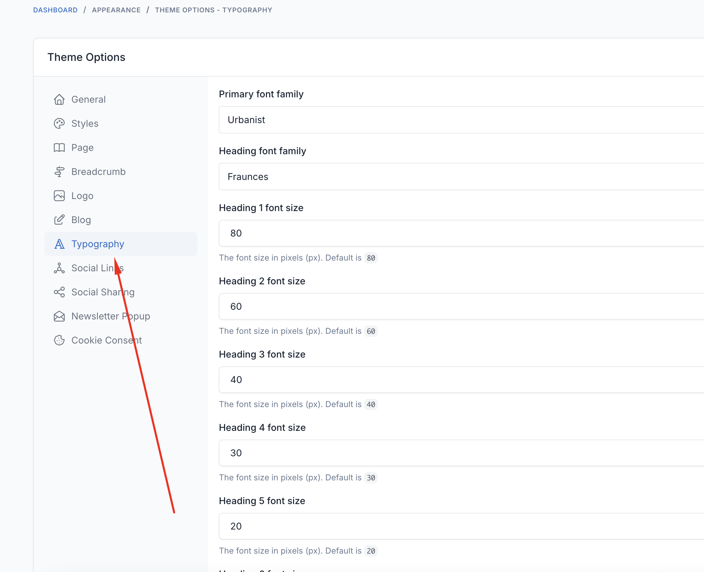

# Theme Options

Theme options allow you to customize every aspect of your Restoria restaurant website without touching any code. Access these settings through **Appearance** → **Theme Options** in your admin panel.

## Styles

Customize the visual appearance of your restaurant website.

### Color Scheme
- **Primary Color**: Main brand color
- **Secondary Color**: Accent color
- **Text Color**: Body text color
- **Heading Color**: Titles and headings
- **Link Color**: Hyperlink color

## Typography

Control fonts and text styling throughout your website.

### Font Families
- **Primary Font**: Main body text font
- **Heading Font**: Titles and headings

### Font Sizes
- **Body Text**: Base font size (14-18px recommended)
- **H1 - H6**: Heading sizes

## Breadcrumbs

Configure breadcrumb navigation for better user experience.

### Breadcrumb Settings
- **Enable Breadcrumbs**: Show/hide breadcrumbs
- **Background Image**: Upload custom background

