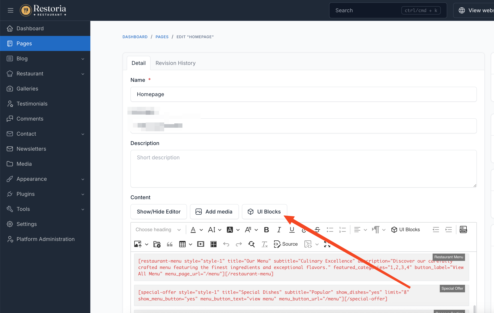
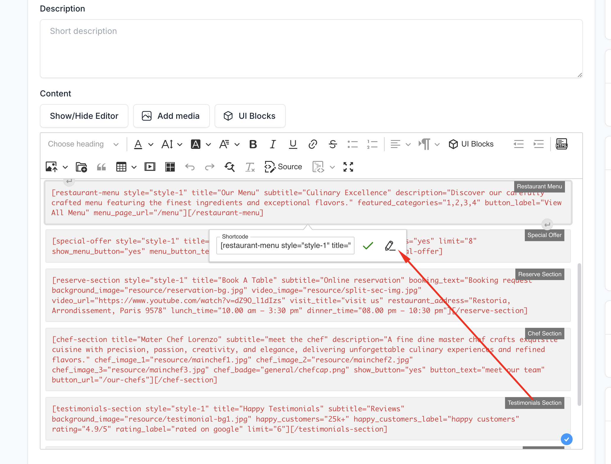

# UI Block

UI Blocks are pre-designed content sections that help you build beautiful restaurant pages quickly. Restoria provides specialized shortcodes tailored for the food and hospitality industry.

## How to Use UI Blocks

### Adding UI Blocks to Pages

1. Navigate to **Pages** in your admin panel
2. Create a new page or edit an existing one
3. Click the **UI Block** button in the editor
4. Select the desired shortcode from the list
5. Configure the shortcode settings
6. Click **Insert** to add it to your page

### Editing UI Blocks

To modify an existing UI block:

1. Click on the shortcode in the editor
2. Select **Edit** from the toolbar
3. Update the settings as needed
4. Click **Update** to save changes

