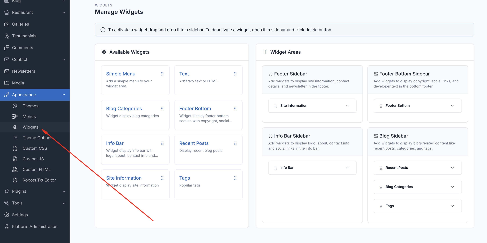
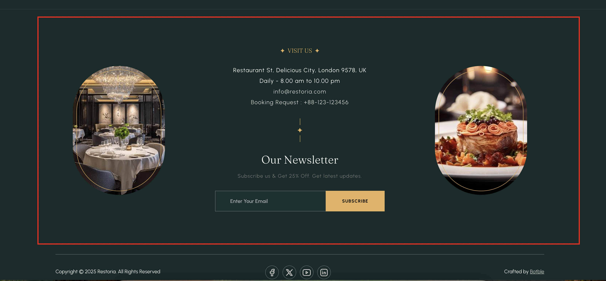
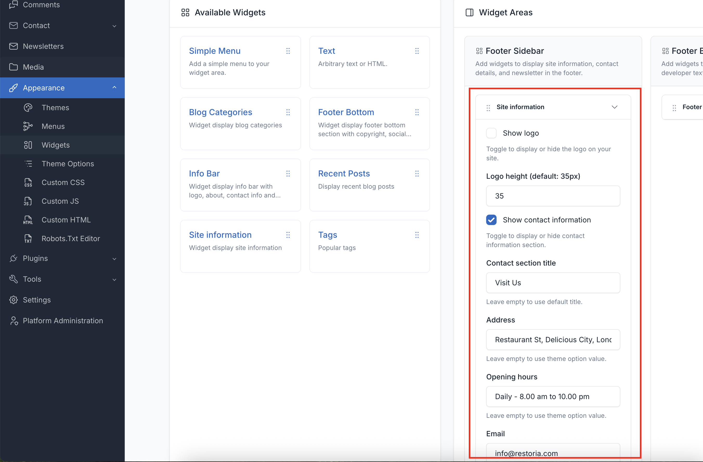
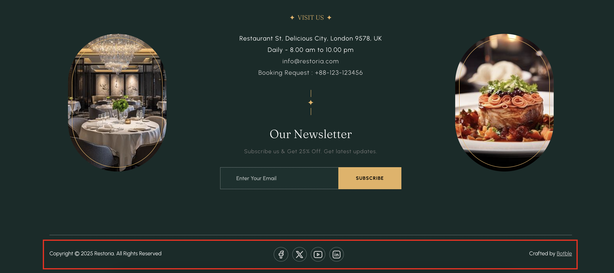
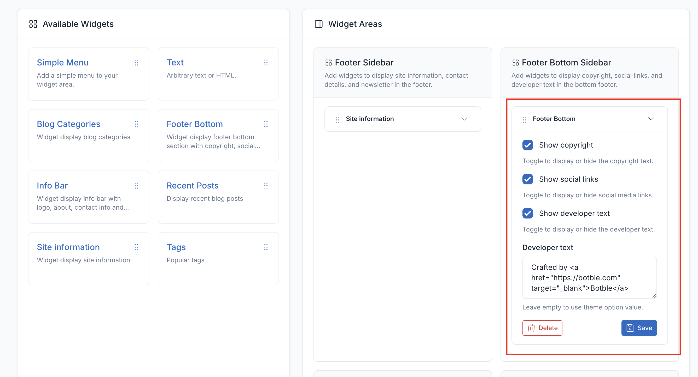
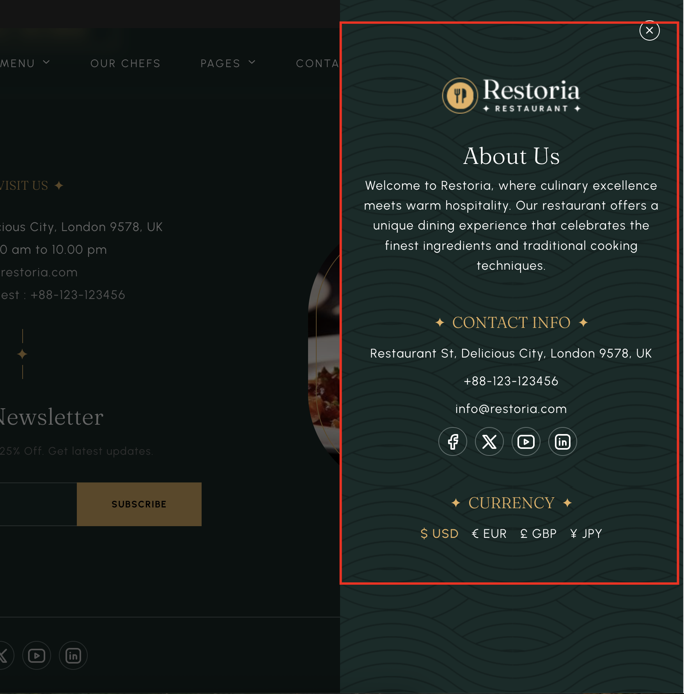
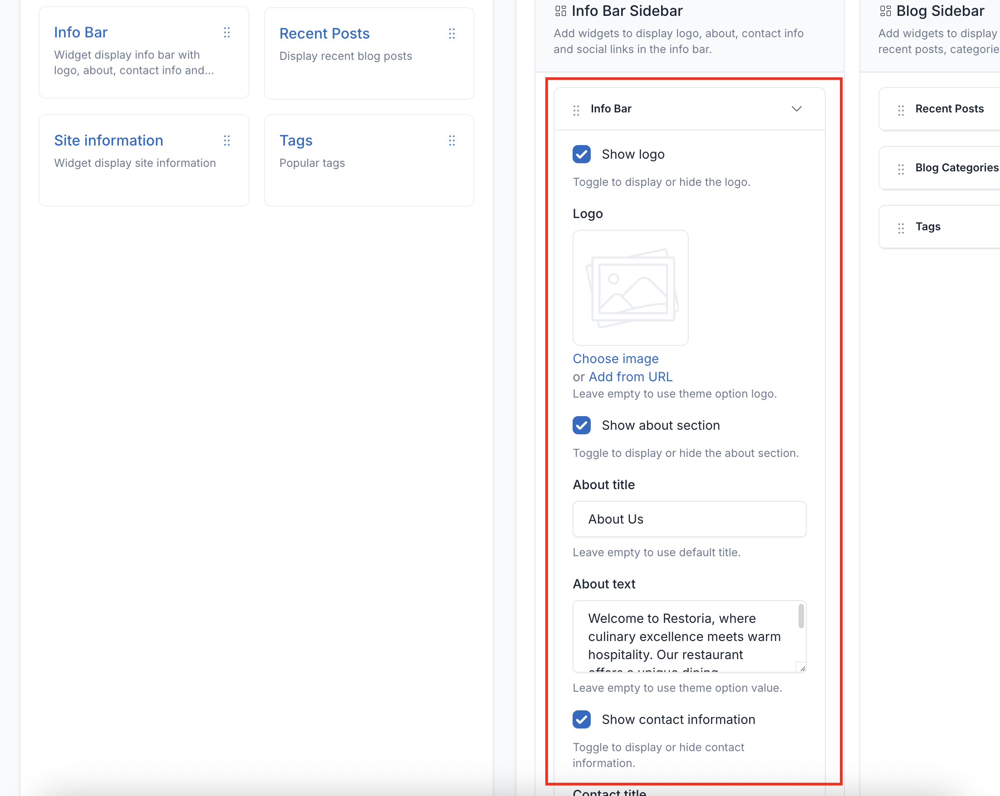
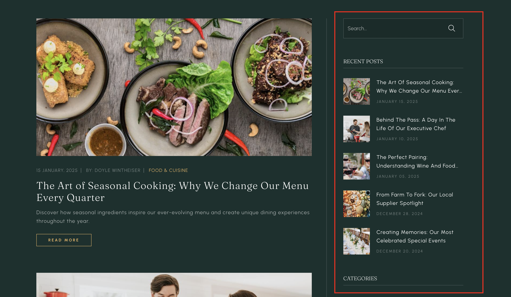
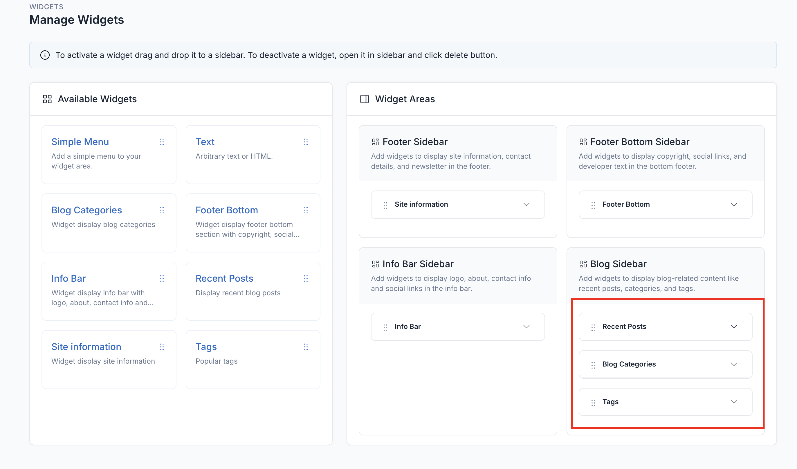
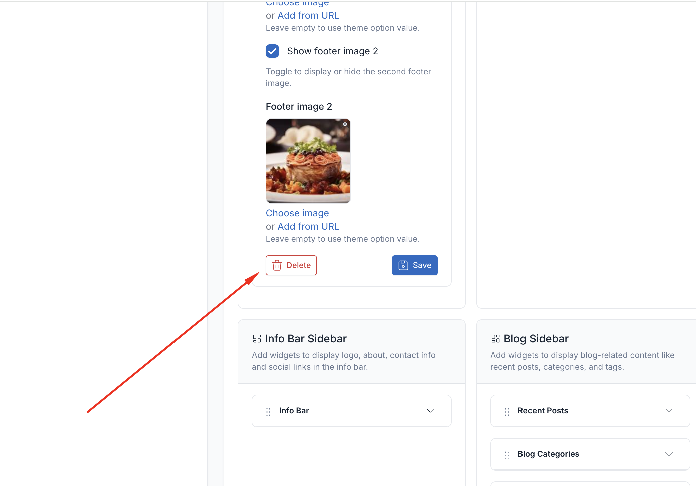

# Widgets

Widgets are modular content blocks that can be placed in various widget areas throughout your Restoria restaurant website. They provide dynamic functionality without requiring coding knowledge.

## Managing Widgets

Access widget management from **Appearance** → **Widgets** in your admin panel.

To add a widget to a sidebar, drag and drop the widget from the left side to the sidebar area on the right side.

## Widget Areas

### 1. Footer sidebar

It is displayed at the footer of the page and includes 1 site-information widget and 3 simple menu widgets.

### 2. Footer bottom sidebar

It is displayed at the footer of the page and includes 1 site-information widget and 3 simple menu widgets.

### 3. Info bar sidebar

It is displayed at the footer of the page and includes 1 site-information widget and 3 simple menu widgets.

### 4. Blog sidebar

It is displayed at the footer of the page and includes 1 site-information widget and 3 simple menu widgets.

## Delete Widgets

If you don't want to use the widgets in some areas, you can remove them by collapsing the widget and clicking the
**Delete** button.

