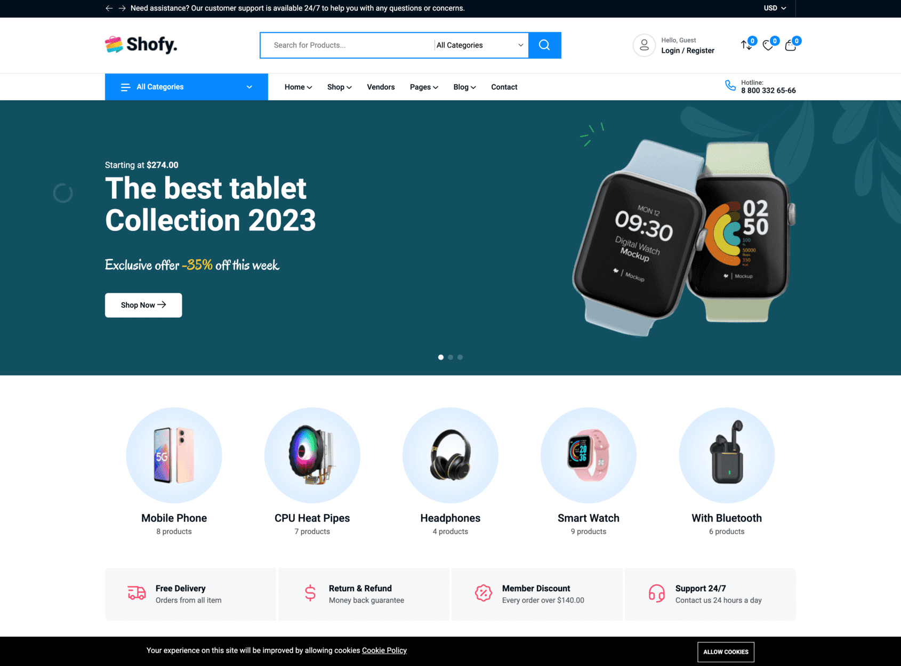

# Shofy - Multipurpose Laravel eCommerce System

## Introduction

Shofy is a multipurpose Laravel eCommerce system. This script comes with high-quality 5 pre-build home pages and many
built-in awesome features.

It built on top of Botble CMS, which is a Laravel based CMS. It offers remarkable flexibility for various use cases.

Released Date: **March 01, 2024**

Author: **[Botble Technologies](https://botble.com)**

Email: **contact@botble.com**

Thank you for purchasing our product. If you have any questions that are beyond the scope of this help file, please feel
free to email via our user page contact form [here](https://codecanyon.net/user/botble) for quickly support. Thank you
so much!

## Features Overview

* Buy One Time & Get Free Updates Forever 
* **Free Theme Installation** – If you will face any problem during installation – we will help you and It’s FREE
* Bootstrap 5.x Framework: Bootstrap is the most popular HTML, CSS, and JS framework for developing responsive,
  mobile-first projects on the web.
* Based on our Botble CMS (using modern Laravel framework) which using by thousand customers.
* Full eCommerce features.
* Support many payment methods: PayPal, Stripe, Paystack, Razorpay, Mollie, SSLCommerz…
* 5 different homepages to give you the best selections in customization.
* Touch Friendly: Easy browsing on touch devices.
* 100% Fully Responsive: Whatever you are using the device your site will run as it should be.
* Powerful admin panel, all things can be changed from the admin panel, no hardcode.
* Nice and clean design from our designer expert.
* Easy to install with UI - [How to install script based on Botble CMS](https://www.youtube.com/watch?v=iam99NkUIu0).
* Multi-language: unlimited languages support.
* Google Analytics: display analytics data in admin panel.
* Translation tool: easy to translate front theme and admin panel to your language.
* Right To Left (RTL) language support.
* Fast support: we always reply your ticket within 1 business day.

## Demo

* Homepage: https://shofy.botble.com
* Admin panel: https://shofy.botble.com/admin
* Admin account: `admin` – `12345678` (username & password are autofilled)
* Customer login URL: https://shofy.botble.com/login
* Customer account: `customer@botble.com` – `12345678`

## Botble Team

For more about our team, visit us at https://botble.com.
