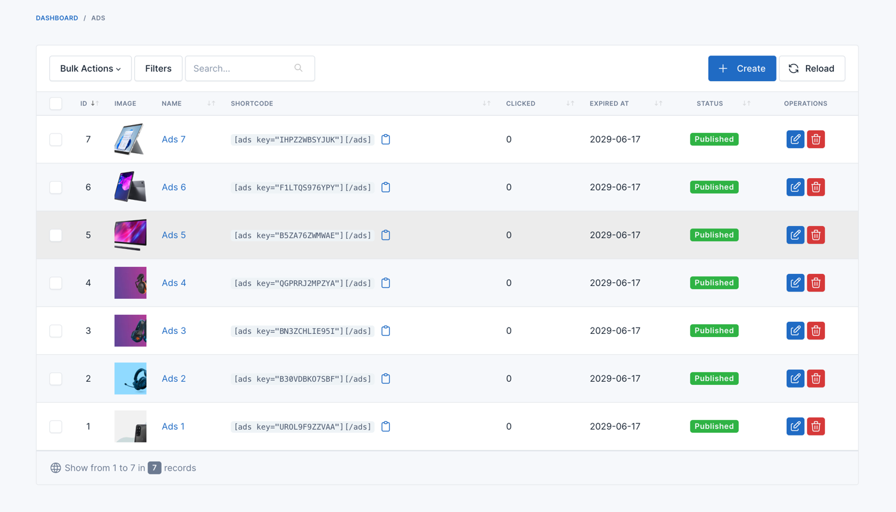
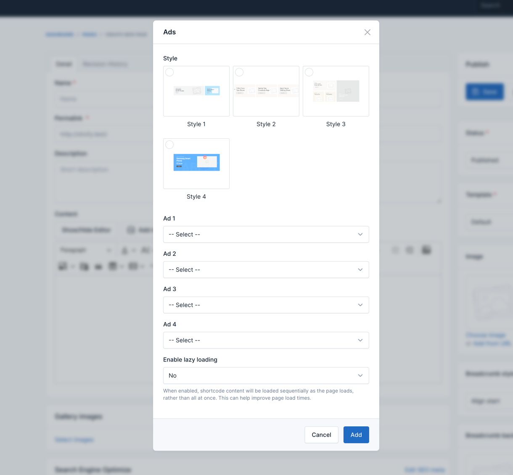
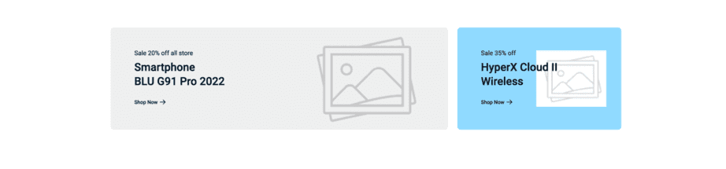
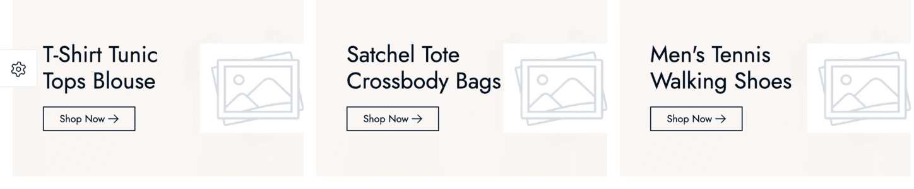
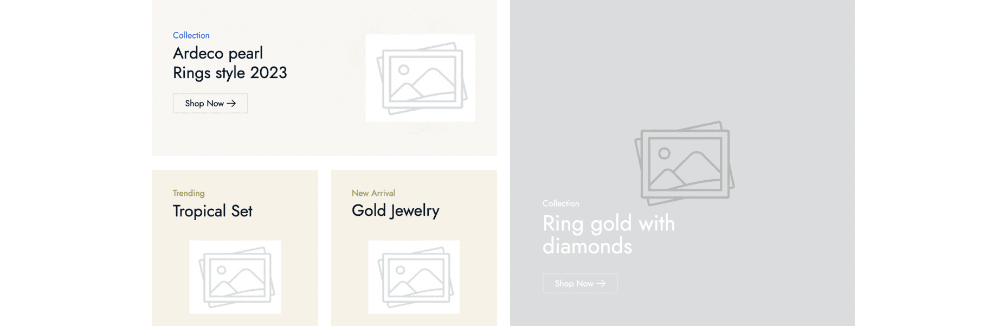
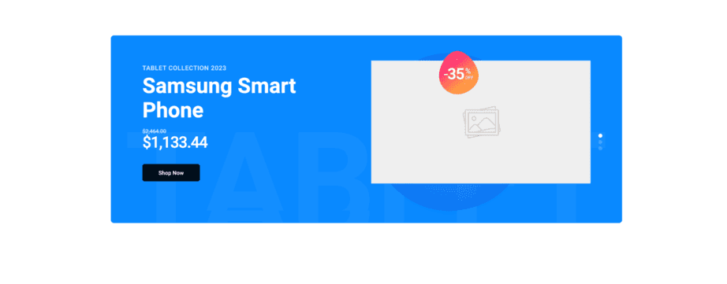
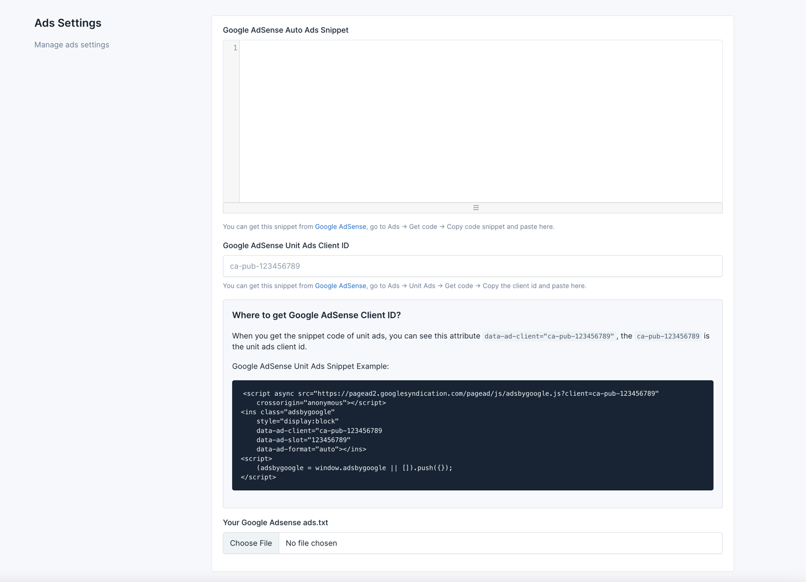

# Ads

Advertisements (ads) are promotional content on your website to generate revenue, promote products, or inform users about services. Ads can be banners, videos, pop-ups, or native ads. In e-commerce, ads help monetize traffic, cross-promote products, and boost brand visibility.

To manage ads on your website, go to **Admin** ->  **Ads** -> **Ads**.

## Displaying Ads on Pages, Posts, and Products

To display ads on specific pages, posts, or product pages, you need to use the content field and add a new UI Block for
ads.

1. Edit the page, post, or product.
2. Click UI Blocks in the Content field.
3. Select the Ads block.
4. Configure the ad settings and click Add.

::: warning
Ad images should NOT contain ‘ads’, ‘advert’, etc., in the name to avoid being blocked by Adblock extensions.
:::

The Ads block comes with four styles:

### Style 1

### Style 2

### Style 3

### Style 4

## Google Adsense

To set up Google Adsense, go to **Admin** -> **Ads** -> **Ads Settings**, enter your Adsense code, and save.

