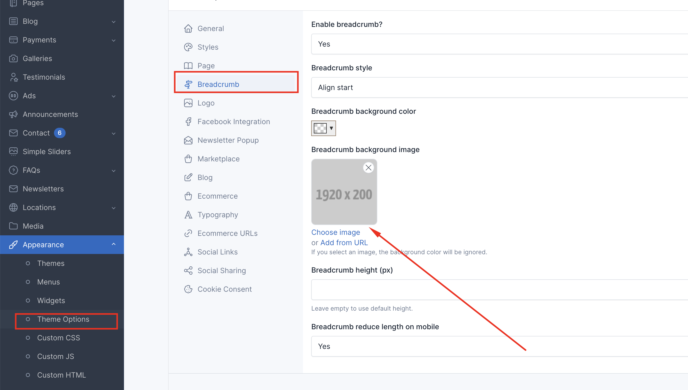
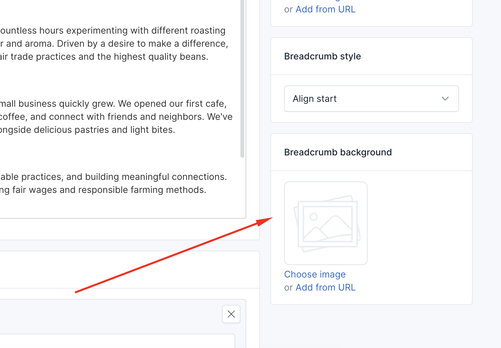

# Breadcrumb

Breadcrumb is a navigation aid that helps users to know where they are on a website. It is usually displayed at the top of a page.

## Breadcrumb background image

You can change it in Appearance → Theme options → Breadcrumb

If you want to set that image for a specific page, such as Contact page, you can go to Admin → Pages → Contact and set breadcrumb image.

