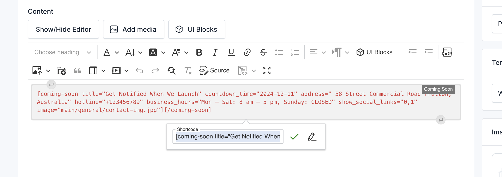
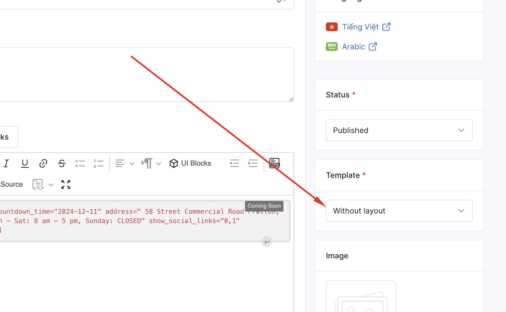
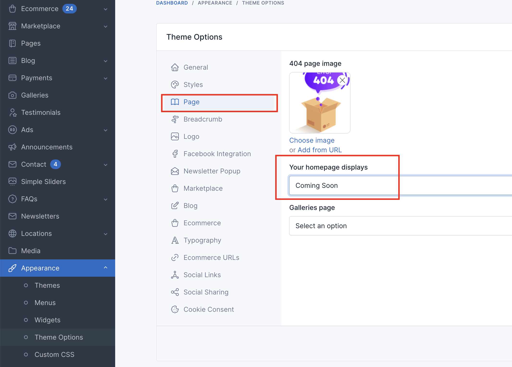

# Coming soon page

It is a good practice to create a coming soon page when you are working on your website. This page
will inform your visitors that your website is under construction and will be available soon.


## Create page

::: tip
You can skip this step if you are using the sample data of **Shofy**. Check if the Admin -> Pages -> Coming soon is already created
:::

To create a coming soon page, in admin panel, go to `Pages` and click on `Create` button.

In the `Create new page` page, fill in the following fields:

- **Title**: Enter the title of the page. For example, `Coming soon`.
- **Content**: 
```
[coming-soon title="Get Notified When We Launch" countdown_time="2024-12-11" address=" 58 Street Commercial Road Fratton, Australia" hotline="+123456789" business_hours="Mon – Sat: 8 am – 5 pm, Sunday: CLOSED" show_social_links="0,1" image="main/general/contact-img.jpg"][/coming-soon]
```



- **Template**: Select `Without layout`.


- Other fields are optional, you can fill them if you want.

## Setup page

After creating the coming soon page, you need to set it as the homepage of your website.

In admin panel, go to `Appearance` -> `Theme Options` -> `Page`, and select the coming soon you just created in
the `Your homepage displays` field.

