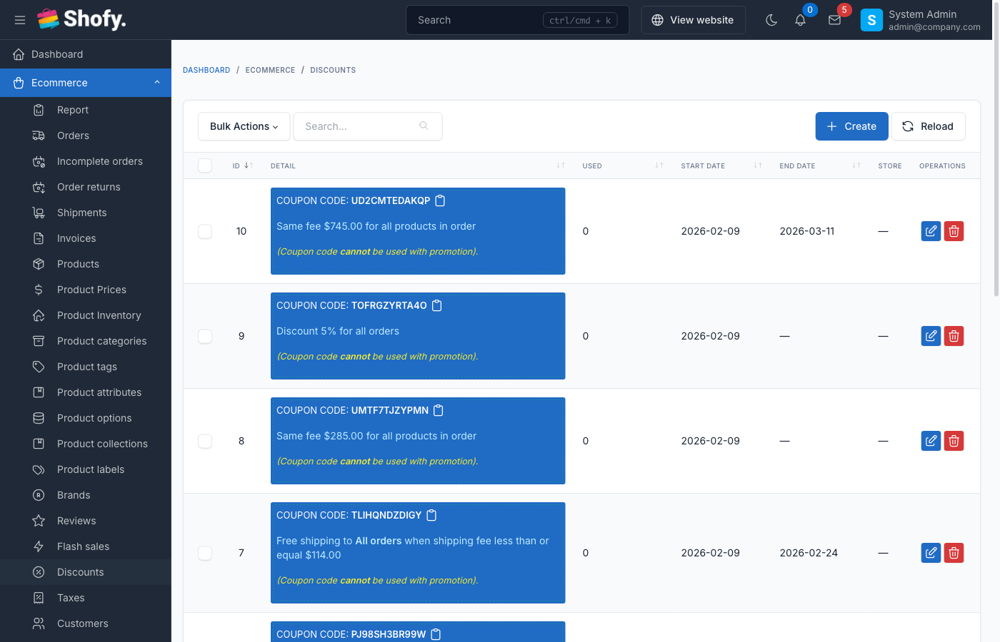
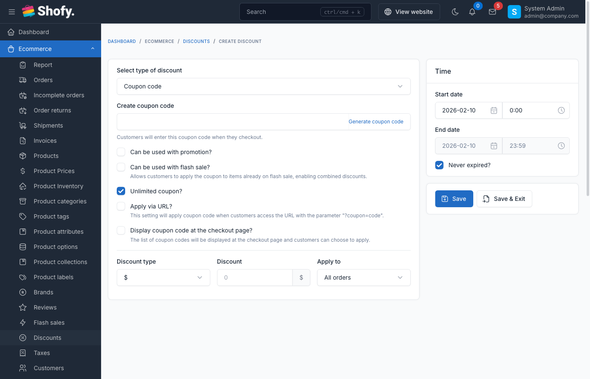

# Discounts & Coupons

Discounts and coupons are powerful tools to incentivize purchases and reward customers. The system supports both automatic promotions and coupon codes with flexible targeting and usage rules.

## Overview



The discount system provides two main types:

- **Coupons** - Require customers to enter a code at checkout
- **Promotions** - Apply automatically when conditions are met

Both types support:
- Multiple discount methods (percentage, fixed amount, free shipping, same price)
- Product/category/collection targeting
- Usage limits per customer or total
- Date-based scheduling
- Minimum order requirements
- Customer-specific discounts

## Discount vs Promotion

| Feature | Coupon | Promotion |
|---------|--------|-----------|
| Requires code | Yes | No |
| Customer enters code | Yes | Auto-applied |
| Quantity limits | Yes | Optional |
| Usage tracking | Per code | Per promotion |
| Best for | Targeted campaigns, email marketing | Store-wide sales, automatic discounts |

## Creating a Discount



Navigate to `Ecommerce` -> `Discounts` -> `Create` in admin panel.

### Basic Information

**For Coupons:**
- **Code** - Alphanumeric code customers enter (max 20 characters)
- **Description** - Optional note visible to admin only

**For Promotions:**
- **Title** - Name displayed to customers (required for promotions)
- **Description** - Optional internal note

::: tip
Use the **Generate coupon code** button to create a random 12-character code.
:::

### Discount Type

Choose how the discount is calculated:

| Type | Description | Example |
|------|-------------|---------|
| **Percentage** | Reduce price by percentage | 20% off = $100 → $80 |
| **Fixed Amount** | Reduce price by fixed value | $10 off = $100 → $90 |
| **Free Shipping** | Remove shipping costs | Free delivery for all items |
| **Same Price** | Set all qualifying items to same price | All items $19.99 |

**Value field:**
- For percentage: Enter number without % symbol (e.g., `20` for 20%)
- For fixed amount: Enter amount (e.g., `10` for $10 off)
- For same price: Enter the fixed price (e.g., `19.99`)
- For free shipping: Value is ignored

### Discount Target

Control which products qualify for the discount:

| Target | Description | Use Case |
|--------|-------------|----------|
| **All Orders** | Applies to entire cart | Store-wide sale |
| **Minimum Order Amount** | Only if cart total reaches minimum | Free shipping over $50 |
| **Specific Products** | Selected products only | Discount on featured items |
| **Product Collections** | All products in collections | Sale on summer collection |
| **Product Categories** | All products in categories | 20% off electronics |
| **Product Variants** | Specific product variants | Discount on large sizes only |
| **Customer** | Only specific customers | VIP customer discount |
| **Once Per Customer** | Limit one use per customer | First-time buyer coupon |

**Additional targeting options:**

- **Minimum order price** - Cart must reach this amount (e.g., $50)
- **Product quantity** - Minimum items required (e.g., buy 3 or more)
- **Discount on** - Choose between "Subtotal" or "Shipping fee" (for percentage/fixed discounts)

### Date & Time Restrictions

Control when the discount is active:

- **Start date/time** - When discount becomes available
- **End date/time** - When discount expires (optional)
- Check **No expiration** for unlimited time

::: warning
Discounts with past start dates are active immediately. Customers cannot use expired discounts.
:::

### Usage Limits (Coupons Only)

For coupon codes, control how many times they can be used:

- **Total usage** - Maximum total uses across all customers
- Check **Unlimited quantity** to remove limits
- Per-customer limits are controlled by target type (see "Once Per Customer")

### Advanced Options

**Can use with promotion:**
- When ON: Coupon can combine with automatic promotions
- When OFF: Coupon cannot stack with promotions

**Can use with flash sale:**
- When ON: Discount applies to flash sale items
- When OFF: Discount excluded from flash sale items

**Apply via URL:**
- When ON: Generate a URL that auto-applies the coupon
- When OFF: Customers must manually enter code
- URL format: `https://yourstore.com/cart?coupon_code=YOURCODE`

**Display at checkout:**
- When ON: Show discount in available coupons list at checkout
- When OFF: Customers must know and enter code manually

## Discount Application Priority

When multiple discounts could apply, the system follows these rules:

1. **Flash sales** take priority over all discounts (unless discount allows flash sale)
2. **Product-specific discounts** override general discounts
3. **Higher value** discount wins if multiple apply to same item
4. **Promotions** auto-apply; coupons require manual entry
5. Only **one coupon** can be used per order (but can combine with promotions if allowed)

## Example Configurations

### Example 1: 20% Off Coupon (Limited Use)

```
Type: Coupon
Code: SAVE20
Discount type: Percentage
Value: 20
Target: All Orders
Quantity: 100
Start date: 2024-01-01
End date: 2024-01-31
Can use with promotion: No
```

### Example 2: Free Shipping Over $50

```
Type: Promotion
Title: Free Shipping on Orders $50+
Discount type: Free Shipping
Target: Minimum Order Amount
Min order price: 50
No expiration: Yes
```

### Example 3: Buy 3 Get 20% Off

```
Type: Promotion
Title: Buy 3 or More Save 20%
Discount type: Percentage
Value: 20
Target: Specific Products (or Collection/Category)
Product quantity: 3
```

### Example 4: VIP Customer Discount

```
Type: Promotion
Title: VIP Customer 15% Off
Discount type: Percentage
Value: 15
Target: Customer
Customers: [Select specific customers]
No expiration: Yes
```

### Example 5: First Order Coupon

```
Type: Coupon
Code: FIRST10
Discount type: Fixed Amount
Value: 10
Target: Once Per Customer
Quantity: Unlimited
```

## Managing Discounts

### Editing Active Discounts

Navigate to `Ecommerce` -> `Discounts` to view all discounts.

The table shows:
- Code/Title
- Type (Coupon/Promotion)
- Discount type (%, fixed, shipping)
- Value
- Total used (for coupons)
- Start/End dates
- Status

Click **Edit** to modify. Changes apply immediately.

::: warning
Changing a coupon code while it's active may break existing links and customer bookmarks.
:::

### Viewing Usage Statistics

For coupons, the **Total Used** column shows how many times the code was used.

To see detailed usage:
1. Edit the discount
2. View **Used by customers** section (shows customer names and usage dates)

### Deleting Discounts

Click **Delete** to remove a discount.

::: warning
Deleting a discount does NOT affect past orders that used it. Historical order totals remain unchanged.
:::

## Customer Experience

### Using Coupons at Checkout

1. Add items to cart
2. Go to checkout page
3. Enter coupon code in "Discount code" field
4. Click "Apply"
5. Discount appears in order summary

**If coupon fails:**
- "Invalid coupon code" - Code doesn't exist or is typed incorrectly
- "Coupon has expired" - Past end date
- "Coupon usage limit reached" - Total uses exceeded
- "You have already used this coupon" - Per-customer limit reached
- "Minimum order amount not met" - Cart total too low

### Auto-Applied Promotions

Promotions apply automatically when conditions are met:
- No code entry required
- Shows as "Promotion: [Title]" in cart
- Removes automatically if conditions no longer met

### Discount Display

At checkout, customers see:
- **Subtotal** - Original total
- **Discount** - Amount saved (shows discount name)
- **Tax** - Calculated on discounted amount
- **Shipping** - Free if shipping discount applied
- **Total** - Final amount

## Best Practices

1. **Use clear codes** - Make coupon codes memorable (e.g., `SAVE20`, `FREESHIP`, `VIP15`)

2. **Set expiration dates** - Create urgency with limited-time offers

3. **Test before launch** - Create test order to verify discount applies correctly

4. **Limit usage** - Prevent abuse with quantity/per-customer limits

5. **Track performance** - Monitor total uses to measure campaign success

6. **Avoid overlap** - Be careful with multiple auto-promotions; higher value wins

7. **Communicate clearly** - Include terms in marketing (min order, expiration, exclusions)

8. **Archive old discounts** - Delete expired/unused discounts to keep list clean

## Troubleshooting

### Discount not applying at checkout

1. **Check dates** - Ensure current date is between start/end
2. **Verify target** - Confirm cart contains qualifying products
3. **Check minimums** - Cart must meet min order/quantity requirements
4. **Test conflicts** - Disable "can use with" options if conflicts suspected

### Coupon code rejected

1. **Check spelling** - Codes are case-sensitive
2. **Verify status** - Discount must be published (not draft)
3. **Check usage** - Quantity limit may be reached
4. **Test customer** - Per-customer limits may apply

### Wrong discount amount

1. **Check discount type** - Percentage vs fixed amount
2. **Verify target** - May only apply to specific products, not entire cart
3. **Check "Discount on"** - May apply to subtotal OR shipping, not both

### Multiple discounts conflicting

- Only one coupon allowed per order
- Promotions can stack if "can use with promotion" enabled
- Highest value discount wins for same products
- Flash sales override discounts (unless discount allows flash sale)

## Frequently Asked Questions

### Can customers use multiple coupons?

No, only one coupon code per order. However, a coupon can be combined with automatic promotions if "Can use with promotion" is enabled.

### Do discounts apply to shipping?

Yes, if:
- Discount type is "Free Shipping", OR
- "Discount on" field is set to "Shipping fee" (for percentage/fixed discounts)

### Can I create buy X get Y discounts?

Yes, use:
- Target: Specific Products (select X and Y)
- Product quantity: Minimum quantity required
- Discount type: Percentage (100% for free) or Fixed Amount

### How do I create a store-wide sale?

Create a Promotion with:
- Target: All Orders
- Discount type: Percentage
- Set start/end dates for sale period

### Can I offer exclusive discounts to specific customers?

Yes, use Target: Customer and select specific customers. This creates a VIP/loyalty discount.

### What happens if I delete a discount that was used in past orders?

Past orders are unaffected. Order totals and discount history remain in the system.

### Can discounts apply to product variants?

Yes, use Target: Product Variants to select specific variants (e.g., only Large sizes).
