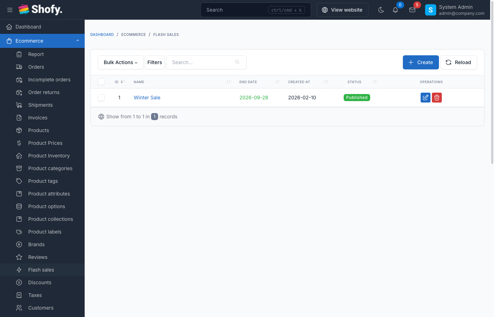
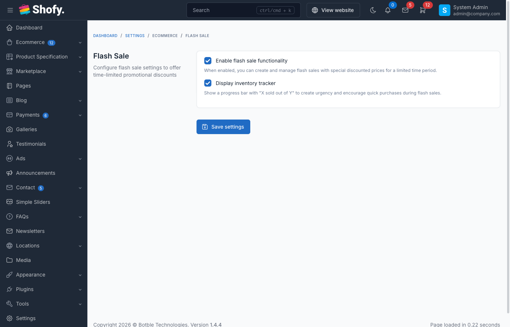

# Flash Sales

Flash sales create urgency and drive sales by offering limited-time discounts on specific products with restricted quantities.

## Overview



Flash sale features:

- **Time-limited offers** - Set end date for automatic expiration
- **Quantity limits** - Control stock available at sale price
- **Sale tracking** - Monitor sold quantity vs available
- **Automatic expiration** - Sales auto-disable when time or quantity runs out
- **Priority pricing** - Flash sale prices override regular discounts
- **Visual countdown** - Storefront displays time remaining

## Enable Flash Sales

Navigate to `Ecommerce` -> `Settings` -> `Flash Sales`.



Toggle **Enable flash sales** to activate the feature.

::: tip
Once enabled, a new "Flash Sales" menu appears under `Ecommerce`.
:::

## Creating a Flash Sale

Navigate to `Ecommerce` -> `Flash Sales` -> `Create`.

### Basic Information

- **Name** - Internal name for the flash sale (e.g., "Black Friday 2024", "Weekend Clearance")
- **End date** - When the sale expires (date only, ends at 23:59:59)
- **Status** - Published (active) or Draft (hidden)

::: warning
Flash sales start immediately when published. There is no start date field - use Draft status to prepare sales in advance.
:::

### Adding Products

In the **Products** section:

1. Click **Add product** button
2. Search and select products
3. For each product, configure:
   - **Sale price** - Discounted price (must be lower than regular price)
   - **Quantity** - Number of units available at sale price
   - **Sold** - Auto-calculated, shows how many sold (read-only in edit mode)

You can add multiple products to one flash sale.

::: tip
The system tracks sold quantity automatically. When quantity is reached, product becomes unavailable at sale price.
:::

### Product Selection Tips

**Best products for flash sales:**
- High-margin items
- Overstocked inventory
- Popular items to drive traffic
- New product launches
- Seasonal clearance

**Avoid:**
- Products with limited stock (may frustrate customers)
- Low-margin items (reduces profitability)
- Already heavily discounted items

## Flash Sale Display

### On Product Pages

When a product is in active flash sale:

- **Original price** shown with strikethrough
- **Flash sale price** highlighted
- **Sale badge** displayed
- **Quantity remaining** indicator (if theme supports)
- **Countdown timer** showing time left
- **"Sold out" badge** when quantity exhausted

### On Category/Shop Pages

Flash sale products show:
- Sale badge
- Discounted price
- Original price (crossed out)
- May be featured in special "Flash Sale" section

### Flash Sale Dedicated Page

Some themes include a flash sale landing page showing:
- All active flash sales
- Countdown timer
- Products by sale
- Sort by ending soon, most popular, etc.

## Managing Flash Sales

Navigate to `Ecommerce` -> `Flash Sales` to view all sales.

### Flash Sale Status

The table shows:

- **Name** - Flash sale title
- **End date** - Expiration date
- **Products** - Count of products in sale
- **Status** - Published or Draft

Additional indicators:
- **Expired** - Past end date (auto-disabled)
- **Sold out** - All product quantities reached

### Editing Active Flash Sales

Click **Edit** on any flash sale.

You can modify:
- Name
- End date (extend or shorten)
- Product list (add/remove products)
- Sale prices
- Quantities (increase only; decreasing below sold quantity prevented)

::: warning
Changes to active flash sales apply immediately. Customers currently viewing products see updated prices after page refresh.
:::

### Monitoring Sales Performance

For each product in a flash sale, view:
- **Sold / Quantity** ratio (e.g., "25/100")
- **Percentage sold** progress bar
- **Revenue generated** (if reporting enabled)

::: tip
Products selling slowly may need price adjustment or quantity reduction to create urgency.
:::

### Extending Flash Sales

To extend a sale:
1. Edit the flash sale
2. Change end date to future date
3. Save

::: tip
Consider increasing product quantities when extending to maintain inventory.
:::

## Flash Sale Priority & Conflicts

### Pricing Priority

Flash sale prices have **highest priority**:

1. **Flash sale price** (if active and quantity available)
2. Discount/coupon (if allowed)
3. Regular sale price
4. Original price

### Interaction with Discounts

By default, discounts/coupons **do NOT apply** to flash sale products.

To allow discounts on flash sale items:
- Edit discount
- Enable **Can use with flash sale** option

Example scenarios:

| Flash Sale Price | Coupon | Can Use with Flash Sale | Final Price |
|-----------------|--------|------------------------|-------------|
| $50 | 10% off | No | $50 (coupon ignored) |
| $50 | 10% off | Yes | $45 (coupon applied) |
| $50 | Free shipping | No or Yes | $50 + free ship (shipping discounts always apply) |

::: warning
Allowing coupons with flash sales reduces profitability. Use cautiously.
:::

## Flash Sale Expiration

### Automatic Expiration

Flash sales expire when:
1. **End date reached** - Auto-disables at end of day
2. **All products sold out** - No quantity remaining

Expired sales:
- No longer visible on storefront
- Products revert to regular pricing
- Still visible in admin (for reporting)

### Manual Expiration

To end a flash sale early:
1. Edit the flash sale
2. Change status to **Draft**, OR
3. Change end date to past date
4. Save

## Example Flash Sale Configurations

### Example 1: Weekend Flash Sale

```
Name: Weekend Flash Sale - 50% Off
End date: Sunday, 11:59 PM
Products:
  - Wireless Headphones: $49.99 (reg $99.99), Qty: 100
  - Smart Watch: $79.99 (reg $159.99), Qty: 50
  - Phone Case: $9.99 (reg $19.99), Qty: 200
Status: Published
```

### Example 2: Limited Stock Clearance

```
Name: Clearance - Last Chance
End date: 7 days from now
Products:
  - Winter Coat (Medium): $39.99 (reg $129.99), Qty: 10
  - Winter Coat (Large): $39.99 (reg $129.99), Qty: 15
  - Winter Coat (XL): $39.99 (reg $129.99), Qty: 8
Status: Published
```

### Example 3: New Product Launch

```
Name: New Arrival Special - First 100 Customers
End date: 30 days from now
Products:
  - New Smart Speaker: $79.99 (reg $99.99), Qty: 100
Status: Published
```

## Best Practices

1. **Create urgency** - Use short timeframes (24-72 hours) for maximum impact

2. **Limit quantities** - Scarcity drives action; use realistic but limited stock

3. **Significant discounts** - Aim for 30-50% off to motivate purchases

4. **Promote heavily** - Use email, social media, homepage banners

5. **Monitor closely** - Check sales progress and adjust if needed

6. **Test pricing** - Start with moderate discount, increase if slow

7. **Bundle complementary items** - Add related products to increase cart value

8. **Schedule strategically** - Align with paydays, holidays, weekends

9. **Prepare inventory** - Ensure adequate stock before launching

10. **Follow up** - Email customers who viewed but didn't buy

## Troubleshooting

### Flash sale not showing on storefront

1. **Status is Published?** - Check flash sale status
2. **End date in future?** - Expired sales don't display
3. **Quantity available?** - Sold-out products hidden
4. **Theme support?** - Verify theme includes flash sale templates
5. **Cache cleared?** - Clear site cache to see updates

### Flash sale price not applying

1. **Product added to sale?** - Verify product in flash sale product list
2. **Sale price set?** - Each product needs individual sale price
3. **Quantity remaining?** - Once quantity reached, regular price applies
4. **Flash sale active?** - Check status and end date

### Can't add more products

1. **Save existing changes first** - Save flash sale before adding more products
2. **Product already in sale?** - Each product can only be in one active flash sale
3. **Product is variation?** - Add parent product, not individual variations

### Quantity showing incorrect

1. **Check sold count** - System auto-updates as orders complete
2. **Orders pending** - Quantities reserved during checkout
3. **Recent edit** - May need page refresh to see updates

## Advanced Usage

### Email Marketing Integration

Promote flash sales via email:

1. Capture email list of interested customers
2. Schedule email blast before sale starts
3. Include countdown timer in email
4. Send reminder emails as sale nears end

### Homepage Flash Sale Banner

Display active flash sales prominently:

1. Use shortcode or widget to show flash sale products
2. Add countdown timer
3. Link to dedicated flash sale page
4. Update banner automatically when sale ends

### Flash Sale Notifications

Notify customers:

1. **In-app notifications** - Alert logged-in users when sale starts
2. **Push notifications** - Mobile app flash sale alerts
3. **SMS notifications** - Text alerts for VIP customers

### Post-Sale Analytics

After flash sale ends, analyze:

- **Total revenue** generated
- **Conversion rate** vs regular products
- **Average order value** during sale
- **Customer acquisition cost**
- **Repeat purchase rate** from flash sale customers

## Frequently Asked Questions

### Can a product be in multiple flash sales at once?

No, each product can only be in one active flash sale at a time.

### What happens if customer adds item to cart during flash sale, but checks out after it ends?

Price locks when added to cart. Customer pays flash sale price even if sale ends (within reasonable time, e.g., 24-48 hours based on cart expiration settings).

### Can I schedule a flash sale to start in the future?

Yes, create flash sale with future dates and set status to Draft. Change to Published when ready to launch. (Note: No automatic start scheduling built-in.)

### Do flash sale products show in regular search/category pages?

Yes, they appear in normal listings with sale badge and discounted price.

### Can I run multiple flash sales simultaneously?

Yes, create separate flash sales with different products. Each operates independently.

### What happens to unfulfilled orders if I delete a flash sale?

Past orders are unaffected. Customers who purchased at flash sale price keep that price.

### Can customers use loyalty points on flash sale items?

Depends on your loyalty program settings. Typically, flash sales exclude additional discounts including points.

### How do I notify customers when a flash sale starts?

Use email marketing tools, social media, homepage banners, or push notifications. The system doesn't have built-in customer notifications.

### Can I limit flash sales to specific customer groups?

Not directly. Use discount codes combined with flash sales, or implement custom logic via hooks.

### What if I set sale price higher than regular price accidentally?

The system doesn't prevent this, but customers will see the higher price. Always verify sale prices are lower than regular prices before publishing.

### Can I see which customers bought during flash sale?

Yes, filter orders by date range matching the flash sale period, or check order details to see flash sale pricing applied.
