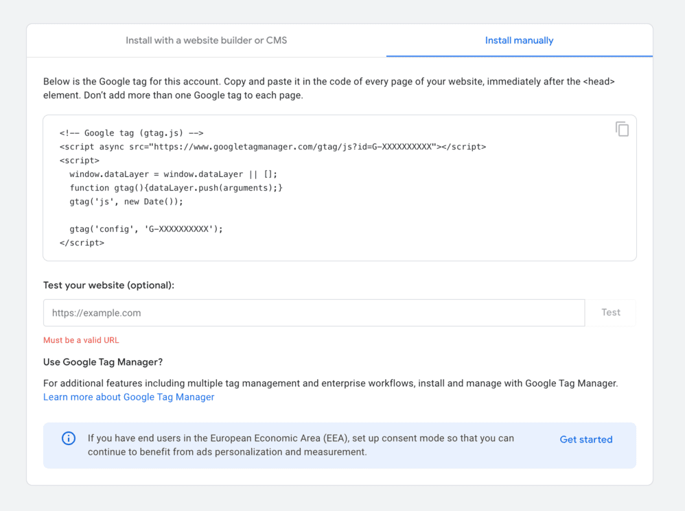
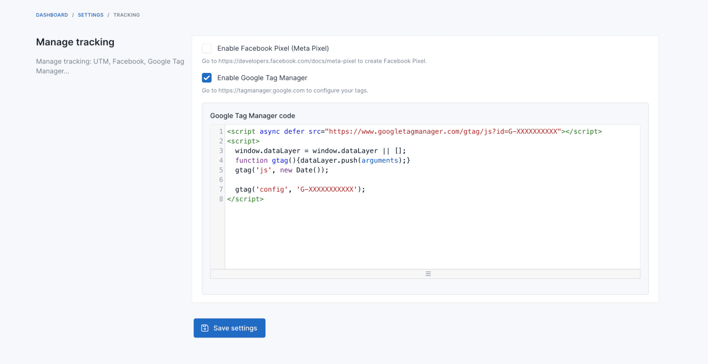
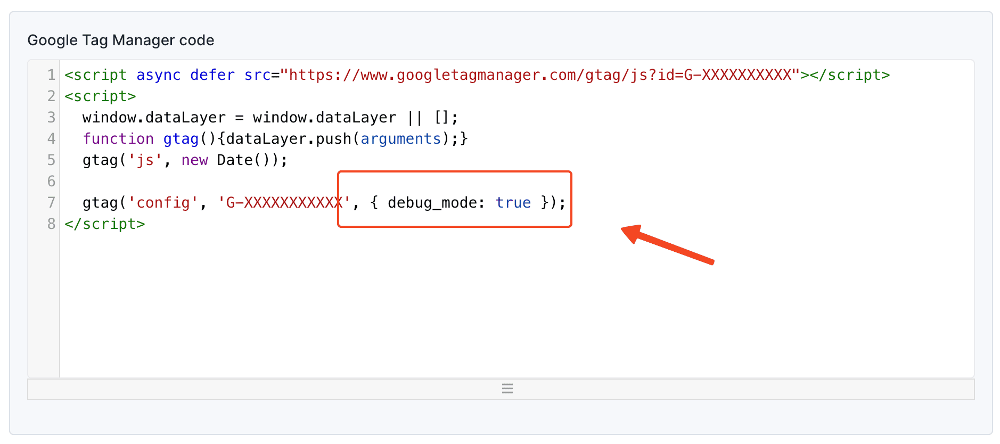

# Measuring Ecommerce with Google Analytics

Google Analytics provides powerful tools for measuring the performance of your ecommerce website. By implementing ecommerce tracking, you can gain valuable insights into your sales funnel, customer behavior, and revenue generation. Below, we'll explore how to effectively measure ecommerce performance using Google Analytics.

## Set Up Google Analytics 4

Before you can measure ecommerce performance, you need to [create a Google Analytics 4 account and property](https://support.google.com/analytics/answer/9304153#account).

Then you need to [create a web data stream](https://support.google.com/analytics/answer/9304153#stream&zippy=%2Cweb) for your website. This will allow you to collect data from your site and track user interactions.



After you've set up your web data stream, you will have a Google Tag Manager code snippet. Go to `Admin` -> `Settings` -> `Ecommerce` -> `Tracking`, enable `Enable Google Tag Manager` field and paste your Google Tag Manager code snippet in the `Google Tag Manager code` field.



## Tracked Events

The following GA4 ecommerce events are tracked automatically:

### Server-Side Events

These events are pushed from the server when pages load:

| Event | Trigger | Data |
|-------|---------|------|
| `view_item_list` | Product listing page (category, search results) | `item_list_id`, `item_list_name`, items with `item_id`, `item_name`, `price`, `item_brand`, `item_category` |
| `view_item` | Product detail page | `currency`, `value`, item details |
| `view_category` | Category page | `categoryId`, `categoryName`, `productCount` |
| `view_cart` | Cart page | `currency`, `value`, all cart items with quantities and variants |
| `begin_checkout` | Checkout page | `currency`, `value`, `coupon`, cart items |
| `purchase` | Order success page | `transaction_id`, `currency`, `value`, `tax`, `shipping`, `coupon`, ordered items |
| `refund` | Order refund processed | `transaction_id`, `currency`, `value`, `tax`, `shipping`, `coupon`, refunded items |
| `search` | Search results page | `search_term`, items |
| `sign_up` | After customer registration | `method` (email) |

### Client-Side Events

These events fire via JavaScript when users interact with the site:

| Event | Trigger | Data |
|-------|---------|------|
| `add_to_cart` | Click add-to-cart button | `currency`, `value`, item with `item_id`, `item_name`, `price`, `quantity`, `item_brand`, categories |
| `remove_from_cart` | Remove item from cart | `currency`, `value`, item details |
| `select_item` | Click on a product link | `item_list_id`, `item_list_name`, item with `index` |
| `add_to_wishlist` | Add product to wishlist | `currency`, `value`, item details |
| `remove_from_wishlist` | Remove product from wishlist | `currency`, `value`, item details |
| `add_to_compare` | Add product to compare list | `currency`, `value`, item details |
| `remove_from_compare` | Remove product from compare | `currency`, `value`, item details |
| `view_promotion` | Promotion banner visible | `promotion_id`, `promotion_name`, `creative_name`, `creative_slot`, `location_id`, items |
| `select_promotion` | Click on a promotion banner | `promotion_id`, `promotion_name`, `creative_name`, `creative_slot`, `location_id` |
| `search` | AJAX quick search or search form submit | `search_term`, `result_count` |
| `scroll` | User scrolls 25%, 50%, 75%, 90% of page | `percent_scrolled` |
| `user_engagement` | User on page for 10s, 30s, 60s, 2m, 3m | `engagement_time_msec` |

### Item Data Structure

Each item in the events contains:

| Field | Description |
|-------|-------------|
| `item_id` | Product SKU or ID |
| `item_name` | Product name |
| `price` | Product price |
| `quantity` | Quantity (when applicable) |
| `item_brand` | Brand name |
| `item_category` | Primary category |
| `item_category2`, `item_category3`, ... | Additional categories |
| `item_variant` | Variant attributes (cart items only) |

## See Your Ecommerce Data

After 24 hours, your ecommerce data will be available in your Google Analytics account. You can view your ecommerce data by reading the [Ecommerce purchases report](https://support.google.com/analytics/answer/12924131?visit_id=638477342970940852-1296123871&rd=1).


## Debugging

Google Analytics provides a [debug mode](https://developers.google.com/analytics/devguides/collection/ga4/set-up-ecommerce#verify-data) to help you verify that your ecommerce tracking is working correctly.

You can add `, { debug_mode: true }` after your `gtag('config', 'G-XXXXXXXXXXX');` code snippet to enable debug mode.

```js
gtag('config', 'TAG_ID', { debug_mode: true });
```



Once you've enabled debug mode, you can use the **DebugView** by following Google's [instructions](https://support.google.com/analytics/answer/7201382).


