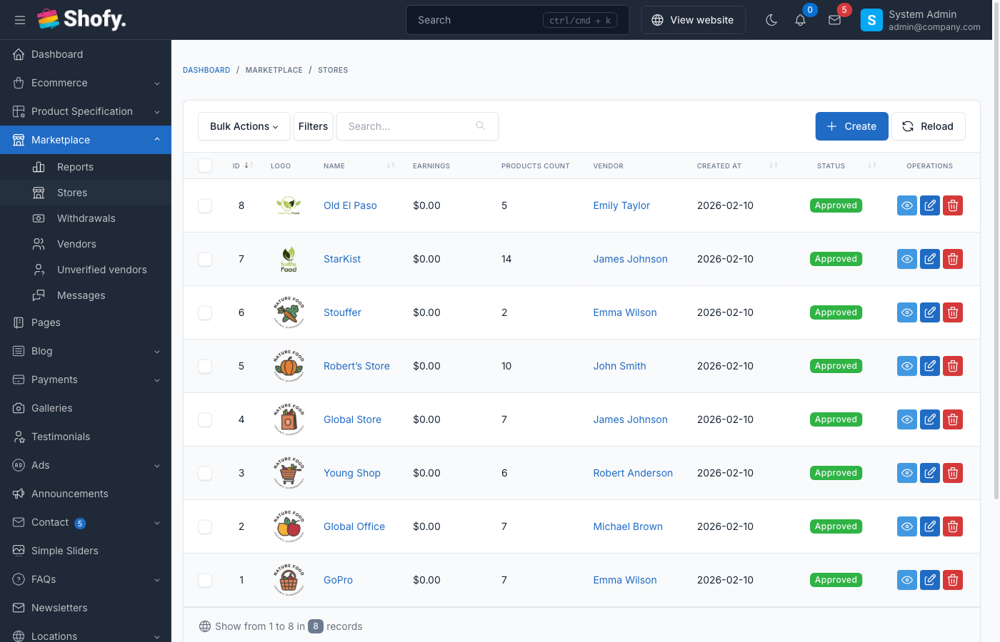

# Marketplace Setup

The Marketplace plugin transforms your ecommerce store into a multi-vendor marketplace where multiple vendors can sell products through their own stores.

## Overview

The Marketplace plugin enables:

1. **Multi-vendor architecture** - Multiple sellers with individual stores
2. **Vendor registration** - Customers can become vendors and create stores
3. **Store management** - Each vendor manages their own products, orders, and discounts
4. **Verification system** - Optional admin approval for new vendors
5. **Commission tracking** - Platform earns commission on vendor sales
6. **Vendor dashboard** - Separate vendor panel for store management



## Activating the Plugin

Navigate to `Plugins` in the admin panel and activate the **Marketplace** plugin.

::: warning
The Marketplace plugin requires the **Ecommerce** plugin to be installed and activated first.
:::

## Marketplace Settings

Navigate to `Marketplace` -> `Settings` to configure marketplace options.

### Vendor Registration

| Setting | Description |
|---------|-------------|
| **Enable vendor registration** | Allow customers to become vendors |
| **Hide become vendor menu in customer dashboard** | Hide "Become Vendor" link from customer dashboard menu |
| **Show vendor registration form at registration page** | Display vendor registration fields on the customer registration page |
| **Verify vendor** | Require admin approval before vendors can start selling |
| **Requires vendor documentations verification** | Vendors must upload certificate and government ID documents |

::: tip
When "Verify vendor" is enabled, new vendors see a pending approval message until admin verifies their store.
:::

### Product Management

| Setting | Description |
|---------|-------------|
| **Enable product approval** | Vendor products require admin approval before going live |
| **Allow vendor digital products** | Vendors can sell digital/downloadable products (requires Digital Products enabled in Ecommerce) |
| **Max upload filesize** | Maximum file size vendors can upload (MB) |
| **Max product images upload by vendor** | Maximum number of images per product |
| **Low stock threshold** | When product quantity drops to or below this number, vendor receives a low stock email notification (default: 5) |
| **Media file types can be uploaded by vendor** | Allowed MIME types for vendor uploads |

### Vendor Capabilities

| Setting | Description |
|---------|-------------|
| **Allow vendor manage shipping** | Vendors can create their own shipping rules |
| **Charge shipping per vendor** | Calculate shipping separately for each vendor in cart |
| **Allow vendor manage product currency** | Vendors can set product prices in different currencies |
| **Allow vendor delete their orders** | Vendors can delete their own orders (not recommended for production) |

### Display Settings

| Setting | Description |
|---------|-------------|
| **Hide store phone number** | Don't display vendor phone on store pages |
| **Hide store email** | Don't display vendor email on store pages |
| **Hide store address** | Don't display vendor address on store pages |
| **Hide store social links** | Don't display vendor social media links |
| **Enable vendor categories filter** | Show category filter on vendors listing page |
| **Show vendor info at checkout** | Display vendor information during checkout |
| **Display order total info for each store** | Show subtotals per vendor in cart/checkout |

### Checkout Options

| Setting | Description |
|---------|-------------|
| **Single vendor checkout** | Customers can only checkout with products from one vendor at a time |
| **Enable messaging system** | Allow customers to message vendors directly |

## Vendor Registration Process

### Customer-Initiated Registration

1. **Customer navigates to "Become a Vendor"** (if logged in) or uses registration page
2. **Fills vendor registration form:**
   - Shop name
   - Shop URL (slug)
   - Shop phone
   - Certificate file (if documentation required)
   - Government ID file (if documentation required)
3. **Submits registration**
4. **System creates store** linked to customer account
5. **Admin receives notification** (if verification enabled)

::: tip
When "Show vendor registration form at registration page" is enabled, customers can register as vendors immediately without creating a customer account first.
:::

### Admin Approval Flow (if enabled)

If "Verify vendor" is enabled:

1. Vendor submits registration
2. Vendor sees "Pending Approval" page
3. Admin receives email notification and dashboard alert
4. Admin reviews vendor at `Marketplace` -> `Unverified Vendors`
5. Admin approves or rejects with optional note
6. Vendor receives email notification
7. Approved vendors gain access to vendor dashboard

Navigate to: `Marketplace` -> `Unverified Vendors`

## Store Setup

### Admin Creating Stores

Navigate to `Marketplace` -> `Stores` -> `Create`

**Store Information:**

| Field | Description |
|-------|-------------|
| **Name** | Store display name |
| **Email** | Store contact email |
| **Phone** | Store contact phone |
| **Logo** | Store logo (square and standard versions) |
| **Cover image** | Store banner/header image |
| **Description** | Short store description (400 characters) |
| **Content** | Full store description (supports HTML) |
| **Status** | Published, Pending, or Blocked |
| **Customer** | Select the customer who owns this store |

**Location Details:**

- Address
- Country
- State
- City
- Zip code

**Business Information:**

- Company name
- Tax ID
- Tax country/state
- Certificate file (upload)
- Government ID file (upload)

**Verification:**

- Is verified (checkbox)
- Verified at (date/time)
- Verified by (admin user)
- Verification note

**Social Links:**

Configure allowed social platforms at `Marketplace` -> `Settings`

::: warning
When a store status is changed to "Blocked", all published products from that store are automatically blocked as well.
:::

### Vendor Store Management

Vendors manage their stores at: `https://your-site.com/vendor/settings/store-settings`

Vendors can update:
- Store name, logo, and cover image
- Contact information
- Store description
- Social media links
- Tax information (in Tax Information tab)
- Payout information (in Payout Information tab)

## Store Verification

### Manual Verification

Navigate to `Marketplace` -> `Stores`, find the store, click "Verify"

Optionally add a verification note that is sent to the vendor.

::: tip
Verification badges appear next to verified store names on the frontend.
:::

### Unverifying a Store

Click "Unverify" on a verified store. The vendor receives an email notification with:
- Unverification reason (from verification note field)
- Contact URL to reach support

## Admin Store Management

Navigate to `Marketplace` -> `Stores`

**Bulk Actions:**
- Delete selected stores

**Per Store Actions:**
- Edit store details
- View store products
- View store orders
- Verify/unverify store
- Delete store

::: warning
Deleting a store will:
- Delete all store products
- Delete all store discounts
- Remove store reference from orders (orders remain)
- Delete store's upload folder
:::

## Marketplace vs Single-Vendor Mode

### Multi-Vendor Mode (Default)

- Multiple stores can exist
- Each vendor manages their own products
- Commissions are tracked per vendor
- Orders can contain products from multiple vendors
- Each vendor has their own revenue tracking

### Single-Vendor Mode (Single Vendor Checkout)

Enable "Single vendor checkout" in settings:

- Customers can only add products from one vendor at a time
- Adding a product from a different vendor clears the cart
- Simpler checkout experience
- Reduces shipping complexity

## Store Pages

### Frontend Store URL

Stores are accessible at: `https://your-site.com/stores/{store-slug}`

The store page displays:
- Store logo and cover image
- Store information (based on privacy settings)
- Store products
- Store reviews (from product reviews)
- Social links (if not hidden)

### Vendor Dashboard

Vendors access their dashboard at: `https://your-site.com/vendor/dashboard`

**Default Dashboard URL** is `/vendor/` but can be changed via `.env`:

```
MARKETPLACE_VENDOR_PANEL_DIR=seller
```

This changes the URL to `/seller/dashboard`

## Low Stock Notifications

Vendors automatically receive email notifications when their product inventory drops below the configured threshold after an order is placed.

### How It Works

1. A customer places an order that reduces a vendor's product quantity
2. The system checks if the product's quantity is at or below the **low stock threshold** (configured in Marketplace Settings)
3. If the product uses storehouse management and belongs to a store, an email is sent to the vendor's store email
4. A 24-hour cooldown prevents duplicate notifications for the same product

### Configuration

Navigate to `Marketplace` -> `Settings` and set the **Low stock threshold** value. The default is `5`.

This threshold also controls the vendor dashboard's inventory status widget, which categorizes products as "In Stock", "Low Stock", or "Out of Stock".

### Email Template

The low stock notification email template can be customized at `Settings` -> `Email` -> `Marketplace` -> **Low stock notification**.

Available template variables:

| Variable | Description |
|----------|-------------|
| `{{ store_name }}` | Vendor's store name |
| `{{ product_name }}` | Product name |
| `{{ product_url }}` | Link to the product |
| `{{ product_quantity }}` | Current remaining quantity |
| `{{ low_stock_threshold }}` | The configured threshold value |

::: tip
The notification can be disabled per email template. Navigate to `Settings` -> `Email` -> `Marketplace` and toggle off the "Low stock notification" template.
:::

## Troubleshooting

### Vendor Registration Not Showing

- Check "Enable vendor registration" is ON in settings
- Verify customer is logged in (if not using registration page integration)
- Check "Hide become vendor menu in customer dashboard" is OFF

### Vendor Stuck on Pending Approval

- Check "Verify vendor" setting - if enabled, admin must approve
- Navigate to `Marketplace` -> `Unverified Vendors` to approve
- Verify vendor uploaded required documents (if documentation verification enabled)

### Products Not Appearing

- Check store status is "Published"
- Check product status is "Published"
- If "Enable product approval" is ON, admin must approve vendor products
- Verify vendor has been approved (if verification enabled)

### Store Page Returns 404

- Verify store has a slug set
- Check store status is "Published"
- Clear cache: `php artisan cache:clear`

## Best Practices

1. **Enable verification** for quality control on new vendors
2. **Require documentation** to verify vendor legitimacy
3. **Use product approval** initially to maintain quality standards
4. **Set reasonable file size limits** to prevent server storage issues
5. **Hide sensitive contact info** to prevent vendor poaching
6. **Enable messaging system** for customer-vendor communication
7. **Use single vendor checkout** if shipping complexity is an issue
