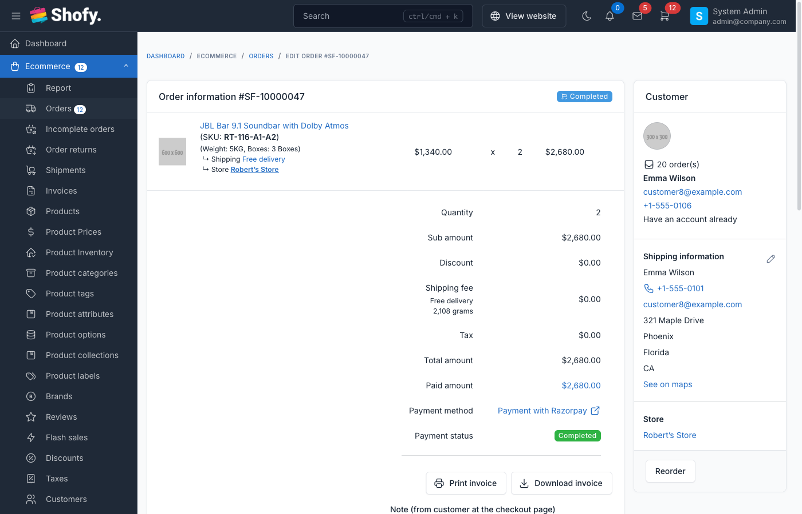

# Order Management

The order management system provides complete control over order processing, tracking, and fulfillment from initial placement through completion.

## Overview

Shofy's order management includes:

- **Order listing & search** - View all orders with filtering and search capabilities
- **Order details** - Complete order information with products, customer data, shipping, and payment
- **Status management** - Track order progression through lifecycle stages
- **Order history** - Detailed timeline of all order activities
- **Communication** - Email notifications and order notes
- **Financial actions** - Refunds, payment confirmation, and adjustments

## Accessing Orders

Navigate to `Ecommerce` -> `Orders` in the admin panel.

The orders table displays:
- Order code
- Customer name
- Products count
- Order amount
- Payment method & status
- Order status
- Creation date
- Actions (View/Edit/Delete)

### Search & Filter

Search orders by:
- Order code
- Customer name
- Customer email
- Customer phone
- Product SKU

Filter by:
- Order status
- Payment status
- Shipping status
- Date range

## Order Statuses

### Order Status Lifecycle

| Status | Description | Badge Color |
|--------|-------------|-------------|
| **Pending** | Order placed, awaiting confirmation | Yellow (warning) |
| **Processing** | Order confirmed, being prepared | Blue (info) |
| **Completed** | Order fulfilled and delivered | Green (success) |
| **Canceled** | Order canceled by admin or customer | Red (danger) |
| **Partial Returned** | Some items returned | Red (danger) |
| **Returned** | All items returned | Red (danger) |

### Shipping Status

| Status | Description |
|--------|-------------|
| **Not Approved** | Shipment pending approval |
| **Approved** | Shipment approved, not yet prepared |
| **Pending** | Awaiting shipment preparation |
| **Arrange Shipment** | Preparing shipment |
| **Ready to be Shipped Out** | Ready for pickup/dispatch |
| **Picking** | Items being picked from warehouse |
| **Delay Picking** | Picking delayed |
| **Picked** | Items picked, ready to ship |
| **Not Picked** | Items could not be picked |
| **Delivering** | In transit to customer |
| **Delivered** | Successfully delivered |
| **Not Delivered** | Delivery failed |
| **Audited** | Delivery audited/verified |
| **Canceled** | Shipment canceled |

### Payment Status

| Status | Description |
|--------|-------------|
| **Pending** | Payment not yet received |
| **Completed** | Payment received successfully |
| **Refunding** | Refund in progress |
| **Refunded** | Refund completed |
| **Failed** | Payment failed |
| **Fraud** | Fraudulent payment detected |
| **Canceled** | Payment canceled |

## Order Details View

### Information Sections

**Order Information**
- Order code
- Order date
- Order status
- Payment method
- Payment status
- Shipping method
- Amount breakdown (subtotal, tax, shipping, discount, total)

**Customer Information**
- Name, email, phone
- Shipping address
- Billing address (if different)
- Customer order history

**Products**
- Product name with SKU
- Product options/variations
- Quantity ordered
- Price per item
- Subtotal

**Shipping Information**
- Shipping address (editable)
- Shipping method
- Tracking number (if available)
- Shipment status

**Payment Information**
- Payment method
- Transaction ID
- Payment amount
- Refund details (if any)

**Tax Information** (if provided)
- Company tax code
- Company name
- Company address
- Company email

## Managing Orders

### Confirming Orders

For pending orders:

1. Review order details
2. Click **Confirm** button
3. System updates status to "Processing"
4. Confirmation email sent to customer

::: tip
Orders created from admin panel are automatically confirmed.
:::

### Updating Order Status

To change order status:

1. Open order details
2. Select new status from dropdown
3. Click **Save**
4. Status change logged in order history

::: warning
Some status changes have restrictions. For example, you cannot change a completed order back to pending.
:::

### Confirming Payment

For orders with pending payment:

1. Click **Confirm Payment** button
2. Payment status changes to "Completed"
3. If order status is pending, it changes to "Processing"
4. Payment confirmation logged in history

### Creating Shipments

To send order to shipping:

1. Open order details
2. Click **Create Shipment** button
3. Fill shipment form:
   - Select shipping method
   - Choose store location (pickup point)
   - Enter shipping notes
   - Set COD amount (if applicable)
4. Click **Create Shipment**
5. Order status updates to "Processing"
6. Shipment status set to "Delivering"

::: tip
An order can only have one shipment. Once created, you can cancel it or update its status.
:::

### Canceling Shipments

To cancel a shipment:

1. Open order with active shipment
2. Click **Cancel Shipment**
3. Confirm cancellation
4. Shipment status changes to "Canceled"

### Canceling Orders

Orders can be canceled if:
- Order status is "Pending" or "Processing"
- Shipment is not yet dispatched (status allows cancellation)

To cancel an order:

1. Open order details
2. Click **Cancel Order** button
3. Select cancellation reason:
   - Customer request
   - Out of stock
   - Fraudulent order
   - Duplicate order
   - Payment issues
   - Other (requires description)
4. Enter additional notes (optional)
5. Click **Confirm**
6. Order status changes to "Canceled"
7. Product quantities restored to inventory
8. Cancellation email sent to customer

::: warning Cancellation Restrictions
You cannot cancel orders that are:
- Already completed
- Already canceled
- In advanced shipping stages (delivered, not delivered)
:::

### Processing Refunds

To refund an order:

1. Open order details
2. Scroll to **Refund** section
3. Select products to refund with quantities
4. Enter refund amount (cannot exceed paid amount minus previous refunds)
5. Add refund note explaining reason
6. Click **Refund**
7. System processes refund:
   - Payment status updates (to "Refunded" if full refund)
   - Product quantities restored to inventory
   - Refund recorded in payment metadata
   - Refund history entry created

::: tip Online Refunds
For payment methods that support online refunds (Stripe, PayPal, etc.), refunds are processed automatically through the payment gateway.
:::

**Partial vs Full Refunds**
- **Partial refund**: Some items or amount refunded, payment status remains "Completed"
- **Full refund**: Entire order refunded, payment status changes to "Refunded"

### Editing Shipping Address

To update shipping address:

1. Open order details
2. Click **Edit** icon next to shipping address
3. Update address fields
4. Click **Save**
5. Address updated, change logged in history

::: warning
Cannot edit addresses for canceled orders.
:::

### Editing Tax Information

For orders with tax information:

1. Click **Edit** icon next to tax information
2. Update:
   - Company tax code
   - Company name
   - Company address
   - Company email
3. Click **Save**

### Adding Order Notes

To add private notes to an order:

1. Scroll to **Notes** section
2. Enter note text
3. Click **Save**

::: tip
Order notes are private and only visible to admin users. They are not sent to customers.
:::

## Order History Timeline

Every order maintains a complete history of activities:

- Order creation
- Status changes
- Payment confirmations
- Shipment creation
- Cancellations
- Refunds
- Address updates
- Email notifications sent

Each history entry shows:
- Action performed
- Description
- User who performed the action (if applicable)
- Timestamp

## Email Notifications

The system automatically sends emails for:

- **Order confirmation** - Sent when order is created or confirmed
- **Order status updates** - Sent when order status changes
- **Shipment notifications** - Sent when shipment is created
- **Cancellation notice** - Sent when order is canceled
- **Refund confirmation** - Sent when refund is processed

### Resending Confirmation Email

To resend order confirmation:

1. Open order details
2. Click **Resend confirmation email** button
3. Email sent to customer's email address

## Creating Orders from Admin

To create new orders manually:

1. Click **Create** button in orders list
2. Search and add products
3. Enter customer information or select existing customer
4. Apply discount/coupon (optional)
5. Select shipping method
6. Choose payment method and status
7. Enter order notes (optional)
8. Click **Create Order**

::: tip
Orders created from admin are marked as confirmed automatically.
:::

## Reordering

To create a new order based on an existing one:

1. Open order details
2. Click **Reorder** button
3. System pre-fills form with:
   - Same products
   - Same customer
   - Same quantities
4. Modify as needed
5. Create the new order

## Incomplete Orders

Incomplete orders are orders that:
- Were created but not finished (payment pending)
- User abandoned checkout before completing payment

Navigate to `Ecommerce` -> `Incomplete Orders` to view these.

### Marking as Completed

To complete an incomplete order:

1. Open incomplete order
2. Click **Mark as Completed**
3. Select payment method
4. Set payment status
5. Enter transaction ID (optional)
6. Click **Confirm**
7. Order moves to regular orders list

### Sending Recovery Email

To remind customer to complete their order:

1. Open incomplete order
2. Click **Send Recovery Email**
3. Email sent with cart contents and checkout link

## Invoice Management

### Generating Invoices

Invoices can be generated:
- **Automatically** - When order is completed (configurable)
- **Manually** - By clicking "Generate Invoice" on order details

To manually generate invoice:

1. Open order details
2. Click **Generate Invoice** button
3. Invoice created and linked to order

### Viewing & Downloading Invoices

Once generated, invoice actions appear:

- **View** - Opens invoice in browser
- **Download** - Downloads PDF file
- **Print** - Opens print dialog

::: tip
Configure invoice settings at `Ecommerce` -> `Settings` -> `Invoice`.
:::

## Payment Proof

For payment methods that support payment proof (bank transfer, cash on delivery):

Customers can upload proof of payment (receipt, transaction screenshot).

To download proof:

1. Open order with uploaded proof
2. Click **Download Proof** button
3. File downloaded to your computer

## Advanced Features

### Bulk Actions

Select multiple orders and:
- Delete orders (if deletion is enabled)
- Export selected orders

### Export Orders

Export order data to CSV/Excel:

1. Click **Export** button
2. Choose date range and filters
3. Select export format
4. Download file

::: tip
Export includes all order details, products, customer info, and amounts.
:::

### Webhooks

Configure webhooks to send order data to external systems:

Navigate to `Ecommerce` -> `Settings` -> `Webhooks`

## Configuration

### Order Settings

Configure order behavior at `Ecommerce` -> `Settings` -> `Orders`:

| Setting | Description |
|---------|-------------|
| **Order code prefix** | Prefix for order codes (e.g., "ORD-") |
| **Order code suffix** | Suffix for order codes |
| **Minimum order amount** | Minimum cart total to place order |
| **Enable order deletion** | Allow admins to delete orders |
| **Invoice generation** | Auto-generate invoices when order is completed |
| **Disable invoice until confirmed** | Hide invoice until order is confirmed |
| **Order tracking via phone/email** | Choose identifier for order tracking |

## Troubleshooting

### Order Not Found

If customer cannot find their order:

1. Search by email or phone
2. Check incomplete orders
3. Verify order was actually created (check payment logs)

### Payment Not Reflecting

If payment is made but status shows pending:

1. Check payment gateway logs
2. Verify transaction in payment gateway dashboard
3. Manually confirm payment if verified

### Stock Not Restored After Cancellation

If inventory is not updated after canceling an order:

1. Check if product has "Manage stock" enabled
2. Verify cancellation was successful in order history
3. Manually adjust stock if needed

### Cannot Cancel Order

If cancel button is disabled:

- Order may be completed already
- Shipment may be delivered
- Order may already be canceled
- Check order and shipment status

## Best Practices

1. **Process orders promptly** - Confirm and ship orders quickly to improve customer satisfaction

2. **Keep customers informed** - Update order status regularly, send tracking information

3. **Double-check before canceling** - Cancellation restocks inventory and may trigger automated refunds

4. **Document refunds clearly** - Always add detailed refund notes for future reference

5. **Monitor incomplete orders** - Follow up with customers who abandoned checkout

6. **Use order notes** - Document any special handling or issues for team reference

7. **Verify addresses** - Review shipping addresses before creating shipments to avoid delivery issues

8. **Track metrics** - Monitor order volume, cancellation rates, and refund patterns
