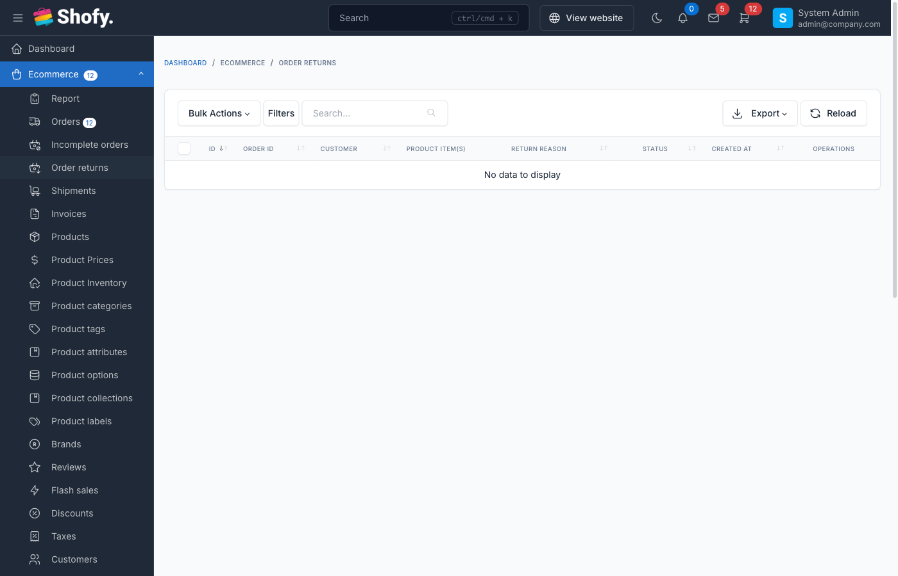
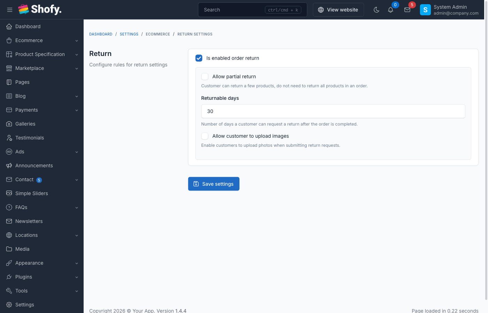

# Order Returns (RMA)

The order return management system (also known as RMA - Return Merchandise Authorization) allows customers to request returns for completed orders and provides admins with tools to review and process these requests.

## Overview

The return system includes:

- **Customer-initiated returns** - Customers can request returns from their account
- **Return reasons** - Structured reasons for returns
- **Return items** - Select specific products and quantities to return
- **Return status workflow** - Track return requests through processing stages
- **Refund integration** - Process refunds after approving returns
- **Return policies** - Configurable return windows and eligibility rules

## Enabling Returns

Navigate to `Ecommerce` -> `Settings` -> `Return Settings`.

Toggle **Enable order returns** to activate the feature.

## Return Settings

| Setting | Default | Description |
|---------|---------|-------------|
| **Enable order returns** | Off | Master switch for return feature |
| **Returnable days** | 30 | Days after order completion to allow returns |
| **Returnable statuses** | Completed | Order statuses eligible for returns |

::: tip
Only orders with "Completed" status can be returned. Orders must be within the returnable days window.
:::

## Return Eligibility Rules

An order can be returned if:

1. **Return feature is enabled** - Setting is turned on
2. **Order is completed** - Order status is "Completed"
3. **Within return window** - Order completed date is within returnable days
4. **No existing return** - Order doesn't already have a return request
5. **No digital downloads** - For digital products, items haven't been downloaded (if digital products are enabled)

::: warning Digital Products
Orders containing downloaded digital products cannot be returned.
:::

## Return Reasons

Customers must select a reason when requesting a return:

| Reason | When to Use |
|--------|-------------|
| **No longer want** | Changed mind, not needed |
| **Damaged** | Product arrived physically damaged |
| **Defective** | Product doesn't work properly |
| **Incorrect item** | Wrong product or variant received |
| **Arrived late** | Delivery missed expected date |
| **Not as described** | Product differs from description/images |
| **Other** | Custom reason (requires text description) |

## Accessing Return Requests

Navigate to `Ecommerce` -> `Order Returns` in the admin panel.

The returns table displays:
- Return code
- Order code
- Customer name
- Return reason
- Return status
- Creation date
- Actions (View/Edit/Delete)

## Return Status Workflow

| Status | Description | Badge Color | Next Actions |
|--------|-------------|-------------|--------------|
| **Pending** | Return requested, awaiting review | Yellow | Approve or reject |
| **Processing** | Return approved, items in transit | Blue | Mark as completed |
| **Completed** | Items received, refund processed | Green | None |
| **Canceled** | Return rejected or canceled | Red | None |

::: warning Status Changes
- Cannot change from Pending/Processing to the same status
- Cannot change from Completed or Canceled
- Can only progress forward through workflow
:::

## Customer Return Process

### How Customers Request Returns

1. Customer logs into their account
2. Navigates to **Order History**
3. Opens completed order (within return window)
4. Clicks **Return** button
5. Fills return form:
   - Selects items and quantities to return
   - Chooses return reason
   - Adds additional details (optional)
   - Uploads images (optional, up to 5 images)
6. Submits return request
7. System creates return with "Pending" status
8. Customer receives confirmation email

::: tip
Return requests are visible to customers in their account dashboard with tracking information.
:::

## Admin Return Processing

### Reviewing Return Requests

To review a return request:

1. Navigate to `Ecommerce` -> `Order Returns`
2. Click on pending return to open details

**Return Details View Shows:**
- Return code and date
- Original order information
- Customer information
- Return reason and description
- Uploaded images (if any)
- Items being returned with quantities
- Return history timeline
- Store location (if multiple stores)

### Approving Returns

To approve a return:

1. Open return details
2. Change **Return Status** to "Processing"
3. Add processing notes (optional)
4. Click **Save**
5. System logs status change
6. Customer notified via email

Actions after approval:
- Provide customer with return shipping instructions
- Generate return label (if applicable)
- Wait for items to arrive

### Completing Returns

Once returned items are received:

1. Open return details
2. Inspect received items
3. Change **Return Status** to "Completed"
4. Add completion notes (optional)
5. Click **Save**
6. Process refund through original order

::: tip Refund Process
After completing a return, go to the original order and process the refund for the returned items.
:::

### Rejecting Returns

To reject a return request:

1. Open return details
2. Change **Return Status** to "Canceled"
3. Add rejection reason in notes
4. Click **Save**
5. Customer notified via email

Common rejection reasons:
- Outside return window
- Items not in original condition
- Missing original packaging
- Non-returnable items
- Evidence of misuse

## Return Items Management

Each return request includes:

- Product name and SKU
- Product variation/options
- Quantity being returned
- Original order quantity
- Product price
- Subtotal for returned items

The system validates:
- Cannot return more than originally ordered
- Cannot return items not in the order
- Must return at least one item

## Return History

Every return maintains a complete history:

- Return creation
- Status changes
- Admin notes
- Customer communications
- Timestamps and user info

View history in the return details page.

## Images & Evidence

Customers can upload up to 5 images with their return request to show:
- Product damage
- Defects or issues
- Wrong items received
- Packaging problems

Admin can view these images in return details.

::: warning
Images are stored securely and only accessible to admin users and the customer who uploaded them.
:::

## Store Locations

If multiple store locations are enabled:

Returns can be assigned to specific stores for processing. This helps with:
- Regional returns processing
- Inventory management
- Shipping logistics

## Return Codes

Return codes are auto-generated using the same format as order codes:

Format: `PREFIX + NUMBER`

Example: `ORD-000123` (using order code prefix)

## Refund After Return

Returns and refunds are separate processes:

**Step 1: Complete the Return**
1. Receive returned items
2. Inspect condition
3. Mark return as "Completed"

**Step 2: Process the Refund**
1. Navigate to original order
2. Use refund function
3. Select returned products
4. Enter refund amount
5. Add refund notes
6. Process refund

::: tip
Always complete the return before processing refunds to maintain accurate tracking.
:::

## Email Notifications

The system sends emails for:

- **Return request received** - Confirms customer's request
- **Return approved** - Provides return shipping instructions
- **Return completed** - Confirms receipt of items
- **Return rejected** - Explains rejection reason
- **Refund processed** - Confirms refund (from order refund system)

Configure email templates at `Settings` -> `Email` -> `Ecommerce` section.

## Return Statistics

Track return metrics:
- Total returns by period
- Return rate by product
- Common return reasons
- Average processing time
- Completed vs canceled returns

Use this data to:
- Identify problematic products
- Improve product descriptions
- Optimize return policies
- Train customer service

## Configuration Best Practices

### Returnable Days

**Conservative (14-15 days)**
- Lower operational costs
- Faster inventory turnover
- Clear expectations

**Standard (30 days)**
- Industry standard
- Balances customer satisfaction and costs
- Reduces pressure on customers

**Extended (60-90 days)**
- Higher customer confidence
- Competitive advantage
- Increased operational costs

::: tip
Match your return window to your product type and market expectations.
:::

### Return Reasons

Keep reasons:
- **Clear** - Easy to understand
- **Specific** - Actionable feedback
- **Limited** - Not overwhelming
- **Inclusive** - Cover all scenarios with "Other" option

## Preventing Return Abuse

To minimize fraudulent returns:

1. **Document everything** - Take photos of returned items
2. **Verify condition** - Check against return policy
3. **Track patterns** - Monitor customers with frequent returns
4. **Set clear policies** - Communicate expectations upfront
5. **Inspect thoroughly** - Verify returned items match order
6. **Use serial numbers** - Track high-value items

## Integration with Orders

The return system integrates with order management:

- **Return button** - Appears on eligible orders
- **Return status** - Shows on order details
- **Order status updates** - Changes to "Partial Returned" or "Returned" after return
- **Linked records** - Easy navigation between order and return

## Troubleshooting

### Return Button Not Showing

Check if:
- Return feature is enabled in settings
- Order status is "Completed"
- Order is within returnable days window
- Order doesn't already have a return request
- No digital products have been downloaded

### Cannot Change Return Status

Verify:
- Not trying to change to same status
- Return is not already Completed or Canceled
- Current status allows the transition

### Refund Not Processing

Ensure:
- Return is marked as "Completed" first
- Refund is processed from original order, not return record
- Payment method supports refunds
- Refund amount doesn't exceed order total

### Customer Not Receiving Emails

Check:
- Email templates are enabled
- Email settings are configured correctly
- Customer's email address is valid
- Emails not in spam folder

## Advanced Features

### Multiple Store Locations

If using multiple stores:

1. Assign returns to specific stores
2. Track inventory by location
3. Process returns at nearest facility
4. Route items to appropriate warehouse

### Return Analytics

Export return data for analysis:

1. Navigate to return list
2. Apply filters (date range, status, reason)
3. Click **Export** button
4. Analyze in spreadsheet

Metrics to track:
- Return rate by product category
- Average return processing time
- Refund amounts by reason
- Seasonal return patterns

### Custom Return Policies

Implement product-specific return policies:

- Non-returnable items (clearance, personalized)
- Extended returns (holiday season)
- Restocking fees
- Store credit only options

::: warning
Custom policies require theme customization. The default system applies settings globally.
:::

## Frequently Asked Questions

### How long do customers have to return items?

The **Returnable days** setting (default 30 days) defines the window. Days are counted from order completion date, not order creation date.

### Can customers return partial orders?

Yes. Customers can select specific items and quantities to return. The system tracks which items were returned.

### Do returned items restock automatically?

No. Returns and refunds are processed separately. When you refund through the order, you choose whether to restock items.

### Can customers track return status?

Yes. Customers see return status in their account under order history. They receive email updates when status changes.

### What happens to return images after processing?

Images are retained with the return record for reference. They can be deleted when the return is deleted.

### Can I customize return reasons?

The return reasons are defined in the OrderReturnReasonEnum. Customization requires code changes. The "Other" option allows free-text reasons.

## Best Practices

1. **Process returns quickly** - Review requests within 24-48 hours

2. **Communicate clearly** - Explain next steps when approving or rejecting

3. **Inspect carefully** - Verify returned items before completing return

4. **Document condition** - Take photos of returned items

5. **Set clear policies** - Make return policies visible on product pages

6. **Train staff** - Ensure team knows return processing steps

7. **Monitor trends** - Track return reasons to improve products

8. **Be customer-focused** - Prioritize fair treatment while protecting business

9. **Use private notes** - Document internal decisions for team reference

10. **Follow up** - Confirm customer satisfaction after refund processed
