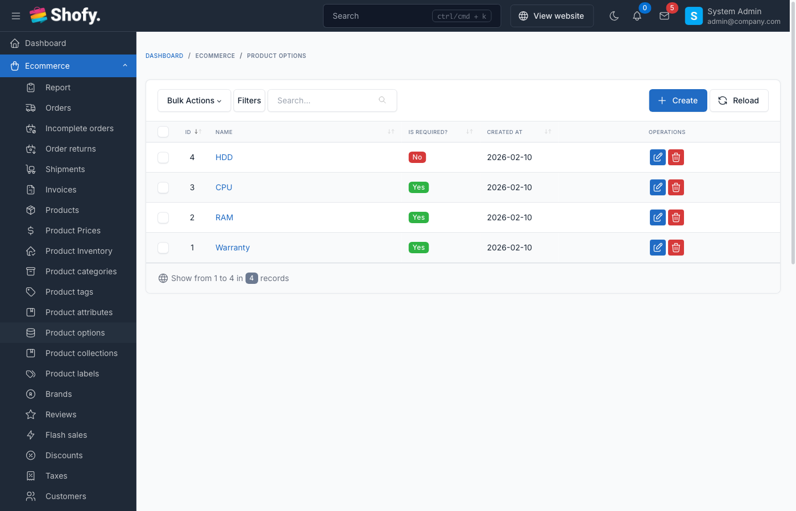

# Product Options

Product options allow customers to customize products beyond variations. While variations change the product itself (size, color), options are add-ons and customizations that affect the final price but don't create separate inventory items.

## Overview

**Product Options vs Variations:**

| Feature | Variations | Options |
|---------|-----------|---------|
| Inventory | Separate stock per variation | No separate inventory |
| Purpose | Different versions of product | Customizations/add-ons |
| Price Impact | Base price changes | Adds/subtracts from base |
| Examples | Size, Color, Material | Engraving, Gift wrap, Warranties |



## Option Types

| Type | Description | Use Case |
|------|-------------|----------|
| **Text** | Single-line text input | Custom text (engraving, name) |
| **Textarea** | Multi-line text input | Long messages, instructions |
| **Dropdown** | Select one option | Single choice (warranty plans) |
| **Checkbox** | Select multiple | Multiple add-ons (gift wrap, card) |
| **Radio** | Select one option | Exclusive choices (size upgrades) |
| **File Upload** | Customer uploads file | Custom designs, logos |

## Creating Global Options

Global options are reusable across multiple products.

Navigate to `Ecommerce` -> `Product Options` -> `Global Options`.

1. Click **Create**
2. Fill in option details:
   - **Name** - Option label (e.g., "Gift Wrapping")
   - **Option Type** - Select field type
   - **Required** - Check if customer must select
3. Click **Save**

### Adding Option Values (Dropdown/Checkbox/Radio)

For dropdown, checkbox, and radio types:

1. Open the global option
2. Scroll to **Option Values** section
3. Click **Add new value**
4. Fill in:
   - **Option Value** - Display text (e.g., "Premium Gift Wrap")
   - **Affect Price** - Amount to add/subtract
   - **Affect Type** - Fixed amount or percentage
   - **Order** - Display order
5. Repeat for all values
6. Click **Save**

### Price Adjustments

**Fixed Amount:**
- Set **Affect Type** = "Fixed"
- **Affect Price** = `5.00` (adds $5.00)
- **Affect Price** = `-2.00` (subtracts $2.00)

**Percentage:**
- Set **Affect Type** = "Percentage"
- **Affect Price** = `10` (adds 10% of product price)
- **Affect Price** = `-5` (subtracts 5% of product price)

::: tip
Use percentage pricing for options that should scale with product value, like warranties or insurance.
:::

## Adding Options to Individual Products

Navigate to `Ecommerce` -> `Products` and open a product.

### Method 1: Assign Global Options

1. Scroll to **Product Options** section
2. Click **Assign Global Option**
3. Select global option(s)
4. Click **Save**

Global option values and pricing apply automatically.

### Method 2: Create Product-Specific Options

1. In **Product Options** section, click **Add new option**
2. Fill in option details:
   - **Name** - Option label
   - **Option Type** - Field type
   - **Required** - Make mandatory
   - **Order** - Display sequence
3. For dropdown/checkbox/radio, add values:
   - Click **Add value**
   - Enter value text and pricing
4. Click **Save**

::: warning
Product-specific options only apply to that product. Changes don't affect other products.
:::

## Option Configuration Examples

### Example 1: Text Engraving

**Option Type:** Text
```
Name: Personalized Engraving
Type: Text
Required: No
Affect Price: $5.00 (Fixed)
```

Customer enters custom text, adds $5 to price.

### Example 2: Gift Wrapping

**Option Type:** Checkbox
```
Name: Add-ons
Type: Checkbox
Required: No

Values:
- Gift Wrapping ($3.00, Fixed)
- Gift Card ($2.00, Fixed)
- Express Shipping ($10.00, Fixed)
```

Customer selects multiple add-ons, each adds its price.

### Example 3: Warranty Plans

**Option Type:** Radio
```
Name: Warranty Plan
Type: Radio
Required: No

Values:
- No Warranty ($0.00)
- 1-Year Warranty (10%, Percentage)
- 2-Year Warranty (15%, Percentage)
```

Customer selects one plan, percentage based on product price.

### Example 4: Custom Design Upload

**Option Type:** File
```
Name: Upload Your Design
Type: File
Required: Yes
Affect Price: $0.00
```

Customer uploads file, required for order processing.

### Example 5: Gift Message

**Option Type:** Textarea
```
Name: Gift Message
Type: Textarea
Required: No
Affect Price: $0.00
```

Customer enters message, no price impact.

## Required vs Optional Options

**Required Options:**
- Customer must select before adding to cart
- "Add to Cart" button disabled until selected
- Use for essential customizations

**Optional Options:**
- Customer can skip
- Use for add-ons and extras

## Option Display Order

Control option sequence on product pages:

1. Edit product
2. In **Product Options**, each option has **Order** field
3. Lower numbers display first
4. Update and save

## File Upload Options

For file type options:

**Settings:**
- Accepts common file formats (images, PDFs, etc.)
- Maximum file size controlled by server settings
- Files stored in `storage/app/uploads`

**Use Cases:**
- Custom logo design
- Artwork for printing
- Measurement photos
- Assembly instructions

::: warning
Configure server `upload_max_filesize` and `post_max_size` in `php.ini` for large file uploads.
:::

## Managing Global Options

### Editing Global Options

1. Navigate to `Ecommerce` -> `Product Options` -> `Global Options`
2. Click option name
3. Modify settings
4. Changes apply to all products using this option
5. Click **Save**

### Deleting Global Options

1. Open global option
2. Click **Delete**
3. Confirm deletion

::: warning
Deleting a global option removes it from all products. Consider deactivating instead.
:::

## Options in Cart & Checkout

When customer adds product with options:

**Cart Display:**
```
Product Name
- Option 1: Selected Value (+$5.00)
- Option 2: Selected Value (+$10.00)
Base Price: $100.00
Options Total: $15.00
Line Total: $115.00
```

**Order Details:**
Options appear in order items with selected values and price adjustments.

## Options vs Variations: When to Use Each

**Use Variations When:**
- Different SKUs needed
- Separate inventory tracking required
- Core product attributes (size, color, model)
- Significant price differences
- Different product images

**Use Options When:**
- No inventory tracking needed
- Add-ons and customizations
- Price adjustments
- Text input from customers
- File uploads
- Same base product with extras

**Can Combine Both:**
Example: T-shirt with variations (size/color) and options (gift wrap, custom name).

## Import/Export Options

::: tip
Global options are managed separately and don't export/import with products. Export products include only assigned global option references.
:::

## Multi-language Support

If language plugin is active:

### Translating Global Options

1. Navigate to `Product Options` -> `Global Options`
2. Open option
3. Switch language
4. Translate option **Name**
5. Translate **Option Values** text
6. Save

### Translating Product Options

1. Edit product
2. Switch language
3. Translate option names and values
4. Save for each language

## Troubleshooting

### Option prices not calculating correctly

1. **Check Affect Type** - Verify "Fixed" vs "Percentage"
2. **Verify base price** - Percentage applies to product price
3. **Check for negative values** - Use minus sign for discounts
4. **Clear cache** - Run `php artisan cache:clear`

### Required option not enforced

1. **Check "Required" checkbox** - Must be enabled
2. **Clear browser cache** - Frontend may cache old form
3. **Check JavaScript** - Ensure no JS errors in browser console

### File upload not working

1. **Check file size** - Verify server upload limits
2. **Check permissions** - Ensure `storage/app` is writable
3. **Review allowed types** - System may block certain file types
4. **Check error logs** - Review Laravel logs for upload errors

### Global option changes not reflecting on products

1. **Clear cache** - Run `php artisan cache:clear`
2. **Refresh product page** - Hard refresh browser (Ctrl+F5)
3. **Re-save products** - May need to trigger cache rebuild

## Best Practices

1. **Use global options for common add-ons** - Create once, use everywhere
2. **Keep options simple** - Too many options overwhelm customers
3. **Set logical defaults** - Pre-select most common choices
4. **Use clear labels** - Describe what customer gets
5. **Show price impact** - Display price changes clearly
6. **Group related options** - Use similar order numbers
7. **Test checkout flow** - Verify options work in cart and checkout
8. **Consider mobile users** - Keep file upload sizes reasonable
9. **Validate required fields** - Ensure critical options are required
10. **Document for staff** - Create guides for custom options handling

## Example: Complete Product Setup

**Product:** Custom T-Shirt

**Variations:**
- Size: S, M, L, XL ($20 base price)
- Color: Red, Blue, Black

**Options:**
1. **Text Engraving (Required):**
   - Type: Text
   - Price: +$5.00

2. **Gift Options (Optional):**
   - Type: Checkbox
   - Gift Wrap: +$3.00
   - Gift Message: +$2.00

3. **Rush Processing (Optional):**
   - Type: Radio
   - Standard (Free)
   - Rush 2-Day: +$10.00
   - Rush Overnight: +$25.00

Customer Experience:
1. Select variation (size/color)
2. Enter custom text (required)
3. Optionally add gift options
4. Choose shipping speed
5. See total: Base + Engraving + Gift Options + Rush
