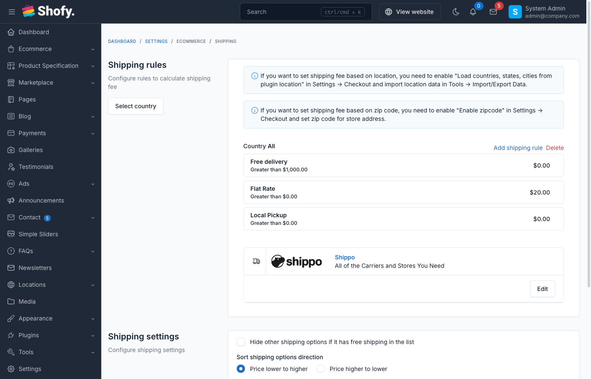

# Shipping Methods

The shipping methods system provides flexible configuration for shipping rates, zones, and rules to accurately calculate shipping costs at checkout.

## Overview

Shofy's shipping system includes:

- **Multiple shipping regions** - Define shipping rules by country
- **Flexible shipping rules** - Price-based, weight-based, zipcode-based, or location-based
- **Rate calculations** - Automatic shipping cost calculation at checkout
- **Free shipping** - Configure free shipping thresholds
- **City-specific rates** - Set different rates for specific cities
- **Store locations** - Link shipments to physical store locations

## Accessing Shipping Settings

Navigate to `Ecommerce` -> `Settings` -> `Shipping` in the admin panel.



## Default Shipping Setup

When you first set up the store, a default shipping region is created for "All locations" with a basic delivery rule.

The default configuration includes:
- Region: All locations (no specific country)
- Rule type: Based on price
- Default shipping rate

::: tip
The default region applies to all countries not explicitly configured with their own shipping rules.
:::

## Shipping Regions

Shipping regions let you define different shipping rules for different countries or groups of countries.

### Creating a Shipping Region

1. Click **Add new region** button
2. Select country (or leave empty for "All locations")
3. Click **Create**
4. System creates region with default delivery rule

### Region Hierarchy

- **Specific country rules** - Applied first if customer's country matches
- **All locations rule** - Applied as fallback if no country-specific rule exists

Example:
```
United States (specific rules) -> Used for US orders
United Kingdom (specific rules) -> Used for UK orders
All locations (default) -> Used for all other countries
```

### Deleting Regions

To delete a shipping region:

1. Find region in shipping list
2. Click **Delete** icon
3. Confirm deletion
4. All shipping rules for that region are deleted

::: warning
Deleting a region removes all its shipping rules. This cannot be undone.
:::

## Shipping Rules

Each shipping region can have multiple shipping rules. Rules define how shipping costs are calculated based on order characteristics.

### Rule Types

#### 1. Based on Price

Calculate shipping based on order subtotal.

**Configuration:**
- **From**: Minimum order amount
- **To**: Maximum order amount (or leave empty for no maximum)
- **Shipping cost**: Fixed rate for this price range

**Example:**
```
From: $0   To: $50   Cost: $5.00
From: $50  To: $100  Cost: $3.00
From: $100 To: -     Cost: Free
```

**Use cases:**
- Encourage larger orders with lower rates
- Free shipping over threshold
- Standard flat rate shipping

#### 2. Based on Weight

Calculate shipping based on total order weight.

**Configuration:**
- **From**: Minimum weight (in configured weight unit)
- **To**: Maximum weight
- **Shipping cost**: Fixed rate for this weight range

**Example (using grams):**
```
From: 0g     To: 500g   Cost: $5.00
From: 500g   To: 1000g  Cost: $8.00
From: 1000g  To: -      Cost: $12.00
```

**Use cases:**
- Heavy item surcharges
- Lightweight item discounts
- Tiered shipping by package size

::: tip Weight Unit
The weight unit is configured at `Ecommerce` -> `Settings` -> `Standard & Formats`. Common units: grams, kg, oz, lbs.
:::

#### 3. Based on Zipcode

Calculate shipping based on customer's postal code.

**Configuration:**
- **Base rate**: Default shipping cost
- **Zipcode adjustments**: Add/subtract amounts for specific zipcodes

**Example:**
```
Base rate: $5.00

Zipcode adjustments:
90001 -> +$2.00 (Remote area surcharge)
10001 -> -$1.00 (Urban discount)
```

**Use cases:**
- Rural area surcharges
- Metropolitan area discounts
- Zone-based pricing

::: warning Requirements
- Only available for specific country regions (not "All locations")
- Requires zipcode to be enabled in checkout settings
:::

#### 4. Based on Location

Calculate shipping based on customer's city or state.

**Configuration:**
- **Base rate**: Default shipping cost
- **City adjustments**: Add/subtract amounts for specific cities

**Example:**
```
Base rate: $5.00

City adjustments:
New York -> +$2.00
Los Angeles -> +$1.50
Chicago -> +$0.50
```

**Use cases:**
- City-specific delivery fees
- Regional pricing
- Metropolitan vs suburban rates

::: warning Requirements
- Only available for specific country regions
- Requires Location plugin to be active
- Must have countries, states, and cities configured
:::

#### 5. Based on Zipcode and Weight

Combines zipcode and weight-based calculations.

**Configuration:**
- **From weight**: Minimum weight
- **To weight**: Maximum weight
- **Base rate**: Default shipping cost for this weight range
- **Zipcode adjustments**: Additional amounts for specific zipcodes

**Example:**
```
Weight: 0-500g
Base rate: $5.00

Zipcode adjustments:
90001 -> +$2.00 (Heavy package to remote area)
10001 -> -$1.00 (Light package to urban area)
```

**Use cases:**
- Complex shipping scenarios
- Courier-based pricing
- High-accuracy cost calculations

### Creating Shipping Rules

To add a new shipping rule:

1. Navigate to shipping settings
2. Find the region
3. Click **Add new rule** button
4. Fill rule details:
   - **Rule name**: Descriptive name (e.g., "Standard Delivery", "Express Shipping")
   - **Type**: Select rule type
   - **From**: Minimum value (price/weight)
   - **To**: Maximum value (empty for unlimited)
   - **Shipping cost**: Base rate
5. Click **Create**
6. Configure city/zipcode adjustments (if applicable)

### Editing Shipping Rules

To modify a shipping rule:

1. Find the rule in shipping list
2. Click **Edit** icon
3. Update rule details
4. Configure city/zipcode adjustments
5. Click **Save**

### Deleting Shipping Rules

To delete a shipping rule:

1. Find rule in shipping list
2. Click **Delete** icon
3. Confirm deletion

::: warning
If you delete all rules for a region, the region is automatically deleted.
:::

## City & Zipcode Adjustments

For rules that support location-based adjustments, you can configure specific rates for cities or zipcodes.

### Adding Adjustments

1. Edit a shipping rule with location support
2. Scroll to city/zipcode adjustments section
3. Find city/zipcode in list
4. Set adjustment:
   - **Positive value**: Adds to base rate (surcharge)
   - **Negative value**: Subtracts from base rate (discount)
   - **Zero**: Uses base rate
   - **Disable**: Location not available for shipping

**Example adjustments:**
```
Base rate: $5.00

Los Angeles: +$2.00 -> Total: $7.00
San Francisco: +$1.50 -> Total: $6.50
San Diego: $0.00 -> Total: $5.00
Remote Area: Disabled -> Not available
```

### Bulk Configuration

When editing rules with many locations:

1. Set common adjustments first
2. Fine-tune specific locations
3. Disable unavailable areas
4. Save changes

## Free Shipping

### Threshold-Based Free Shipping

Use price-based rules to offer free shipping:

**Method 1: Separate rule**
```
Rule 1: From $0 to $100 -> $5.00
Rule 2: From $100 to - -> $0.00 (Free)
```

**Method 2: High threshold**
```
From $0 to $150 -> $8.00
From $150 to - -> Free
```

### Coupon-Based Free Shipping

Configure free shipping coupons at `Ecommerce` -> `Promotions` -> `Coupons`:

1. Create new coupon
2. Select **Free shipping**
3. Set minimum order (optional)
4. Save coupon

When applied, shipping cost becomes $0 regardless of shipping rules.

## Shipping Calculation Logic

### How Shipping is Calculated

1. **Customer location determined** - Country, state, city, zipcode from checkout form
2. **Region selected** - Specific country region or "All locations" fallback
3. **Matching rule found** - First rule matching order characteristics
4. **Base rate retrieved** - From the matching rule
5. **Adjustments applied** - City/zipcode adjustments added to base rate
6. **Final cost calculated** - Total shipping cost displayed

### Multiple Rules Priority

If multiple rules match, the system uses:

1. **Most specific rule** - Country-specific over "All locations"
2. **First matching rule** - In order of creation
3. **Rule with tighter range** - More specific ranges take precedence

### Example Calculation

**Order details:**
- Subtotal: $75
- Weight: 800g
- Country: United States
- Zipcode: 90001

**Available rules:**
1. US - Based on price: $0-$50 -> $5, $50-$100 -> $3, $100+ -> Free
2. US - Based on weight: 0-500g -> $5, 500-1000g -> $8
3. All locations - Based on price: $0+ -> $10

**Calculation:**
- Country-specific rules available (US)
- Order is $75 (matches rule 1: $50-$100)
- Shipping cost: $3.00

## Digital Products

Digital products (downloads) don't require shipping:

- Automatically excluded from shipping calculation
- If order contains only digital products, no shipping charged
- Mixed orders (physical + digital) charge shipping only for physical items

::: tip
Enable digital products at `Ecommerce` -> `Settings` -> `Digital Products`.
:::

## Store Locations

Link shipments to physical store locations for:

- Pickup points
- Regional warehouses
- Fulfillment centers

Configure at `Ecommerce` -> `Store Locators`:

1. Create store locations
2. Enable **Is shipping location**
3. When creating shipments, select store location

Benefits:
- Track which location fulfilled order
- Multi-warehouse inventory management
- Regional shipping optimization

## Advanced Shipping Methods

For more advanced shipping needs, Shofy supports:

### Shipping by Location Plugin

Enables detailed city/state-based shipping rules.

See: [Shipping by Location Documentation](usage-shipping-by-location.md)

### Shippo Integration

Connect to Shippo for real-time carrier rates and label printing.

See: [Shippo Integration Documentation](usage-shippo.md)

### Third-Party Carriers

Integrate with:
- FedEx
- UPS
- USPS
- DHL
- Local carriers

::: tip
Third-party integrations require separate plugins or customization.
:::

## Shipping at Checkout

### Customer Experience

1. Customer adds products to cart
2. Proceeds to checkout
3. Enters shipping address
4. System calculates shipping options
5. Customer selects shipping method
6. Shipping cost added to order total

### Multiple Shipping Options

If you configure multiple shipping rules (e.g., Standard and Express), customers can choose their preferred method at checkout.

**Example:**
```
Standard Delivery (3-5 days) - $5.00
Express Shipping (1-2 days) - $15.00
```

## Configuration Tips

### Setting Up New Store

1. **Start simple** - Begin with flat rate shipping for all locations
2. **Test checkout** - Verify shipping appears correctly
3. **Add country rules** - Configure top destination countries
4. **Refine rates** - Adjust based on actual carrier costs
5. **Monitor costs** - Track if shipping covers actual expenses

### Optimizing Shipping Costs

1. **Negotiate carrier rates** - Use shipping volume for better rates
2. **Use weight tiers** - Align with carrier's weight breaks
3. **Offer free shipping strategically** - Set threshold above average order value
4. **Regional pricing** - Charge more for remote areas
5. **Bundle products** - Encourage multi-item orders with better shipping rates

### Common Configurations

**Basic flat rate:**
```
All locations
Based on price: $0 to - -> $5.00
```

**Tiered with free shipping:**
```
All locations
Rule 1: $0 to $50 -> $7.00
Rule 2: $50 to $100 -> $4.00
Rule 3: $100 to - -> Free
```

**Weight-based domestic:**
```
United States
Based on weight:
0-500g -> $5.00
500-1000g -> $8.00
1000g+ -> $12.00
```

**International premium:**
```
All locations (excluding specific countries)
Based on price: $0 to - -> $25.00
```

## Troubleshooting

### No Shipping Options at Checkout

Check:
- At least one shipping region exists
- Region has at least one active shipping rule
- Rule ranges cover customer's order (price/weight)
- Customer's country is covered by a region
- Products are not all digital products

### Incorrect Shipping Cost

Verify:
- Rule type matches what you're testing (price vs weight)
- Rule ranges don't have gaps
- City/zipcode adjustments are correct
- Weight unit matches products
- No conflicting rules

### Shipping Too Expensive

Options:
- Lower base rates
- Add free shipping threshold
- Create promotional rates for specific regions
- Use weight-based rules for lighter items
- Absorb some shipping cost in product price

### Cannot Create Location-Based Rules

Requirements:
- Must select specific country (not "All locations")
- Location plugin must be active
- Countries and cities must be configured
- Zipcode must be enabled in settings

## Best Practices

1. **Keep it simple** - Start with basic rules, add complexity only if needed

2. **Test thoroughly** - Place test orders from different locations

3. **Cover all scenarios** - Ensure every order can calculate shipping

4. **Use realistic ranges** - Base ranges on actual order patterns

5. **Monitor shipping costs** - Track if charges cover actual shipping expenses

6. **Communicate clearly** - Display shipping policies on your site

7. **Update regularly** - Adjust rates when carrier costs change

8. **Provide options** - Offer standard and express shipping when possible

9. **Consider margins** - Factor shipping costs into product pricing

10. **Use analytics** - Track which shipping options customers prefer

## Frequently Asked Questions

### Can I offer both flat rate and calculated shipping?

Yes. Create multiple rules with different types. Customers will see all matching options at checkout.

### How do I charge exact carrier rates?

Use Shippo integration or similar carrier plugins for real-time rate calculation from carriers.

### Can I hide certain shipping methods?

Yes. Delete or disable rules you don't want to offer. Only active rules appear at checkout.

### What happens if no shipping rule matches?

Checkout will show an error. Always ensure rules cover all possible order scenarios.

### Can I charge handling fees?

Yes. Add handling fees to your shipping rates, or create separate line items in order processing.

### How do I test shipping calculations?

Place test orders with different amounts/weights, use different addresses, check calculated rates.
