# Theme Options

Theme options are a great way to customize your theme. You can change the color, typography, layout, and more.

To access the theme options, go to `Appearance` -> `Theme Options` in your admin panel.

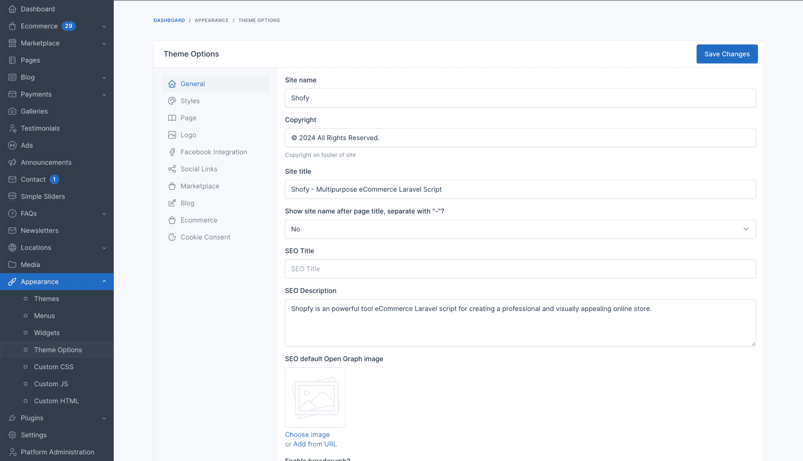

## General

The **General** tab allows you to configure fundamental settings that shape your website's identity and basic operation.

This section typically includes options for setting your site name, description, and other essential details.

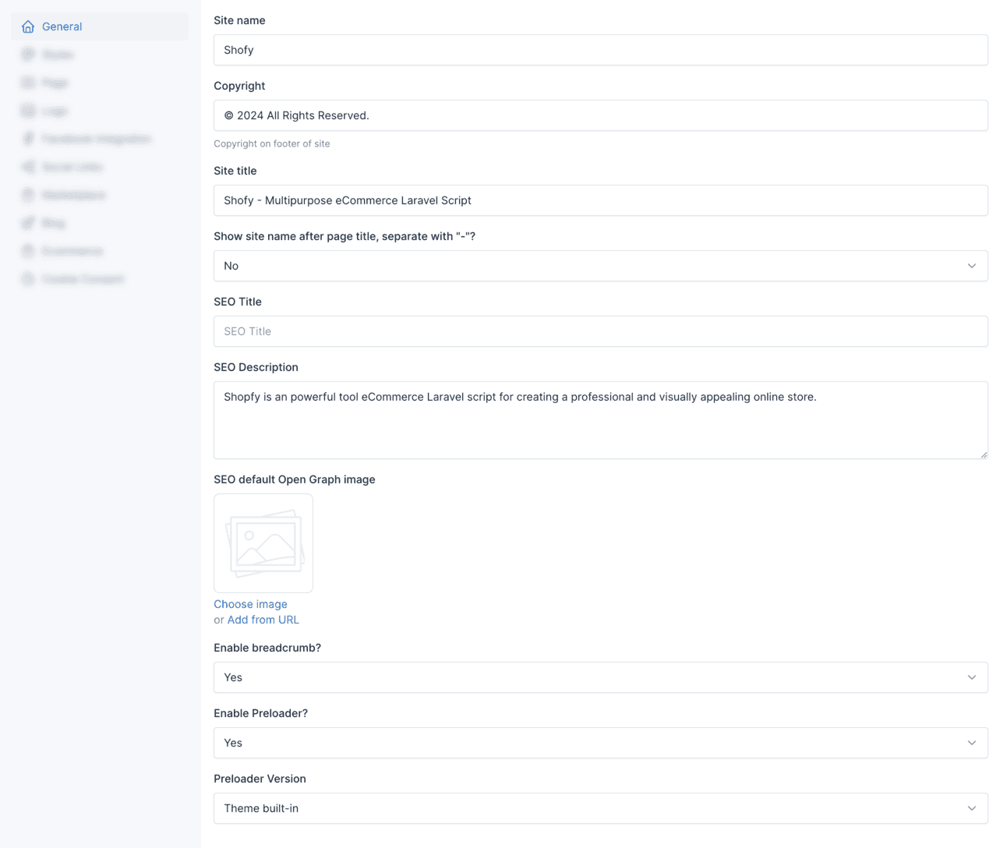

### Preloader

The preloader is a small animation that appears while your website is loading. You can enable or disable it in the **General** tab.

You can also choose between different preloader versions available in Shofy.

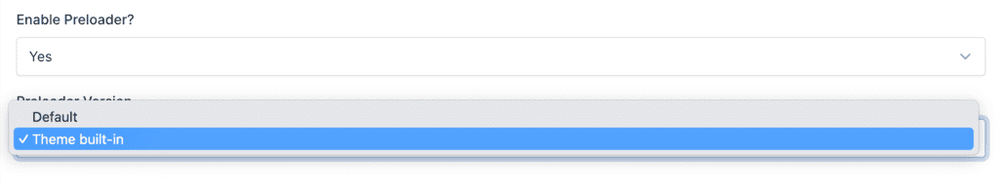

## Styles

The **Styles** tab within the theme options empowers you to personalize the visual identity of your Shofy store.

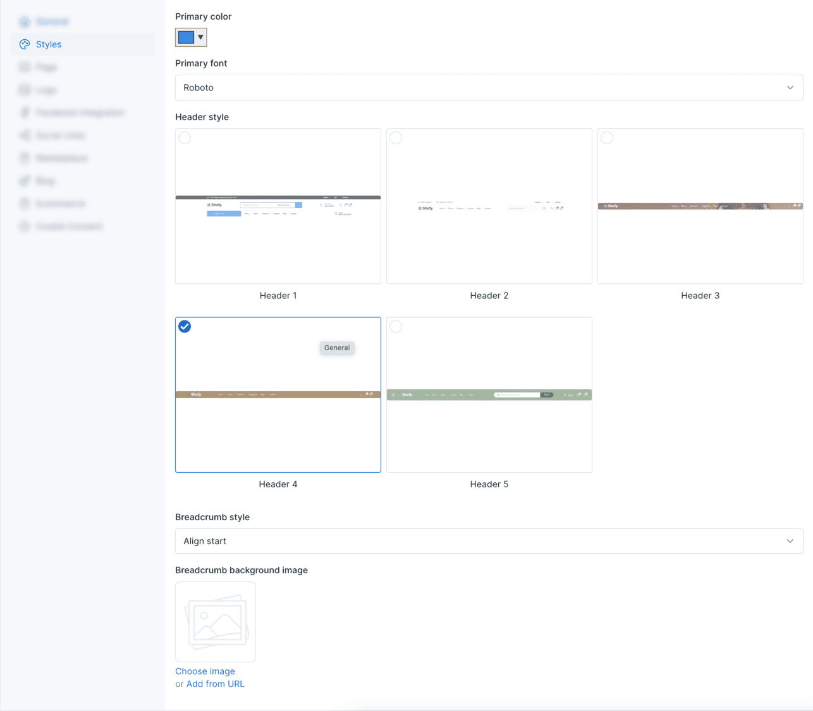

### Header Style

The header style section allows you to choose between different header styles for your website. There are 5 predefined header styles to choose from.

#### Header Style 1

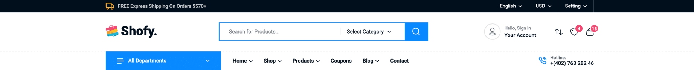

#### Header Style 2

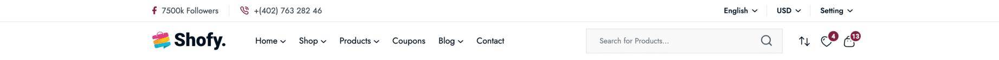

#### Header Style 3

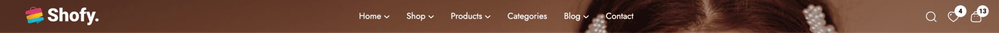

#### Header Style 4

#### Header Style 5

### Footer Style

Shofy includes 2 predefined footer styles to complement your header selection and complete your store's visual identity.

## Social Links

Social links are a great way to connect with your audience. You can add your social media links in the **Social Links** tab.

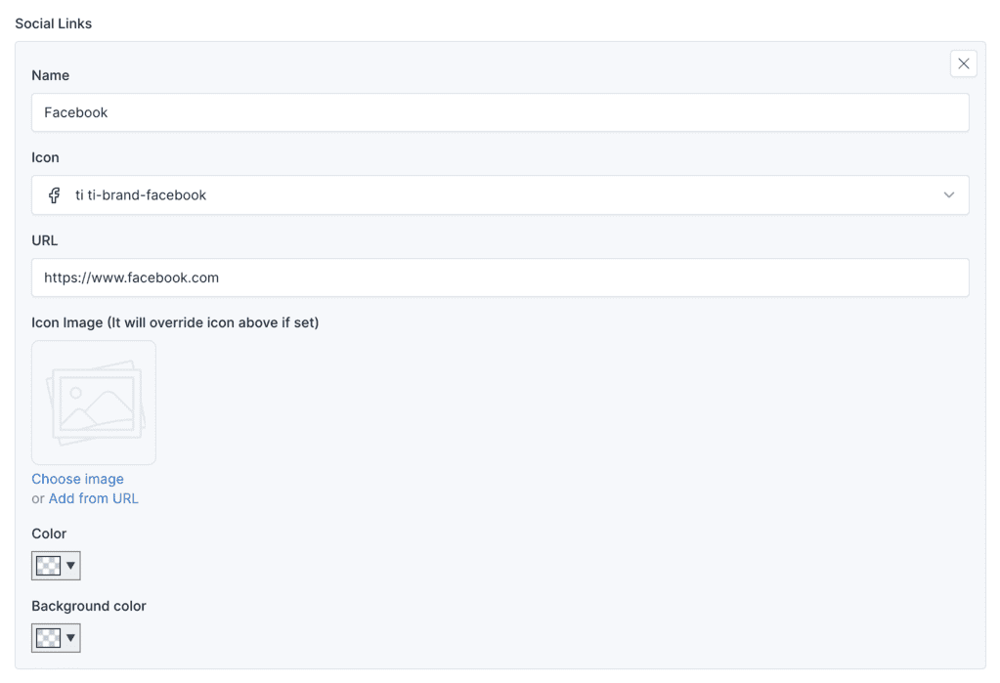

Then, these links can be used in **[Site Information](./usage-widgets.md#12-footer-primary-sidebar)** widget, or in **Contact Form** shortcode.

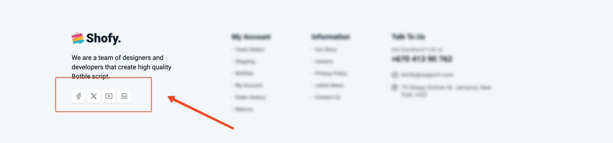

## Ecommerce

In here, there are various options to configure your shop that related to eCommerce features. You can set the number of products per page, products list display style or even product item display style, and more.

### Product Listing Page Layout

There are 3 options to choose from for the product listing page layout.

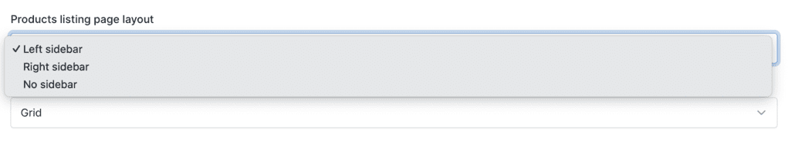

You can choose between a left sidebar, right sidebar, or no sidebar for the product listing page in the **Products listing page layout** option.

#### Product Listing Page with Left Sidebar

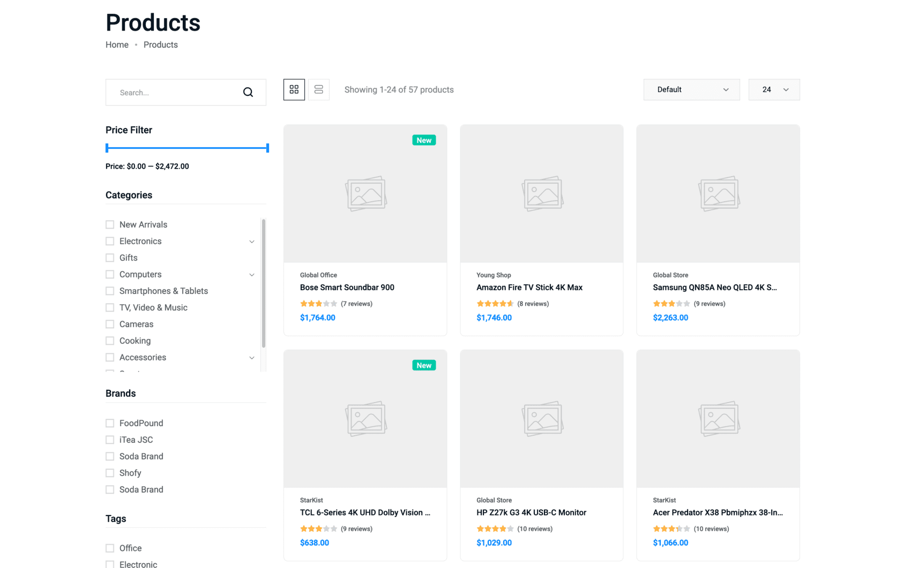

#### Product Listing Page with Right Sidebar

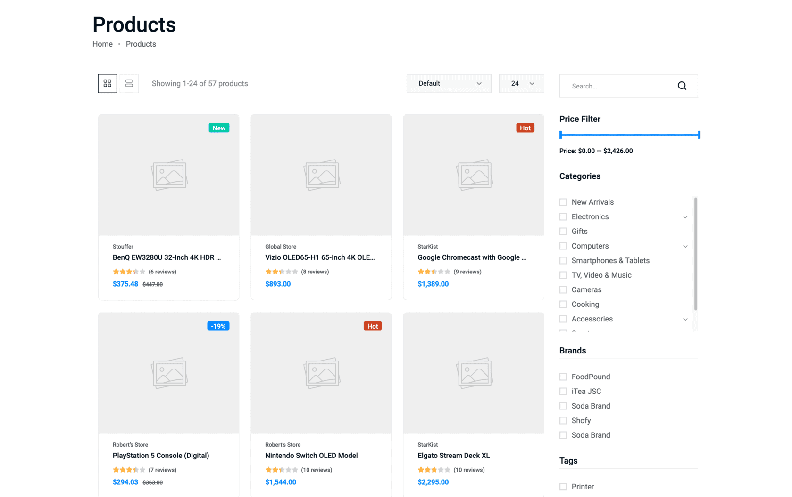

#### Product Listing Page with No Sidebar

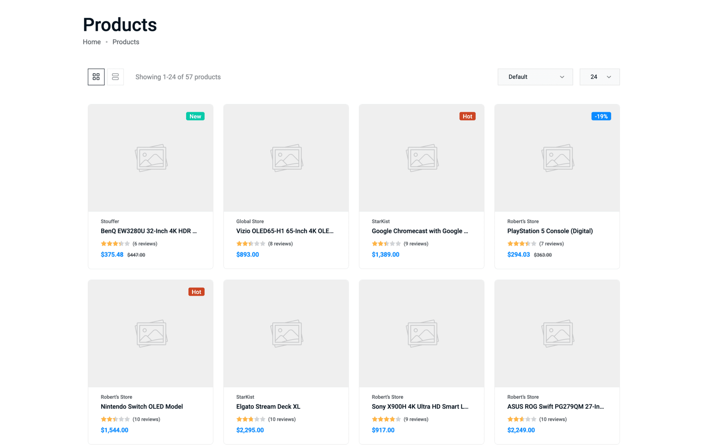

### Product Item Display Style

Shofy comes with 5 predefined product item display styles for various purposes. Each style offers a different visual presentation of your products on listing pages.

#### Product Item Display Style 1

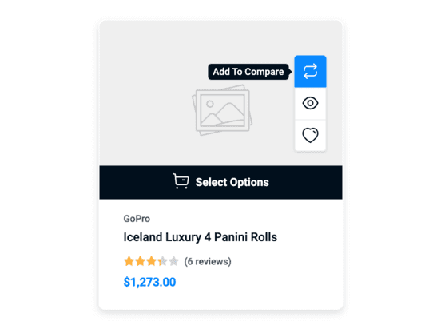

#### Product Item Display Style 2

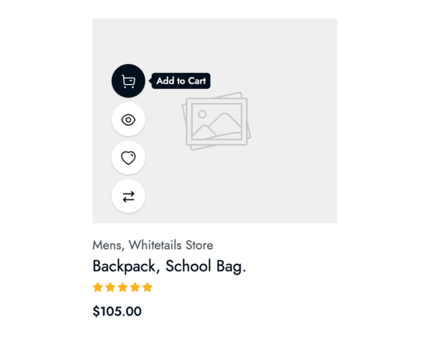

#### Product Item Display Style 3

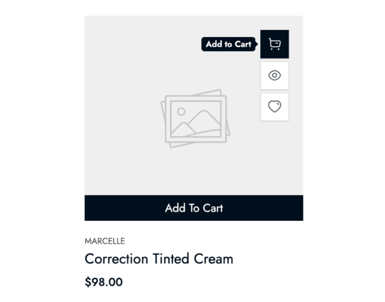

#### Product Item Display Style 4

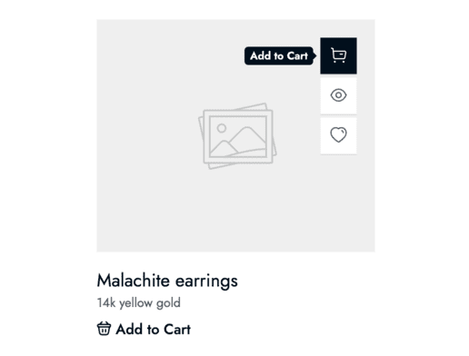

#### Product Item Display Style 5

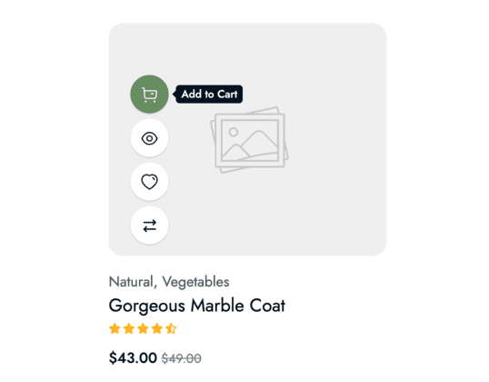

### Number of Products Per Page

The default number of products per page is 24. You can change this number in the **Number of products per page** option based on your preference.

### Other Options

There are also options to customize your product listing page slug, product gallery image style (horizontal or vertical), and more.

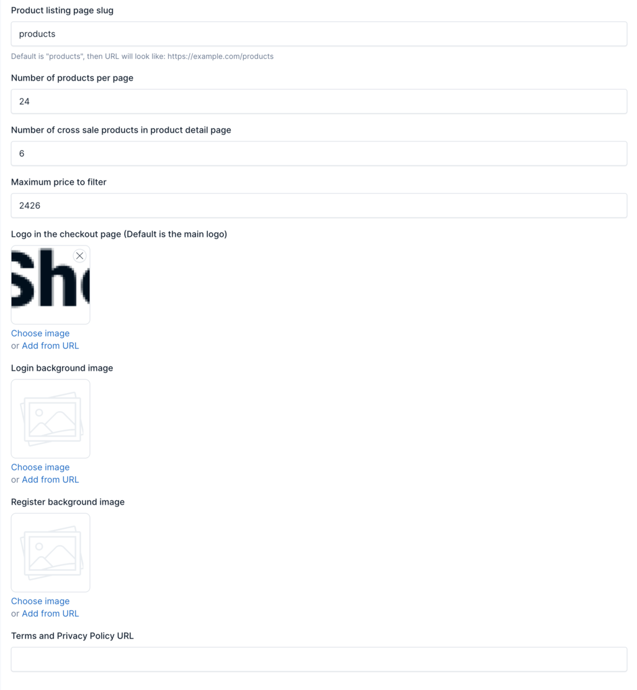
