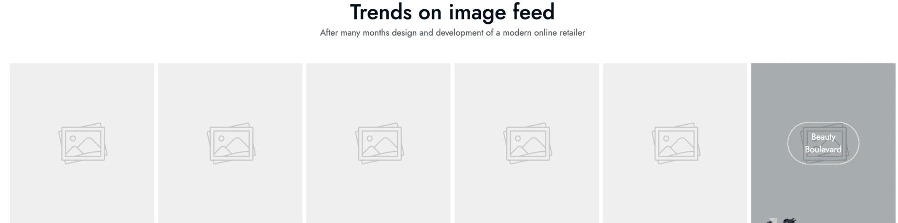
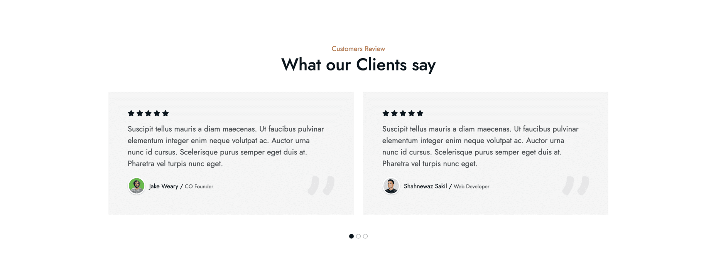

# UI Block (Shortcode)

UI Blocks, also known as Shortcodes, are small pieces of code that allow you to add predefined elements to your website.
They are used to enhance the functionality of your website without the need to write custom code.

## Usage

To use a shortcode, simply add the shortcode to the content of a page or post.

For example, to add a Google Maps to a page, use the following shortcode:

```html
[google-map]New York, USA[/google-map]
```


The above shortcode will add a **Google Map** to the page with the location set to `New York, USA`.

Go to the frontend of your website to see the result:


## Available Shortcodes

### About

Display simple information about your shop, company, or organization.

```html
[about image_1="path_to_media_image" image_2="path_to_media_image" subtitle="Sample subtitle" title="Sample title" description="Sample description" action_label="Contact Us" action_url="/contact"][/about]
```


### Ads

Display advertisements on your website. There are 4 different styles available.

For example:

```
[ads style="1" key_1="ADS_KEY" key_2="ADS_KEY"][/ads]
```

#### Style 1


#### Style 2


#### Style 3


#### Style 4


To use the Ads shortcode, activate the **Ads** plugin and create an ad unit in the **Ads** section of the admin menu
dashboard.


Then, choose the ad unit to display in the shortcode.


### App Downloads

Display app download links with icons.

Example:

```html
[app-downloads title="Sample title" google_label="Google Play" google_icon="ti ti-brand-google-play" apple_label="Apple Store" apple_icon="ti ti-brand-apple-filled" screenshot="path_to_media_image"][/app-downloads]
```


### Blog Posts

Display a list of blog posts.


Use the following shortcode to display a list of blog posts:

```html
[blog-posts title="Sample title" type="latest" limit="3"][/blog-posts]
```

The above shortcode will display the latest 3 blog posts.

### Coming Soon

Display a coming soon page with a countdown timer and newsletter subscription form.

```html
[coming-soon title="Coming Soon" subtitle="Our website is under construction" date="2025-12-31" image="path_to_media_image"][/coming-soon]
```

This shortcode is useful for launching a coming soon page while your website is still being developed.

### Contact Form

Display a contact form on a page.

```html
[contact-form show_contact_form="1" title="Sent A Message"][/contact-form]
```


### Ecommerce Brands

Display a list of product brands.

```html
[ecommerce-brands brand_ids="1,2,3,4,5"][/ecommerce-brands]
```

This shortcode displays brand logos or names that link to their respective product listing pages.

### Ecommerce Categories

Display a list of specific product categories.

```html
[ecommerce-categories style="slider" category_ids="1,2,3,4,5"][/ecommerce-categories]
```

We have 2 styles available for the Ecommerce Categories shortcode:

#### Grid style


#### Slider style


### Ecommerce Coupons

Display a list of specific available coupons.

```html
[ecommerce-coupons coupon_ids="1,2,3,4"][/ecommerce-coupons]
```


### Ecommerce Collections

Display a list of product collections. Collections are groups of products that you define in the admin panel.

```html
[ecommerce-collections collection_ids="1,2,3"][/ecommerce-collections]
```

This shortcode displays products from specific collections, useful for curated product groups like "Best Sellers", "New Arrivals", or "Staff Picks".

### Ecommerce Flash Sale

The Ecommerce Flash Sale shortcode can be used to display a list of products or a countdown timer.

```html
[ecommerce-flash-sale style="1" title="Sample title" flash_sale_id="1" limit="4"][/ecommerce-flash-sale]
```

The above shortcode will display a list of products with the specified flash sale ID (in this case, 1). Make sure to
create a flash sale in the admin panel first.

#### List product style


#### Countdown style


### Ecommerce Product Groups

Product groups are used to display a list of products in a group. There are 5 groups available:

* All: Display all products
* Featured: Display featured products
* On Sale: Display products that are on sale
* Trending: Display trending products
* Top Rated: Display top-rated products

```html
[ecommerce-product-groups title="Sample title" limit="8" tabs="all,featured,on-sale,trending,top-rated"][/ecommerce-product-groups]
```

You also can choose the style tabs or columns for the product groups.

#### Tabs style


#### Columns style


### Ecommerce Products

This is the most used shortcode to display a list of products. In this shortcode, you can choose the category,
collection, or specific products to display.

```html
[ecommerce-products style="grid" category_ids="20" limit="12"][/ecommerce-products]
```

The above example will display 20 products in the category with the ID of 20.

You also can control the left side of product list to display the category detail, and ads banners.


#### Grid style


#### Slider style


#### Simple style


### FAQ

Display frequently asked questions in a collapsible format. There are 2 different styles available.

```html
[faqs style="group" category_ids="1,2,3"][/faqs]
```

::: tip
Activate the **FAQ** plugin to use this shortcode.
:::

#### Group style

Display FAQs grouped by category.

#### List style

Display FAQs as a simple list.

### Gallery Images

Display a list of images in a gallery. There are 2 different styles available.

#### Style 1


#### Style 2



::: tip
Activate the **Gallery** plugin to use this shortcode.
:::

### Google Maps

Display an embedded Google Map on your page.

```html
[google-map]New York, USA[/google-map]
```

This will display an interactive Google Map with the specified location.

### Image Slider

Display a list of images in a slider. Usually used for brands, logos, or sponsors.


### Newsletter

Display a newsletter subscription form to collect email addresses from visitors.

```html
[newsletter][/newsletter]
```

::: tip
Activate the **Newsletter** plugin to use this shortcode.
:::

### Simple Slider

Usually used to display a list of images in a slider on the hero section of the website.

First, you need to create a slider in the admin panel. Go to `Simple Slider` on the admin menu dashboard to create a slider.

There are 5 styles for different purposes:

#### Style 1


#### Style 2


#### Style 3


#### Style 4


#### Style 5


::: tip
Activate the **Simple Slider** plugin to use this shortcode.
:::

### Site Features

Display a list of site features. There are 4 different styles available.

#### Style 1


#### Style 2


#### Style 3


#### Style 4


### Testimonials

Add testimonials to your website. There are 3 different styles available.

```html
[testimonials style="1" testimonial_ids="1,2,3"][/testimonials]
```

Go to `Testimonials` on the admin menu dashboard to create testimonials and assign them to the shortcode.

::: tip
Activate the **Testimonials** plugin to use this shortcode.
:::

#### Style 1


#### Style 2



#### Style 3


