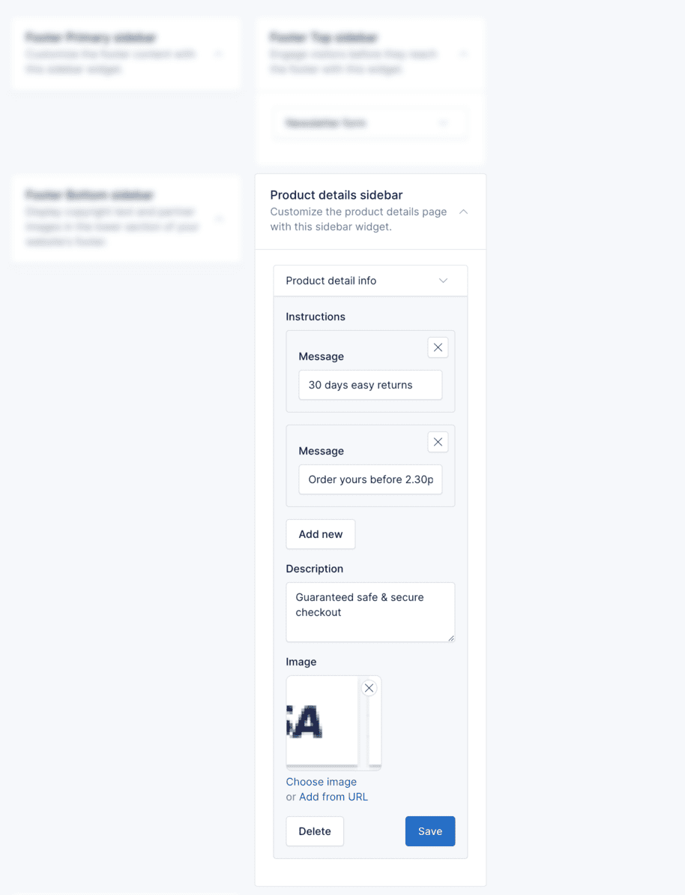

# Widgets

Shofy provides thirteen pre-made widget areas to help you customize the user interface and organize content strategically across your store.

These sidebars offer flexibility in placement and functionality, allowing you to tailor the user experience on different
sections of your online store.

## Manage Widgets

To manage the widgets, go to the `Appearance` -> `Widgets` menu in the admin panel.

To add a widget to a sidebar, drag and drop the widget from the left side to the sidebar area on the right side.

## Widget Areas

### 1. Blog Sidebar

The blog sidebar appears on the right side of the blog page. You can use this area to display widgets such as **Blog Search**, **Recent Posts**, **Categories**, etc.

### 2. Product Details Sidebar

Located on the right side of the product details page, this sidebar is ideal for displaying additional information about the product. Common widgets include **Product Detail Info** and product-related widgets.

### 3. Products Listing Top Sidebar

This sidebar appears at the top of the products listing page. Use it to display category filters, search widgets, or promotional content above the product grid.

### 4. Products Listing Bottom Sidebar

This sidebar appears at the bottom of the products listing page. Use it to display additional filters, related categories, or call-to-action widgets below the product grid.

### 5. Products by Category Top Sidebar

This sidebar appears at the top of the category-specific products page. Use it to display category details, featured filters, or related promotions.

### 6. Products by Category Bottom Sidebar

This sidebar appears at the bottom of the category-specific products page. Use it to display additional category information or promotional content.

### 7. Products by Brand Top Sidebar

This sidebar appears at the top of the brand-specific products page. Use it to display brand information, filters, or related widgets.

### 8. Products by Brand Bottom Sidebar

This sidebar appears at the bottom of the brand-specific products page. Use it to display additional brand content or promotional material.

### 9. Products by Tag Top Sidebar

This sidebar appears at the top of the tag-specific products page. Use it to display tag-related filters or related tags.

### 10. Products by Tag Bottom Sidebar

This sidebar appears at the bottom of the tag-specific products page. Use it to display additional tag-related content.

### 11. Footer Top Sidebar

Located at the top section of the footer, this sidebar is ideal for grabbing user attention before they reach the bottom of the page. It's perfect for displaying newsletter subscription forms.

In the example below, we use the **Newsletter** widget to display a newsletter subscription form.

::: tip
To use the **Newsletter** widget, you need to activate the **Newsletter** plugin in `Plugins` -> `Installed Plugins`.
:::

### 12. Footer Primary Sidebar

Occupying the central and often most prominent position in the footer, this sidebar is well-suited for showcasing essential information like site information, menus, and contact details.

In the example below, we use:

* **Site Information** widget to display details about the site, logo, and social media.
* **Custom Menu** widget to display a custom menu.
* **Site Contact** widget to display contact details.

::: tip
To use the **Custom Menu** widget, you can follow the steps in the [Menu](./usage-menu.md) section to create a custom menu and then add it to the widget.
:::

### 13. Footer Bottom Sidebar

Situated at the lowest section of the footer, this sidebar is typically used for displaying less visually prominent information. It's often used to showcase copyright information, partner logos, or credit card icons.

In the example below, we use the **Site Copyright** and **Site Accepted Payments** widgets to display copyright information and credit card icons.

## Delete Widgets

If you don't want to use the widgets in some areas, you can remove them by collapsing the widget and clicking the
**Delete** button.

