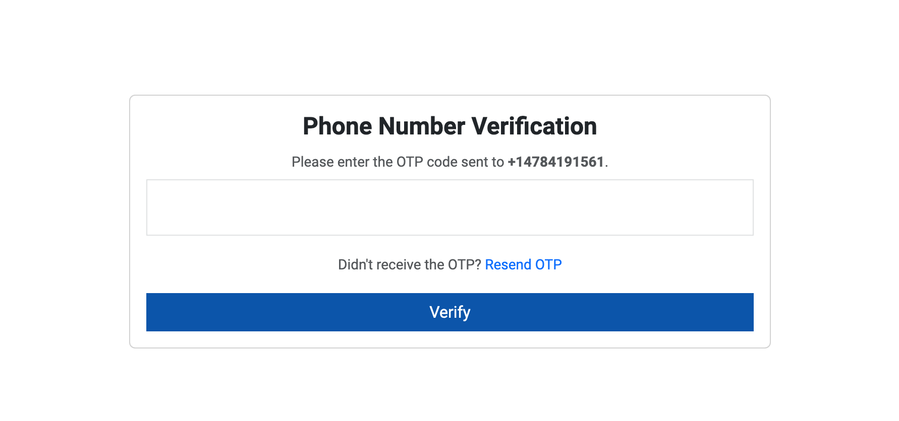
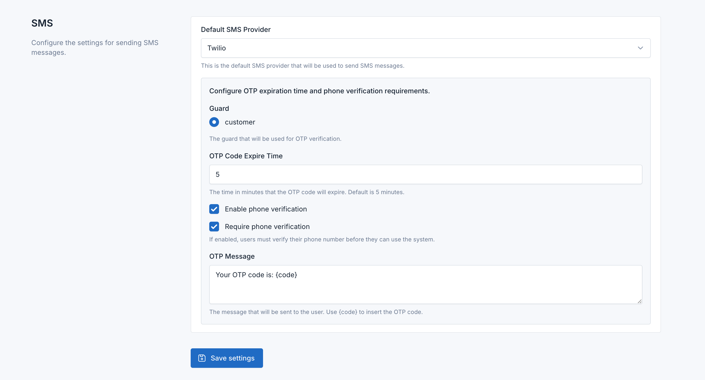

# Phone Verification

The **Phone Verification** feature in the SMS Gateway plugin allows you to verify user phone numbers via OTP (One-Time Password). This process ensures the phone numbers provided by users are valid and active.



## Configuring Phone Verification

1. **Access Phone Verification Settings**:
    - Log in to your Botble CMS admin panel.
    - Navigate to **SMS Gateway**.

2. **Configure OTP Settings**:
    - **Guard**: Specify the guard to be used for OTP verification.
    - **OTP Code Expire Time**: Set the expiration time for the OTP code in minutes. The default setting is 5 minutes. This determines how long the OTP code will remain valid before expiring.
    - **Phone Verification Requirement**: Enable this option to require users to verify their phone number before they can access the system.
    - **OTP Message**: Customize the message sent to users containing the OTP code. Use `{code}` as a placeholder for the actual OTP code.

   ### Example OTP Message

   ```plaintext
   Your OTP code is: {code}
   ```

3. **Save Settings**:
    - Click **Save settings** to apply the configuration changes.


