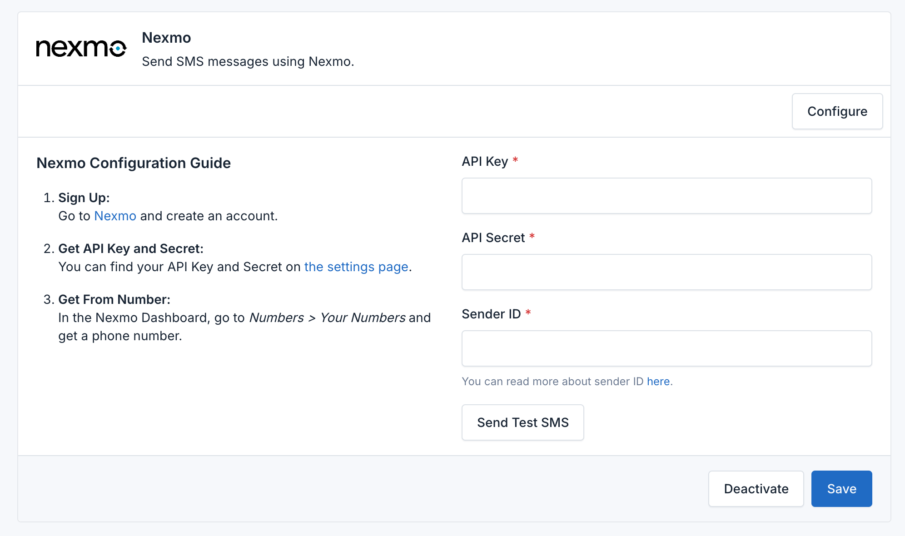

# Nexmo Integration

The **SMS Gateway Plugin** for Botble CMS integrates with **Nexmo** (Vonage) to enable SMS messaging. Follow these steps to configure Nexmo as your SMS service provider and utilize its features.


## Prerequisites

Before configuring Nexmo, make sure you have:

- A Nexmo account. Sign up at [Nexmo's website](https://www.vonage.com/communications-apis/sms/).
- A verified Nexmo phone number capable of sending SMS.
- Your Nexmo **API Key** and **API Secret**.

## Step 1: Activate and Configure Nexmo

1. **Access the Plugin Settings**:
    - Log in to your Botble CMS admin panel.
    - Navigate to **SMS Gateway**.

2. **Activate Nexmo as a Service Provider**:
    - In the **Service Providers** section, select **Nexmo** from the list.
    - Click **Activate** to enable Nexmo as a service provider.

3. **Configure Nexmo Credentials**:
    - **API Key**: Enter the API Key from your Nexmo dashboard.
    - **API Secret**: Enter the API Secret found in your Nexmo dashboard.
    - **From Number**: Enter the Nexmo phone number or sender name from which SMS messages will be sent. Ensure it is correctly formatted according to Nexmo’s requirements.

4. **Save Your Settings**:
    - Click **Save** to apply the Nexmo configuration.



### Example Configuration

```plaintext
API Key: your_api_key
API Secret: your_api_secret
From Number: +1234567890 or YourCompany
```

## Step 2: Set Nexmo as the Default SMS Provider

1. **Choose the Default Provider**:
    - After activating and configuring Nexmo, navigate to the **Default SMS Provider** setting.
    - Select **Nexmo** from the dropdown list of activated providers.

2. **Save the Default Provider**:
    - Click **Save** to confirm Nexmo as your default SMS provider.

## Step 3: Sending SMS with Nexmo

Once Nexmo is set as the default provider, the SMS Gateway Plugin will use it for all SMS messaging, including verification and notifications.

### Sending a Test SMS

1. In the **SMS Gateway** settings, locate the **Send Test SMS** section.
2. Enter a recipient phone number in international format (e.g., `+11234567890`).
3. Write a test message and click **Send Test SMS**.
4. Verify the delivery of the test SMS on your phone or check the Nexmo logs.

## Troubleshooting

If you encounter issues:

1. **Review Logs**: Check the raw request and response for errors or issues.
2. **Verify Configuration**: Ensure your Nexmo credentials and settings are correct.
3. **Consult Nexmo Documentation**: Refer to [Nexmo's API documentation](https://developer.nexmo.com/messaging/sms/overview) for error codes and troubleshooting tips.

For specific error codes and their resolutions, refer to the Nexmo documentation or contact Nexmo support.
