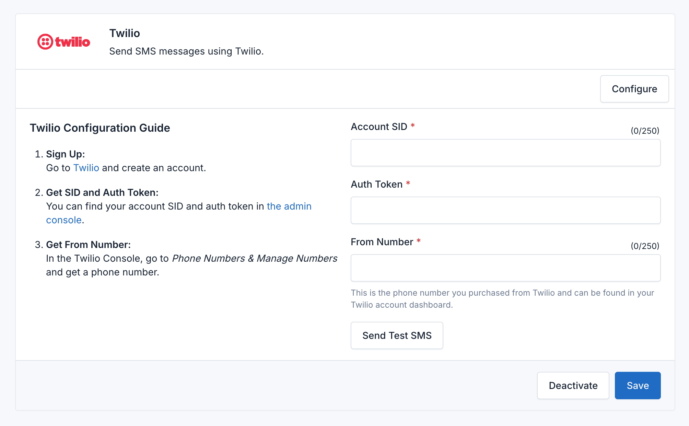

# Twilio Integration

The **SMS Gateway Plugin** for Botble CMS includes integration with **Twilio**. Follow the steps below to activate, configure, and set Twilio as your default SMS provider.


## Prerequisites

Before setting up Twilio, make sure you have:

- A Twilio account. Sign up at [Twilio's website](https://www.twilio.com/).
- A verified Twilio phone number for sending SMS.
- Your Twilio **Account SID** and **Auth Token**.

## Step 1: Activate and Configure Twilio

1. **Access the Plugin Settings**:
    - Log in to your Botble CMS admin panel.
    - Navigate to **SMS Gateway**.

2. **Activate Twilio as a Service Provider**:
    - In the **Service Providers** section, select **Twilio** from the list.
    - Click **Activate** to enable Twilio as a service provider.

3. **Configure Twilio Credentials**:
    - **Account SID**: Enter the Account SID from your Twilio dashboard under **Account Info**.
    - **Auth Token**: Enter the Auth Token found in your Twilio dashboard.
    - **From Number**: Enter the Twilio phone number from which SMS messages will be sent. Make sure to include the country code (e.g., `+1XXXXXXXXXX`).

4. **Save Your Settings**:
    - Click **Save** to apply the Twilio configuration.



### Example Configuration

```plaintext
Account SID: ACXXXXXXXXXXXXXXXXXXXXXXXXXXXXXXXX
Auth Token: your_auth_token
From Number: +1234567890
```

## Step 2: Set Twilio as the Default SMS Provider

1. **Choose the Default Provider**:
    - After activating and configuring Twilio, navigate to the **Default SMS Provider** setting.
    - Select **Twilio** from the dropdown list of activated providers.

2. **Save the Default Provider**:
    - Click **Save** to confirm Twilio as your default SMS provider.

## Sending SMS with Twilio

Once Twilio is set as the default provider, the SMS Gateway Plugin will use it for all SMS messaging, including verification and notifications.

### Sending a Test SMS

1. In the **SMS Gateway** settings, locate the **Send Test SMS** section.
2. Enter a recipient phone number in international format (e.g., `+11234567890`).
3. Write a test message and click **Send Test SMS**.
4. Verify the delivery of the test SMS on your phone or check the Twilio logs.

## Monitoring and Troubleshooting

- **Review Logs**: Check the raw request and response for errors or issues.
- **Twilio Logs**: Monitor message delivery and errors via the Twilio console under **Messaging** > **Logs**.
- **Error Handling**: If there are issues, double-check your configuration and refer to Twilio's [Error and Warning Dictionary](https://www.twilio.com/docs/api/errors).
