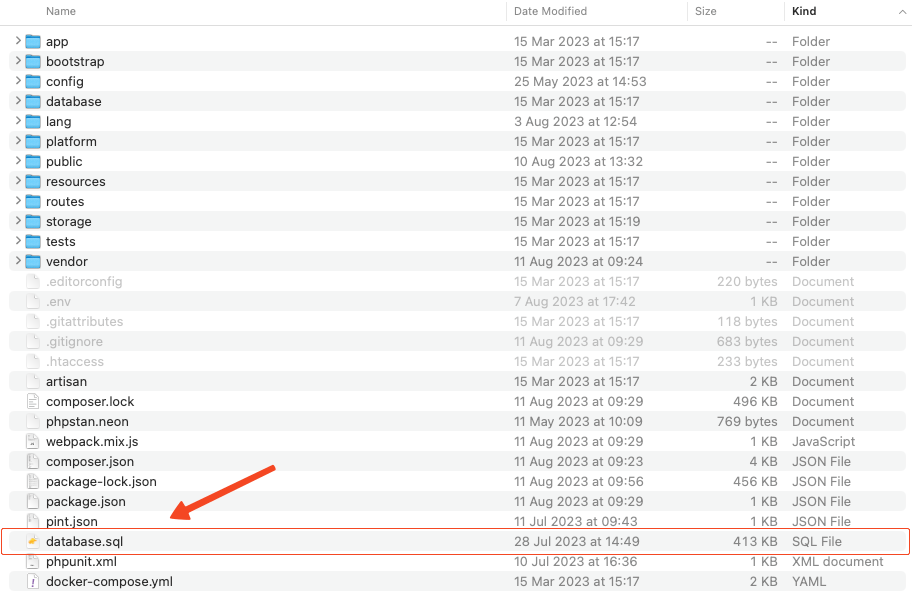
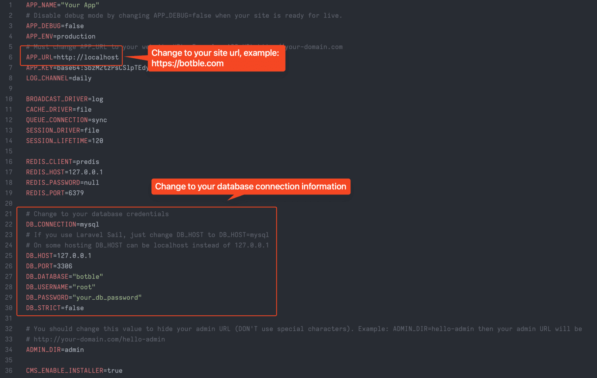

# Using web interface

The easiest way to install SnapCart is with the built-in installer UI.

## Install with the Installer UI

1. Create a database on your server.
2. Extract the source code into your web root directory.
3. Point your document root at the `/public` folder.
4. Go to `[your-domain.com]` to start the installation.
5. Follow the steps to set up your database connection, site information and administrator account.
6. Log in and set up your store from the **Welcome Board**.

## Install manually

1. Upload all files into the root folder of your hosting (normally `public_html`).
2. Create a database and import `database.sql` (located in the source code). This file contains the full demo data
   matching the demo site.

   
3. Update your database credentials and `APP_URL` in `.env`.

   
4. Go to `/admin` to access the admin panel.
5. The default admin account is `admin` / `12345678`.

   

::: warning Installing in a sub-folder
SnapCart is based on the Laravel framework, so its root folder is `/public`. If you install it in a sub-folder, you'll
need to access `your-domain.com/sub-folder/public`. To remove `/public` from the URL, follow
this [video tutorial](https://youtu.be/XdAYETd04iA).
:::

::: tip
Change the default admin password immediately after your first login.
:::
