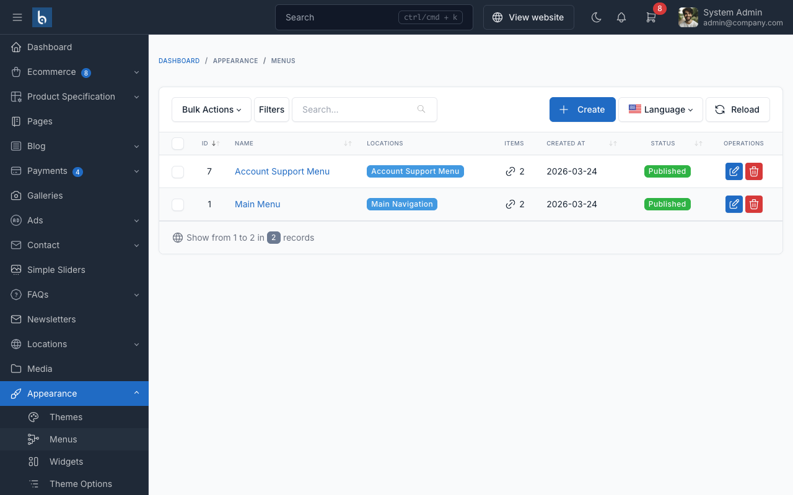

# Menu

SnapCart uses menus for the bottom navigation bar and category navigation. You can manage menus from the admin panel.

## Manage Menus

To manage menus, go to `Appearance` -> `Menus` in the admin panel.

## Bottom Navigation

SnapCart features a mobile-optimized bottom navigation bar with 5 tabs: Home, Categories, Cart, Account, and More.
This navigation is configured through the theme's built-in bottom navigation component.

## Category Navigation

Product categories can be browsed through the category menu, accessible via the bottom navigation. Categories are
fetched via AJAX and cached for 1 hour for optimal performance.

## Adding Menu Items

To add items to a menu:

1. Select the menu you want to edit from the dropdown
2. On the left side, choose items from Pages, Categories, or Custom Links
3. Click `Add to Menu`
4. Drag and drop to reorder items
5. Click `Save Menu`

::: tip
Use the category navigation for your product categories and keep the main menu simple for a better mobile experience.
:::
