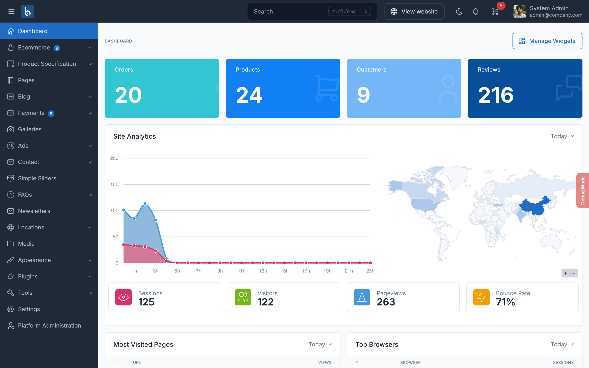

# Order Management

Manage customer orders from the admin panel. SnapCart supports the full order lifecycle from placement to delivery.

## Viewing Orders

Go to `Ecommerce` -> `Orders` in the admin panel to view all orders.

## Order Statuses

- **Pending**: Order placed, awaiting processing
- **Processing**: Order is being prepared
- **Completed**: Order delivered to customer
- **Cancelled**: Order was cancelled

## Processing an Order

1. Click on an order to view its details
2. Review the order items, shipping address, and payment status
3. Update the order status as you process it
4. Add tracking information if applicable
5. Click `Save`

## Order Notifications

Customers receive email notifications when:
- Order is placed (confirmation)
- Order status changes
- Shipping tracking is added

::: tip
Process orders promptly and keep customers informed of status changes to build trust and reduce support requests.
:::
